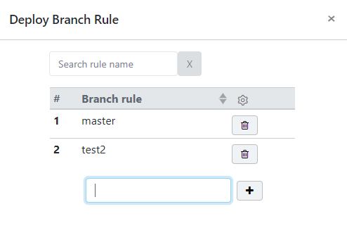

[TOC]

---

vuejs bootstrap: https://bootstrap-vue.js.org/docs/components/table

끝판왕 : https://bootstrap-vue.js.org/docs/components/table/#complete-example

<br>

---

## 1. table field 여러 조건



```html
<template>
    <div>
        <b-table :items="items" 
                 :fields="fields" 
                 :keyword="keyword" small
                 class="w-75 h-100"
                 sticky-header 
                 head-variant="light">
            <template v-slot:head(settings)="data">
                <span v-html="data.field.value" class="ml-2"></span>
            </template>
            <template v-slot:cell(#)="data">
                <b>{{ data.index + 1 }}</b>
            </template>
            <template v-slot:cell(rule)="data">
                {{data.item.rule}}
            </template>
            <template v-slot:cell(settings)="data">
                <b-button @click="delete(data.item.appId, data.item.id)">
                    <i class="fa fa-trash-o"></i>
                </b-button>
            </template>
        </b-table>
    </div>
</template>
<script>
    export default {
        data() {
            return {
                sampleLists: [],
                keyword: '',
                fields: [
                    '#',
                    {key: 'rule', label: 'rule', sortable: true},
                    {key: 'settings', value: '<span class="cui-settings"></span>'}
                ]
            }
        },
        computed: {
            items () {
                return this.keyword
                    ? this.sampleLists.filter(item => item.rule.includes(this.keyword))
                : this.sampleLists
            }
        }
    }
</script>
```

---


