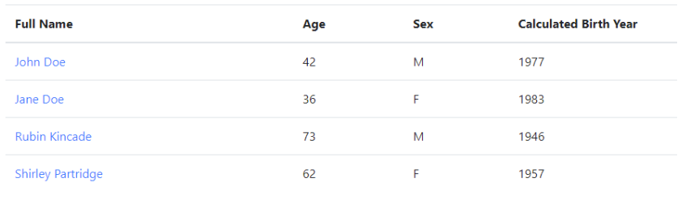
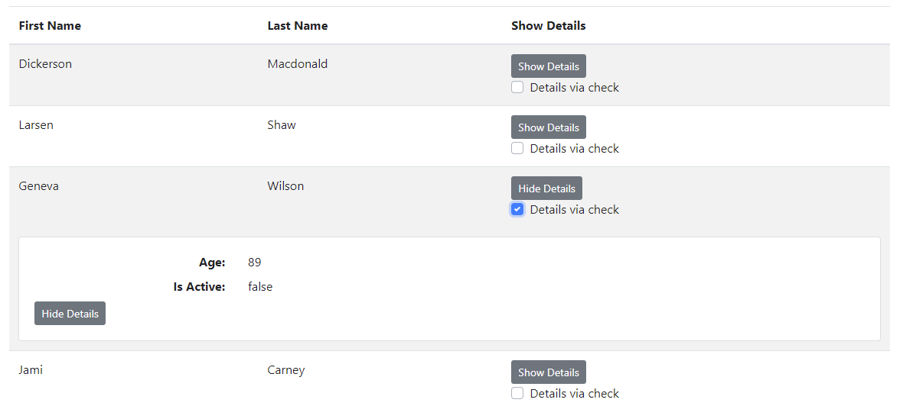

[TOC]

---

vuejs bootstrap: https://bootstrap-vue.js.org/docs/components/table

끝판왕 : https://bootstrap-vue.js.org/docs/components/table/#complete-example

<br>

## 0. tbody > tr 색 다르게

`:class="조건 ? 'table-danger' : ''"`

---

## 1. table field 여러 조건



```html
<template>
  <div>
    <b-table :fields="fields" :items="items">
      <template v-slot:cell(name)="data">
		// 아래의 {{data.value}}는 formatter fullName을 거치고 나온 데이터, 
		// a태그 클릭시 ex) John Doe -> url/#john-doe 
        <a :href="`#${data.value.replace(/[^a-z]+/i,'-').toLowerCase()}`">{{ data.value }}</a>
      </template>
    </b-table>
  </div>
</template>
<script>
  export default {
    data() {
      return {
        fields: [       
		  {
            key: 'name',
            label: 'Full Name',
			sortable: true,
			variant: 'danger',
			class: 'text-left',
            formatter: 'fullName'
          },
          'age', // 기본 컬럼
          {
            key: 'sex',
            formatter: value => {
              return value.charAt(0).toUpperCase()
            }
          },
          {
            key: 'birthYear',
            label: 'Calculated Birth Year',
            formatter: (value, key, item) => {
              return new Date().getFullYear() - item.age
            }
          }
        ],
        items: [
          { name: { first: 'John', last: 'Doe' }, sex: 'Male', age: 42 },
          { name: { first: 'Jane', last: 'Doe' }, sex: 'Female', age: 36 },
          { name: { first: 'Rubin', last: 'Kincade' }, sex: 'male', age: 73 },
          { name: { first: 'Shirley', last: 'Partridge' }, sex: 'female', age: 62 }
        ]
      }
    },
    methods: {
      fullName(value) {
        return `${value.first} ${value.last}`
      }
    }
  }
</script>
```

---

## 2. custom empty option

```html
<div>
  <b-table :fields="fields" :items="items" show-empty>
    <template v-slot:empty="scope">
      <h4>{{ scope.emptyText }}</h4>
    </template>
    <template v-slot:emptyfiltered="scope">
      <h4>{{ scope.emptyFilteredText }}</h4>
    </template>
  </b-table>
</div>
```

---

## 3.  header row & header 전체 조건

```html
	<b-table
      responsive
      :items="items"
      :fields="fields"
    >
      <template v-slot:head(id)="scope">
        <div class="text-nowrap">Row ID</div>
      </template>
      <template v-slot:head()="scope">
        <div class="text-nowrap">
          Heading {{ scope.label }}
        </div>
      </template>
    </b-table>

<script>
  export default {
    data() {
      return {
        stickyHeader: true,
        noCollapse: false,
        fields: [
          { key: 'id', stickyColumn: true, isRowHeader: true, variant: 'primary' },
          'a',
          'b',
          { key: 'c', stickyColumn: true, variant: 'info' },
          'd',
          'e',
          'f',
          'g',
          'h',
          'i',
          'j',
          'k',
          'l'
        ],
        items: [
          { id: 1, a: 0, b: 1, c: 2, d: 3, e: 4, f: 5, g: 6, h: 7, i: 8, j: 9, k: 10, l: 11 },
          { id: 2, a: 0, b: 1, c: 2, d: 3, e: 4, f: 5, g: 6, h: 7, i: 8, j: 9, k: 10, l: 11 },
          { id: 3, a: 0, b: 1, c: 2, d: 3, e: 4, f: 5, g: 6, h: 7, i: 8, j: 9, k: 10, l: 11 },
          { id: 4, a: 0, b: 1, c: 2, d: 3, e: 4, f: 5, g: 6, h: 7, i: 8, j: 9, k: 10, l: 11 },
          { id: 5, a: 0, b: 1, c: 2, d: 3, e: 4, f: 5, g: 6, h: 7, i: 8, j: 9, k: 10, l: 11 },
          { id: 6, a: 0, b: 1, c: 2, d: 3, e: 4, f: 5, g: 6, h: 7, i: 8, j: 9, k: 10, l: 11 },
          { id: 7, a: 0, b: 1, c: 2, d: 3, e: 4, f: 5, g: 6, h: 7, i: 8, j: 9, k: 10, l: 11 },
          { id: 8, a: 0, b: 1, c: 2, d: 3, e: 4, f: 5, g: 6, h: 7, i: 8, j: 9, k: 10, l: 11 },
          { id: 9, a: 0, b: 1, c: 2, d: 3, e: 4, f: 5, g: 6, h: 7, i: 8, j: 9, k: 10, l: 11 },
          { id: 10, a: 0, b: 1, c: 2, d: 3, e: 4, f: 5, g: 6, h: 7, i: 8, j: 9, k: 10, l: 11 }
        ]
      }
    }
  }
</script>
```

---

## 4. table toggle detail 조건



```html
<template>
  <div>
    <b-table :items="items" :fields="fields" striped responsive="sm">
      <template v-slot:cell(show_details)="row">
        <b-button size="sm" @click="row.toggleDetails" class="mr-2">
          {{ row.detailsShowing ? 'Hide' : 'Show'}} Details
        </b-button>

        <!-- As `row.showDetails` is one-way, we call the toggleDetails function on @change -->
        <b-form-checkbox v-model="row.detailsShowing" @change="row.toggleDetails">
          Details via check
        </b-form-checkbox>
      </template>

      <template v-slot:row-details="row">
        <b-card>
          <b-row class="mb-2">
            <b-col sm="3" class="text-sm-right"><b>Age:</b></b-col>
            <b-col>{{ row.item.age }}</b-col>
          </b-row>

          <b-row class="mb-2">
            <b-col sm="3" class="text-sm-right"><b>Is Active:</b></b-col>
            <b-col>{{ row.item.isActive }}</b-col>
          </b-row>

          <b-button size="sm" @click="row.toggleDetails">Hide Details</b-button>
        </b-card>
      </template>
    </b-table>
  </div>
</template>

<script>
  export default {
    data() {
      return {
        fields: ['first_name', 'last_name', 'show_details'],
        items: [
          { isActive: true, age: 40, first_name: 'Dickerson', last_name: 'Macdonald' },
          { isActive: false, age: 21, first_name: 'Larsen', last_name: 'Shaw' },
          {
            isActive: false,
            age: 89,
            first_name: 'Geneva',
            last_name: 'Wilson',
            _showDetails: true
          },
          { isActive: true, age: 38, first_name: 'Jami', last_name: 'Carney' }
        ]
      }
    }
  }
</script>
```

---

## 5. table item 정렬

> ex) tagName으로 오름차순 정리

```html
<b-table :items="items" :fields="fields" class="ec-table" :keyword="selectedInstance"
         :sort-by.sync="sortBy"
         :sort-desc.sync="sortDesc">
</b-table>
<script>
    ...
    
data: function () {
  return {
    sortBy: 'tagName',
    sortDesc: false,
    selectedInstance: '',
    fields: [
      '#',
      {key: 'tagName', label: 'Name', sortable: true, class: 'text-left', sortDirection: 'asc'},
      {key: 'instance', label: 'Instance', sortable: true, class: 'text-left'},
      {key: 'subnetId', label: 'Subnet ID', sortable: true, class: 'text-left'},
      {key: 'AZ', label: 'AZ', sortable: true, class: 'text-left'},
      {key: 'status', label: 'Status', sortable: true},
      {key: 'publiIPv4', label: 'Public IP / DNS (IPv4)', class: 'text-left'},
      {key: 'keyName', label: 'Key name', sortable: true, class: 'text-left'},
      {key: 'monitoring', label: 'Monitoring'},
      {key: 'launchTime', label: 'Launch time', sortable: true, class: 'text-center'},
      {key: 'sg', label: 'Security groups', class: 'text-left'},
      {key: 'volume', label: 'Volume', class: 'text-left'}
    ]
  }
}
    ...
</script>
```


