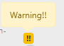
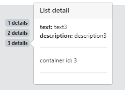
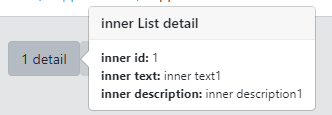

https://bootstrap-vue.js.org/docs/components/popover/

<br>

## example 1

> 아주 간단한 데이터 보여줄 때



```html
<b-badge variant="warning" v-b-popover.hover.top="{variant: 'warning', content: 'Warning!!'}">!!</b-badge>
```

<br>

## example 2

> 기본 list 팝업



```html
<template>
    <div class="animated fadeIn">
        <div v-for="list in testList"
             v-bind:key="list.id">
            <b-badge
                    class="text-left"
                    :id="`popover-${list.id}`"
            >
                {{list.id}} details
                <b-popover :target="`popover-${list.id}`" triggers="hover focus" placement="right">
                    <template v-slot:title>List detail</template>
                    <strong>text:</strong> {{list.text}} <br>
                    <strong>description:</strong> {{list.description}}
                    <hr>
                    <p>
                        container id: {{list.id}}
                    </p>
                    <hr>
                </b-popover>
            </b-badge>
        </div>
    </div>
</template>

<script>
    export default {
        name: "AppList",
        data () {
            return {
                testList: [
                    {id: 1, text:'text1', description: 'description1'},
                    {id: 2, text:'text2', description: 'description2'},
                    {id: 3, text:'text3', description: 'description3'},
                ]
            }
        }
    }
</script>
<style scoped>
</style>
```

<br>

## example 3

> list 안의 list



```html
<template>
    <div class="animated fadeIn">
        <div v-for="list in testList"
             v-bind:key="list.id">
            <b-button v-for="inner in list.innerList" v-bind:key="inner.id" :id="`popover-${inner.id}`">
                {{inner.id}} detail
                    <b-popover :target="`popover-${inner.id}`" triggers="hover focus" placement="left">
                        <template v-slot:title>inner List detail</template>
                        <strong>inner id:</strong> {{inner.id}} <br>
                        <strong>inner text:</strong> {{inner.text}}<br>
                        <strong>inner description:</strong> {{inner.description}} <br>
                    </b-popover>
            </b-button>
        </div>
    </div>
</template>

<script>
    export default {
        name: "AppList",
        data () {
            return {
                testList: [
                    {id: 1, text:'text1', description: 'description1'},
                    {id: 2, text:'text2', description: 'description2'},
                    {id: 3, text:'text3', description: 'description3'},
                    {innerList: [
                            {id: 1, text:'inner text1', description: 'inner description1'},
                            {id: 2, text:'inner text2', description: 'inner description2'},
                            {id: 3, text:'inner text3', description: 'inner description3'},
                    ]}
                ]
            }
        }
    }
</script>

<style scoped>
</style>
```

