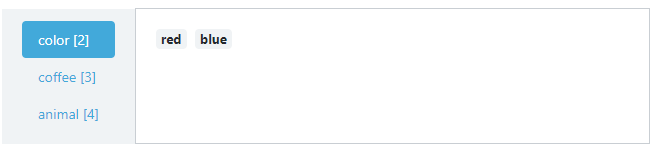
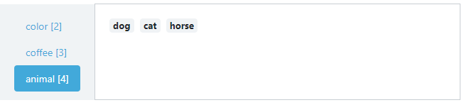

상황: 부트스트랩 properties에 vue data를 여러개 함께 넣어야 하는 경우


#### 코드


```html
<b-tabs pills card vertical>
    <b-tab v-for="item in list" v-bind:key="item.id"
            :title="`${item.type} [${item.count}]`">
        <b-card-text>
            <h5>
                <b-badge class="m-1" variant="light">
                    {{item.name}}
                </b-badge>
            </h5>
        </b-card-text>
    </b-tab>
</b-tabs>

<script>
export default {
    name: "Clusters",
    components: {ClusterList},
    data () {
        return {
            list: [
                {type: 'color', count: 2, name: ['red', 'blue']},
                {type: 'coffee', count: 3, name: ['black', 'milk', 'latte']},
                {type: 'animal', count: 4, name: ['dog', 'cat', 'horse']}
            ]
        }
    }
}
</script>
```


#### 결과



