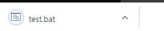

## 파일 읽기, 수정하기, 실행

npm 설치

file-saver: `npm i file-saver --save`

raw-loader: `npm install raw-loader --save`

<br>

**sampleBatch.txt**

```text
:: SET ENV VAR
set SAMPLE_IPADDRESS=XXIPXX
set SAMPLE_HOSTNAME=XXHOSTXX

....


pause
exit
```


```js
import { saveAs } from 'file-saver'
import sampleBatch from 'raw-loader!./sampleBatch.txt'

...

saveBatchFile (ip, host) {
    const result = sampleBatch.toString().replace('XXIPXX', ip)
    const result2 = result.toString().replace('XXHOSTXX', host)
    const blob = new Blob([result2], {type: "text/plain;charset=utf-8"})
    saveAs(blob, "test.bat")
},
```



