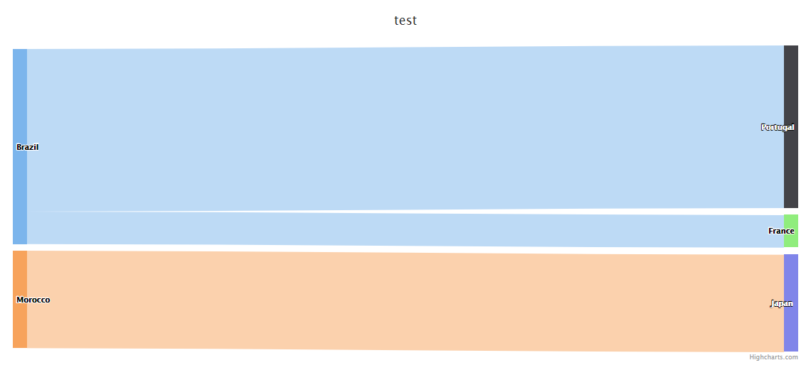

### hicharts-vue에서 sankey 사용



<br>

**main.js**

```js
import Highcharts from 'highcharts'
import sanKeyInit from 'highcharts/modules/sankey'
sanKeyInit(Highcharts)
```

**template**

```html
<template>
    <div>
        <highcharts :options="chartOptions" class="highcharts-legend-item-hidden">
        </highcharts>
    </div>
</template>
```

**script**

```js
import { Chart } from 'highcharts-vue'
import * as Api from '@/api/index.js'

export default {
    name: 'BackendServiceInboundTrafficRegionGraph',
    components: {
        highcharts: Chart
    },
    props: {
        appnodeLabels: Array,
        prometheusId: Number,
        selectRange: String
    },
    data: function () {
        return {
            chartOptions: {
                chart: {
                    type: 'sankey'
                },
                title: {
                    text: 'test'
                },
                accessibility: {
                    point: {
                        valueDescriptionFormat: '{index}. {point.from} to {point.to}, {point.weight}.'
                    }
                },
                series: [{
                    keys: ['from', 'to', 'weight'],
                    data: [
                        ['Brazil', 'Portugal', 5],
                        ['Brazil', 'France', 1],
                        ['Morocco', 'Japan', 3]
                    ]
                }]
            }
        }
    }
}
```

