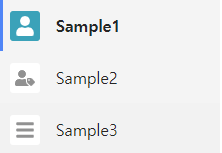

<br>

### css

```css
.v-sidebar-menu.vsm_white-theme .vsm--link_level-1.vsm--link_exact-active .vsm--icon, .v-sidebar-menu.vsm_white-theme .vsm--link_level-1.vsm--link_active .vsm--icon {
    color: #fff;
    background-color: #17a2b8;
}
.v-sidebar-menu.vsm_white-theme .vsm--link_level-1 .vsm--icon {
    background-color: #FFFFFF;
    padding: 5px;
}
.v-sidebar-menu.vsm_white-theme .vsm--icon {
    color: #919191;
}
```

<br>

### data

```js
menuIcon: [
    {title: 'Sample1', icon: 'fa fa-user'},
    {title: 'Sample2', icon: 'fa fa-user-tag'},
    {title: 'Sample3', icon: 'fa fa-bars'}
]
```

<br>

### menu만들기

```js
getMenus () {
    const menu = []
    for (let menu of this.$store.getters.sampleMenus) {
        const tempMenu = {
            href: {path: menu.path},
            title: menu.title,
            icon: this.getIcon(menu.title),
            exactPath: true
        }
        menu.push(tempMenu)
    }
    return menu
}
```

