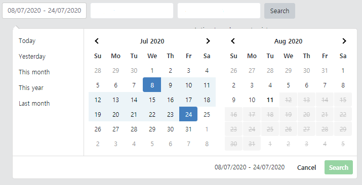
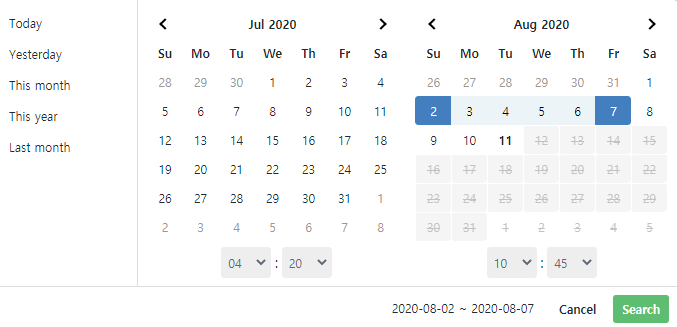

[TOC]

docs: https://innologica.github.io/vue2-daterange-picker/#usage




- time-picker



## npm

`npm i vue2-daterange-picker --save`


<br>

### ranges 버그 수정

**import component**

```html
<date-range-picker
                   :ranges="ranges"
                   :time-picker="true"
                   :time-picker-increment="1"
                   class="mr-2"
                   ref="picker"
                   :opens="'false'"
                   :maxDate="new Date()"
                   :closeOnEsc="true"
                   v-model="findQuery.date"
                   @update="checkDate()"
                   :locale-data="locale"
                   >
    <template v-slot:input="picker" style="min-width: 350px;">
        {{ myDateFormat(picker.startDate)}} ~ {{ myDateFormat(picker.endDate)}}
    </template>
</date-range-picker>
```

```js
import * as Api from '@/api/index.js'
import * as moment from 'moment'
import DateRangePicker from 'vue2-daterange-picker'
import 'vue2-daterange-picker/dist/vue2-daterange-picker.css'

export default {
    components: { DateRangePicker },
    data: function () {
        return {
            locale: {
                direction: 'ltr', //direction of text
                format: 'dd/mm/yyyy', //fomart of the dates displayed
                separator: ' - ', //separator between the two ranges
                applyLabel: 'Search',
                cancelLabel: 'Cancel'
            },
            findQuery: {
                date: {
                    startDate: new Date(),
                    endDate: new Date()
                }
            },
            ranges: {}
        }
    },
    methods: {
        myDateFormat (date) {
            if (!date) date = new Date()
            return moment(date).format('YYYY-MM-DD H:mm') // 24시간 적용
        },
        checkDate() {
            console.log(moment(this.findQuery.date.endDate).format('YYYY-MM-DD H:mm'))
            console.log(moment(this.findQuery.date.startDate).format('YYYY-MM-DD H:mm'))
        },
        setRanges () {
            let today = new Date()
            today.setHours(0, 0, 0, 0)

            let yesterday = new Date()
            yesterday.setDate(today.getDate() - 1)
            yesterday.setHours(0, 0, 0, 0)

            let yesterday2 = new Date()
            yesterday2.setDate(today.getDate() - 1)
            yesterday2.setHours(23, 59, 59, 59)
            this.ranges = {
                'Today': [today, new Date()],
                'Yesterday': [yesterday, yesterday2],
                'This month': [new Date(today.getFullYear(), today.getMonth(), 1), new Date()],
                'Last month': [new Date(today.getFullYear(), today.getMonth() - 1, 1), new Date(today.getFullYear(), today.getMonth(), 0)],
                'This year': [new Date(today.getFullYear(), 0, 1), new Date()]
            }
        }
    },
    created() {
        this.setRanges()
    }
}
```


------


<br>
<br>

### ranges 버그 수정 전


**import component**

```html
<date-range-picker
                   :time-picker="true"
                   class="mr-2"
                   ref="picker"
                   :opens="'false'"
                   :maxDate="new Date()"
                   :closeOnEsc="true"
                   v-model="findQuery.date"
                   @update="checkDate()"
                   :locale-data="locale"
                   >
    <template v-slot:input="picker" style="min-width: 350px;">
        {{ myDateFormat(picker.startDate)}} - {{ myDateFormat(picker.endDate)}}
    </template>
</date-range-picker>
```

```js
import * as Api from '@/api/index.js'
import * as moment from 'moment'
import DateRangePicker from 'vue2-daterange-picker'
import 'vue2-daterange-picker/dist/vue2-daterange-picker.css'

export default {
    components: { DateRangePicker },
    data: function () {
        return {
            locale: {
                direction: 'ltr', //direction of text
                format: 'dd/mm/yyyy', //fomart of the dates displayed
                separator: ' - ', //separator between the two ranges
                applyLabel: 'Search',
                cancelLabel: 'Cancel'
            },
            findQuery: {
                date: {
                    startDate: new Date(),
                    endDate: new Date()
                }
            }
        }
    },
    methods: {
        myDateFormat (date) {
            if (!date) date = new Date()
            return moment(date).format('YYYY-MM-DD hh:mm:ss')
        },
        checkDate() {
            console.log(moment(this.findQuery.date.endDate).format('DD/MM/YYYY'))
            console.log(moment(this.findQuery.date.startDate).format('DD/MM/YYYY'))
        },
}
```


