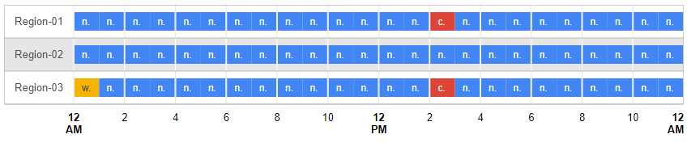

https://jsfiddle.net/a7cqvorn/10/



```html
<script type="text/javascript" src="https://www.gstatic.com/charts/loader.js"></script>
       <div id="timeline" style="height: 180px;"></div>
   
```

```js
      google.charts.load('current', {'packages':['timeline']});
      google.charts.setOnLoadCallback(drawChart);
      function drawChart() {
        var container = document.getElementById('timeline');
        var chart = new google.visualization.Timeline(container);
        var dataTable = new google.visualization.DataTable();
        dataTable.addColumn({ type: 'string', id: 'Region' });
        dataTable.addColumn({ type: 'string', id: 'Status' });
        dataTable.addColumn({ type: 'date', id: 'Start' });
        dataTable.addColumn({ type: 'date', id: 'End' });
        dataTable.addRows([
          [ 'Region-01', 'normal', new Date(0,0,0,0,0,0),  new Date(0,0,0,1,0,0) ],
          [ 'Region-01', 'normal', new Date(0,0,0,1,0,0),  new Date(0,0,0,2,0,0) ],
          [ 'Region-01', 'normal', new Date(0,0,0,2,0,0),  new Date(0,0,0,3,0,0) ],
          [ 'Region-01', 'normal', new Date(0,0,0,3,0,0),  new Date(0,0,0,4,0,0) ],
          [ 'Region-01', 'normal', new Date(0,0,0,4,0,0),  new Date(0,0,0,5,0,0) ],
          [ 'Region-01', 'normal', new Date(0,0,0,5,0,0),  new Date(0,0,0,6,0,0) ],
          [ 'Region-01', 'normal', new Date(0,0,0,6,0,0),  new Date(0,0,0,7,0,0) ],
          [ 'Region-01', 'normal', new Date(0,0,0,7,0,0),  new Date(0,0,0,8,0,0) ],
          [ 'Region-01', 'normal', new Date(0,0,0,8,0,0),  new Date(0,0,0,9,0,0) ],
          [ 'Region-01', 'normal', new Date(0,0,0,9,0,0),  new Date(0,0,0,10,0,0) ],
          [ 'Region-01', 'normal', new Date(0,0,0,10,0,0),  new Date(0,0,0,11,0,0) ],
          [ 'Region-01', 'normal', new Date(0,0,0,11,0,0),  new Date(0,0,0,12,0,0) ], 
          [ 'Region-01', 'normal', new Date(0,0,0,12,0,0),  new Date(0,0,0,13,0,0) ],
          [ 'Region-01', 'normal', new Date(0,0,0,13,0,0),  new Date(0,0,0,14,0,0) ],
          [ 'Region-01', 'critical', new Date(0,0,0,14,0,0), new Date(0,0,0,15,0,0) ],
          [ 'Region-01', 'normal', new Date(0,0,0,15,0,0),  new Date(0,0,0,16,0,0) ],
          [ 'Region-01', 'normal', new Date(0,0,0,16,0,0),  new Date(0,0,0,17,0,0) ],
          [ 'Region-01', 'normal', new Date(0,0,0,17,0,0),  new Date(0,0,0,18,0,0) ],
          [ 'Region-01', 'normal', new Date(0,0,0,18,0,0),  new Date(0,0,0,19,0,0) ],
          [ 'Region-01', 'normal', new Date(0,0,0,19,0,0),  new Date(0,0,0,20,0,0) ],
          [ 'Region-01', 'normal', new Date(0,0,0,20,0,0),  new Date(0,0,0,21,0,0) ],
          [ 'Region-01', 'normal', new Date(0,0,0,21,0,0),  new Date(0,0,0,22,0,0) ],
          [ 'Region-01', 'normal', new Date(0,0,0,22,0,0),  new Date(0,0,0,23,0,0) ],
          [ 'Region-01', 'normal', new Date(0,0,0,23,0,0),  new Date(0,0,0,24,0,0) ],
          
          [ 'Region-02', 'normal', new Date(0,0,0,0,0,0),  new Date(0,0,0,1,0,0) ],
          [ 'Region-02', 'normal', new Date(0,0,0,1,0,0),  new Date(0,0,0,2,0,0) ],
          [ 'Region-02', 'normal', new Date(0,0,0,2,0,0),  new Date(0,0,0,3,0,0) ],
          [ 'Region-02', 'normal', new Date(0,0,0,3,0,0),  new Date(0,0,0,4,0,0) ],
          [ 'Region-02', 'normal', new Date(0,0,0,4,0,0),  new Date(0,0,0,5,0,0) ],
          [ 'Region-02', 'normal', new Date(0,0,0,5,0,0),  new Date(0,0,0,6,0,0) ],
          [ 'Region-02', 'normal', new Date(0,0,0,6,0,0),  new Date(0,0,0,7,0,0) ],
          [ 'Region-02', 'normal', new Date(0,0,0,7,0,0),  new Date(0,0,0,8,0,0) ],
          [ 'Region-02', 'normal', new Date(0,0,0,8,0,0),  new Date(0,0,0,9,0,0) ],
          [ 'Region-02', 'normal', new Date(0,0,0,9,0,0),  new Date(0,0,0,10,0,0) ],
          [ 'Region-02', 'normal', new Date(0,0,0,10,0,0),  new Date(0,0,0,11,0,0) ],
          [ 'Region-02', 'normal', new Date(0,0,0,11,0,0),  new Date(0,0,0,12,0,0) ],
          [ 'Region-02', 'normal', new Date(0,0,0,12,0,0),  new Date(0,0,0,13,0,0) ],
          [ 'Region-02', 'normal', new Date(0,0,0,13,0,0),  new Date(0,0,0,14,0,0) ],
          [ 'Region-02', 'normal', new Date(0,0,0,14,0,0), new Date(0,0,0,15,0,0) ],
          [ 'Region-02', 'normal', new Date(0,0,0,15,0,0),  new Date(0,0,0,16,0,0) ],
          [ 'Region-02', 'normal', new Date(0,0,0,16,0,0),  new Date(0,0,0,17,0,0) ],
          [ 'Region-02', 'normal', new Date(0,0,0,17,0,0),  new Date(0,0,0,18,0,0) ],
          [ 'Region-02', 'normal', new Date(0,0,0,18,0,0),  new Date(0,0,0,19,0,0) ],
          [ 'Region-02', 'normal', new Date(0,0,0,19,0,0),  new Date(0,0,0,20,0,0) ],
          [ 'Region-02', 'normal', new Date(0,0,0,20,0,0),  new Date(0,0,0,21,0,0) ],
          [ 'Region-02', 'normal', new Date(0,0,0,21,0,0),  new Date(0,0,0,22,0,0) ],
          [ 'Region-02', 'normal', new Date(0,0,0,22,0,0),  new Date(0,0,0,23,0,0) ],
          [ 'Region-02', 'normal', new Date(0,0,0,23,0,0),  new Date(0,0,0,24,0,0) ],
          
          [ 'Region-03', 'warning', new Date(0,0,0,0,0,0),  new Date(0,0,0,1,0,0) ],
          [ 'Region-03', 'normal', new Date(0,0,0,1,0,0),  new Date(0,0,0,2,0,0) ],
          [ 'Region-03', 'normal', new Date(0,0,0,2,0,0),  new Date(0,0,0,3,0,0) ],
          [ 'Region-03', 'normal', new Date(0,0,0,3,0,0),  new Date(0,0,0,4,0,0) ],
          [ 'Region-03', 'normal', new Date(0,0,0,4,0,0),  new Date(0,0,0,5,0,0) ],
          [ 'Region-03', 'normal', new Date(0,0,0,5,0,0),  new Date(0,0,0,6,0,0) ],
          [ 'Region-03', 'normal', new Date(0,0,0,6,0,0),  new Date(0,0,0,7,0,0) ],
          [ 'Region-03', 'normal', new Date(0,0,0,7,0,0),  new Date(0,0,0,8,0,0) ],
          [ 'Region-03', 'normal', new Date(0,0,0,8,0,0),  new Date(0,0,0,9,0,0) ],
          [ 'Region-03', 'normal', new Date(0,0,0,9,0,0),  new Date(0,0,0,10,0,0) ],
          [ 'Region-03', 'normal', new Date(0,0,0,10,0,0),  new Date(0,0,0,11,0,0) ],
          [ 'Region-03', 'normal', new Date(0,0,0,11,0,0),  new Date(0,0,0,12,0,0) ],
          [ 'Region-03', 'normal', new Date(0,0,0,12,0,0),  new Date(0,0,0,13,0,0) ],
          [ 'Region-03', 'normal', new Date(0,0,0,13,0,0),  new Date(0,0,0,14,0,0) ],
          [ 'Region-03', 'critical', new Date(0,0,0,14,0,0), new Date(0,0,0,15,0,0) ],
          [ 'Region-03', 'normal', new Date(0,0,0,15,0,0),  new Date(0,0,0,16,0,0) ],
          [ 'Region-03', 'normal', new Date(0,0,0,16,0,0),  new Date(0,0,0,17,0,0) ],
          [ 'Region-03', 'normal', new Date(0,0,0,17,0,0),  new Date(0,0,0,18,0,0) ],
          [ 'Region-03', 'normal', new Date(0,0,0,18,0,0),  new Date(0,0,0,19,0,0) ],
          [ 'Region-03', 'normal', new Date(0,0,0,19,0,0),  new Date(0,0,0,20,0,0) ],
          [ 'Region-03', 'normal', new Date(0,0,0,20,0,0),  new Date(0,0,0,21,0,0) ],
          [ 'Region-03', 'normal', new Date(0,0,0,21,0,0),  new Date(0,0,0,22,0,0) ],
          [ 'Region-03', 'normal', new Date(0,0,0,22,0,0),  new Date(0,0,0,23,0,0) ],
          [ 'Region-03', 'normal', new Date(0,0,0,23,0,0),  new Date(0,0,0,24,0,0) ]
          ]);

        chart.draw(dataTable);
      }
```

