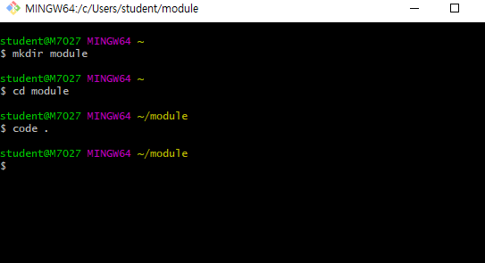
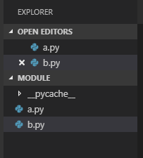
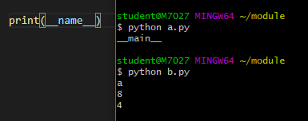

# 2019-01-14 - 3 from, import





**a.py**

```python
"""
두 개의 함수를 정의한다.
cube(num) =>  num를 세제곱 해주는 함수
square(num) => num을 제곱 해주는 함수
"""

def cube(num):
    return num**3

def square(num):
    return num**2

# print(cube(2))
# print(square(2))
# --> 그냥 이러면 b.py출력할때도 출력됨.

# print(__name__)    					--> ----> 아래 그림 참조
# 파일이 직접 실행되면 -> "__main__"
# 파일이 불려오게 되면(import) => "파일이름"

if __name__ == "__main__":   # 본인을 직접 호출하면 그때만 아래 코드 실행
    print(cube(2))
    print(square(2))
   

```

> 

**b.py**

```python
from a import cube, square

print(cube(2))
print(square(2))

# import a
# print(a.cube(2))
# print(a.square(2))

# import requests
# requests.get()

# import bs4
# bs4.BeautifulSoup() # 분명 bs4.py안에 class BeautifulSoup: 라는 게 있을거야.

# import flask
# app = flask.Flask()


```


