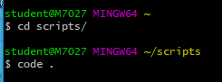
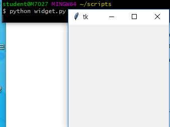
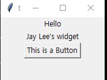
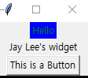

# 2019-01-15 - 1 Tkinter



**touch widget.py**

```python
from tkinter import *

root = Tk()

root.mainloop()
```



---

```python
from tkinter import *
import webbrowser

def browser():
    webbrowser.open("https://www.daum.net")

root = Tk()

# Label(어떤 tkinder 윈도우/프로그램에 넣을지, text = "")
label = Label(root, text="Hello")
label2 = Label(root, text="Jay Lee's widget")

btn = Button(root, text="This is a Button", command=browser) #->누르면 함수로 

label.pack()   # 라벨 하나를 만들어 가장 위부터 쌓아줌
label2.pack()
btn.pack()

root.mainloop()

```



---

```python
label = Label(root, text="Hello", fg="green", bg="blue")
```



---


