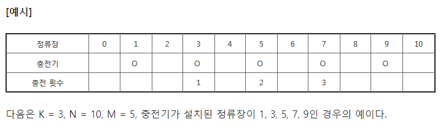

# 2019-01-17 -1문제풀이

**min_max.py**

```python
"""
>문제
N개의 양의 정수에서 가장 큰 수와 가장 작은 수의 차이를 출력하시오.

>입력
첫 줄에 테스트 케이스의 수 T가 주어진다. ( 1 ≤ T ≤ 50 )

각 케이스의 첫 줄에 양수의 개수 N이 주어진다. ( 5 ≤ N ≤ 1000 )

다음 줄에 N개의 양수 ai가 주어진다. ( 1 ≤ ai≤ 1000000 )

>출력
각 줄마다 "#T" (T는 테스트 케이스 번호)를 출력한 뒤, 답을 출력한다.
"""
import sys
sys.stdin = open("input.txt", "r")

# 1
# def my_min(n):
#     result = n[0]
#     for i in n:
#         if i < result:
#             result = i
#     return result
#
# def my_max(n):
#     result = n[0]
#     for i in n:
#         if i > result:
#             result = i
#     return result
#
#
# T = int(input())
# for tc in range(1,T+1):
#     n = int(input())
#     nums = list(map(int, input().split()))
#     a = my_max(nums)-my_min(nums)
#     print(f'#{tc} {a}')

# 2
T = int(input())
for tc in range(1,T+1):
    n = int(input())
    nums = list(map(int, input().split()))
    print("#{} {}".format(tc, max(nums)-min(nums)))
```


**elec_bus.py**



```python
"""
>문제
A도시는 전기버스를 운행하려고 한다. 전기버스는 한번 충전으로 이동할 수 있는 정류장 수가 정해져 있어서,
중간에 충전기가 설치된 정류장을 만들기로 했다.

버스는 0번에서 출발해 종점인 N번 정류장까지 이동하고, 한번 충전으로 최대한 이동할 수 있는 정류장 수 K가 정해져 있다.

충전기가 설치된 M개의 정류장 번호가 주어질 때, 최소한 몇 번의 충전을 해야 종점에 도착할 수 있는지
출력하는 프로그램을 만드시오.

만약 충전기 설치가 잘못되어 종점에 도착할 수 없는 경우는 0을 출력한다. 출발지에는 항상 충전기가 설치되어 있지만
충전횟수에는 포함하지 않는다.

>입력
첫 줄에 노선 수 T가 주어진다.  ( 1 ≤ T ≤ 50 )


각 노선별로 K, N, M이 주어지고, 다음줄에 M개의 정류장 번호가 주어진다. ( 1 ≤ K, N, M ≤ 100 )

>출력
#과 노선번호, 빈칸에 이어 최소 충전횟수 또는 0을 출력한다.
"""

import sys
sys.stdin = open("input2.txt", "r")

T = int(input())
for tc in range(1, T+1):
    k, n, m = list(map(int, input().split())) # 3 10 5
    c = list(map(int, input().split())) # 충전기가 설치된 곳  각각 인덱스의 차이 > k 면 0 출력
    p = 0
    cnt = 0
    ck =0
    for i in range(len(c)-1):
        if(c[i+1]-c[i]>k):
            ck +=1
    if(ck>0):
        cnt = 0
    else:
        while(p<n):
            for i in c:
                if(p+k>i and p+k not in c):
                    cnt+=1
                    p=i
                if(p+k == i):
                    cnt+=1
                    p=i
                if(p>=n-k):
                    p=n
                    break
                if(p+k<i):
                    cnt = 0
                    break
    print(f'#{tc} {cnt}')


```


