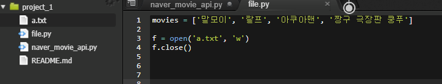
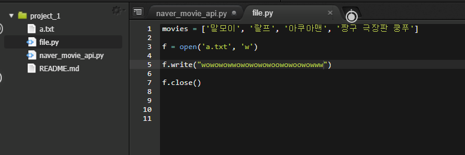
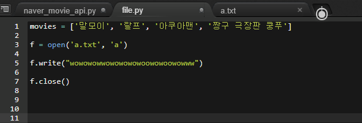
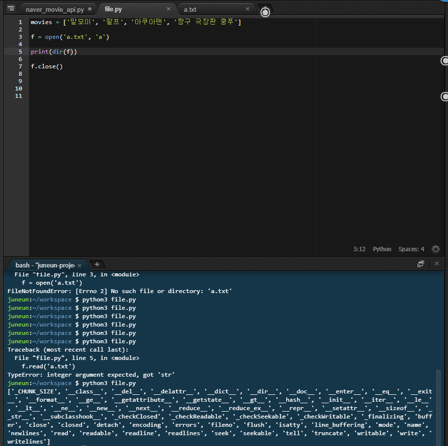
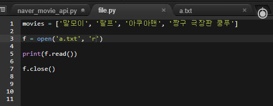

# python file

file => 영구저장방법

`python file manipulation, 파이썬 파일 조작 ` 검색


'w'  --> 텍스트파일 없으면 a.txt 텍스트 생성 



---

---



▼▼▼▼▼▼▼▼▼▼▼▼▼▼▼▼▼▼▼▼▼▼▼▼▼▼▼▼▼▼▼▼▼▼▼▼▼▼▼


​							'w'속성--> 덮어쓰기.

​					이어쓰고 싶으면  append - a! 를 써야함




---

---

---

## f의 dir



---

## file read




---

### file에 변수로 넣기

**file.py**

```python
movies = ['말모이', '랄프', '아쿠아맨', '짱구 극장판 쿵푸']

content = "안녕!"

f = open('b.txt', 'a')

f.write(content)

f.close()

```

**b.txt**

```tex
안녕!
```

---

---

리스트를 파일에 넣어보기

**file.py**

```python
movies = ['말모이', '랄프', '아쿠아맨', '짱구 극장판 쿵푸']

f = open('movies.txt', 'w')
for movie in movies:
    f.write(movie+ ", ")

f.close()
```

**movies.txt**

```
말모이, 랄프, 아쿠아맨, 짱구 극장판 쿵푸, 
```

가져온 ㅍㅏ일 다시 리스트로 만들어보기

**file.py**

```python
f = open('movies.txt', 'r')
m = f.read().split(", ")
print(m)
f.close()
# --> ['말모이', '랄프', '아쿠아맨', '짱구 극장판 쿵푸']
```


