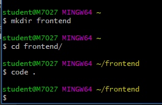
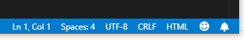

# 2019-01-21 2 frontend - html



---



​				혹시 저기 HTML이 dajsngo html이면  click해서 바꿔줘야함!


---

**python.html**

```html
...
<body>
    <h1>프로그래밍 교육</h1>
    <hr>
    <h2>파이썬</h2>
    <h3>Number Type</h3>
    <p>파이썬에서 숫자형은 아래와 같이 있다.</p>
    <ol>
        <li>int</li>
        <li>float</li>
        <li>complex</li>
        <li><s>str</s></li>
    </ol>
    <h3>Sequence</h3>
    <p>파이썬에서 시퀀스는 아래와같이 있다.</p>
    <strong>시퀀스는 for문을 돌릴 수 있다!!!</strong>
    <ol>
        <li>str</li>
        <li>list</li>
        <li>tuple</li>
        <li>range</li>
    </ol>
    <hr>
    <h2>웹</h2>
    <h3>기초</h3>
    <ul style="list-style-type: lower-roman;">
            <li>HTML</li>
            <li>CSS</li>
    </ul>
</body>
...
```


---

---


[form 태그 속성 ]

http://www.nextree.co.kr/p8428/

