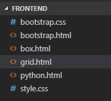
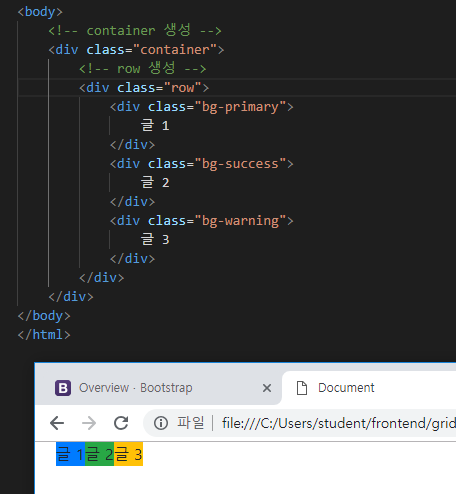
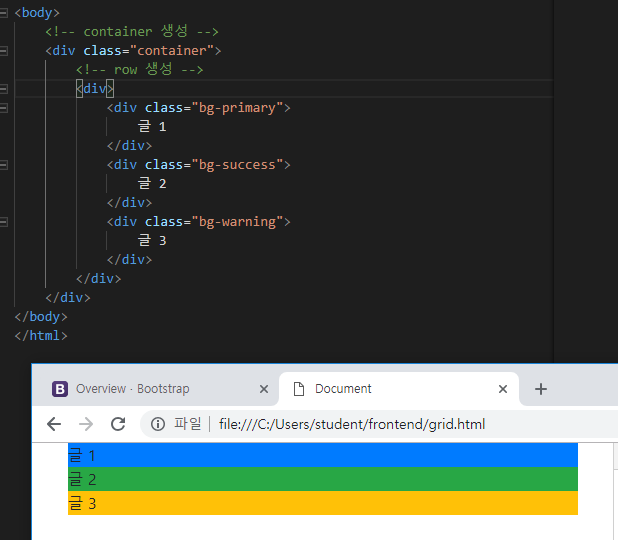
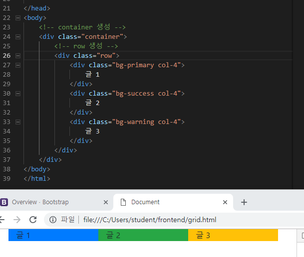
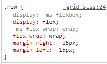
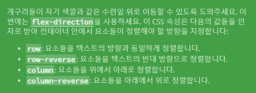
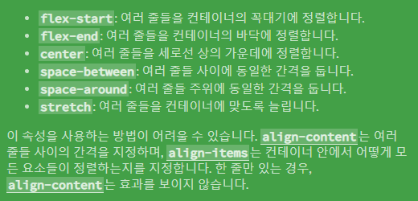

# 2019-01-22 4 Bootstrap grid


---

---

https://getbootstrap.com/docs/4.2/layout/overview/



**grid.html**

```html
<body>
    <!-- container 생성 -->
    <div class="container">
        <!-- row 생성 -->
        <div class="row item">
            <div>
                글 1
            </div>
            <div>
                글 2
            </div>
            <div>
                글 3
            </div>
        </div>
    </div>
</body>
```










**...flex...!?**

### flex

**flexbox froggy** : https://flexboxfroggy.com/#ko





