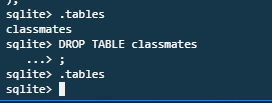

# 2019-01-28 2- sql기초

## berkeley EECS Database Systems

https://www2.eecs.berkeley.edu/Courses/CS186/

---> CS186

---


### RDBMS - 관계형 데이터 베이스 관리 시스템

- 관계형 모델을 기반으로하는 데이터베이스 관리 시스템

> SQLite, MySQL


---

## 용어정리

- 스키마(schema)

> 데이터베이스에서 자료의 구조, 표현방법, 관계 등을 정의한 구조
>
> 
>
> 데이터베이스의 구조와 제약 조건에 관련한 전반적인 명세를 기술한 것
>
> 
>
> 
>
> 
>
> 


---

---

## SQL

**SQL(Structured Query Language)**는 관계형 데이터베이스 관리시스템(RDBMS)의 데이터를 관리하기 위해 설계된 특수 목적의 프로그래밍 언어이다. 

관계형 데이터베이스 관리 시스템에서 

1.자료의 검색과 관리, 

2.데이터베이스 스키마 생성과 수정, 

3.데이터베이스 객체 접근 조정 관리를 위해 고안되었다


### SQL 문법


---

## 실행해보기

c9

```
$ sqlite3     -> 실행
$ .exit		  -> 종료
```


**csv 파일 가져오기**


```
$ sqlite3   -> 실행
$ .mode csv -> csv를 읽을 수 있는 모드로 해
$ .import hellodb.csv hellodb ->hellodb.csv 파일을 hellodb라는 이름으로 가져올거야
$ .databases  -> 내가 갖고있는 데이터베이스를 다 보여줘
$ SELECT * FROM hellodb; -> 방금 넣은 데이터베이스 확인 
$ SELECT * FROM question LIMIT 3;   -> 3개만 볼거야
$ .tables -> 갖고있는 테이블 목록
```


---

---


.headers on -> 헤더컬럼

.mode column  ->탭


## 데이터 베이스 생성

`$ sqlite3 test.sqlite3`  => test라는 데이터베이스 생성


## 테이블 생성


---


---

## Table 및 schema 조회

```
$ .tables
$ .schema classmates  -> classmates테이블이 어떤 구조를 갖고있는지
```


---

## Table 삭제 (DROP)

`$ DROP TABLE classmates`




---

## 테이블 만들어보기


---

---

**.sql 파일을 만들어 테이블 만들기**

`.read db.sql`

create_student.sql

```sqlite
CREATE TABLE students(
    id      INT primary key,
    name    TEXT,
    age     INT,
    address TEXT
);
```


