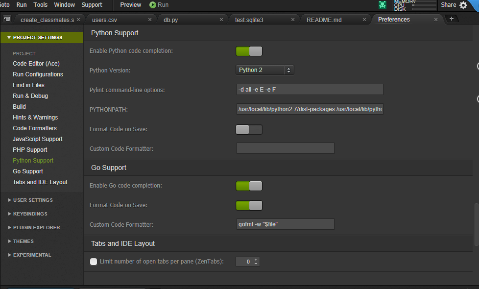
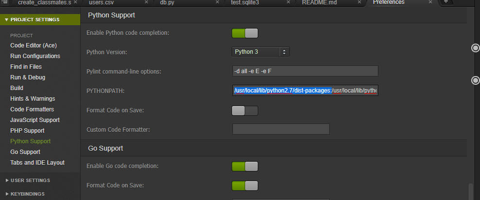
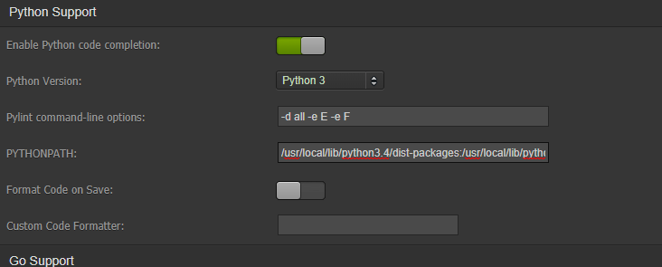
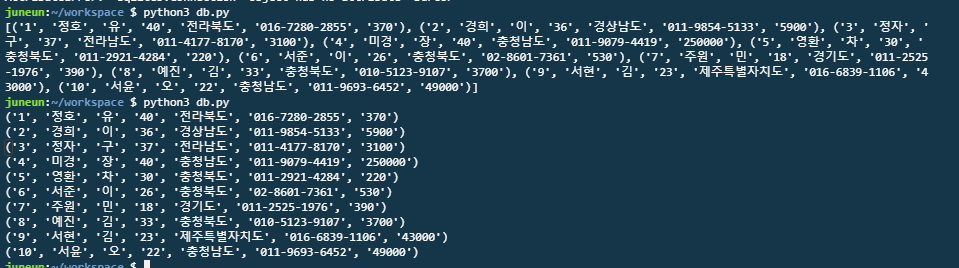

# 2019-01-29

python version -> 3으로! 








**cloud9 - asked**

**db.py**

>  sqlite3.connect('데이터베이스파일명')

```python
import sqlite3
'''
1. $ sqlite3 [데이터베이스 파일명]
    => 데이터 베이스에 접속
2. SQL 쿼리 사용
    => SELECT * FROM users;
    => 결과를 가져다줌 
3. $ .exit
    => 작업이 끝나면 콘솔 종료
'''

db = sqlite3.connect('test.sqlite3')
cur = db.cursor()  # db조작을 할 수 있는 커서를 만듦.
cur.execute('SELECT * FROM users LIMIT 10')
# cur.fetchone()
data = cur.fetchall()  # -> 생김새 : [ (1행),(2행),(3행),(4행) ]
# print(data)   [('','',''),('','',''),('','',''),('','','')]

for row in data : 
    print(row) 
```

> 

**입력받아 데이터 조회하기**

```python
import sqlite3

word = input("검색할 이름의 성을 입력하세요 : ")

db = sqlite3.connect('test.sqlite3')
cur = db.cursor()  
#cur.execute('SELECT * FROM users WHERE last_name = "{}"'.format(word))
cur.execute('SELECT COUNT(*) FROM users WHERE last_name = "{}"'.format(keyword))
data = cur.fetchall() 

for row in data : 
    print(row)
```

**{}성을 가진 사람 수, 명단**

```python
import sqlite3

db = sqlite3.connect('test.sqlite3')

word = input("검색할 이름의 성을 입력하세요 : ")

def search(keyword):
    '''
    DB에서 검색어를 받아 검색을 해주는 친구!
    '''
    cur = db.cursor()  # db조작을 할 수 있는 커서를 만듦.
    cur.execute('SELECT * FROM users WHERE last_name = "{}"'.format(keyword))
    data = cur.fetchall()  
    cur.execute('SELECT COUNT(*) FROM users WHERE last_name = "{}"'.format(keyword))
    total = cur.fetchone()  
    
    print("{}씨 성을 가진 사람은 {}명입니다. 명단은 다음과 같습니다.".format(keyword,total[0]))
    
    for row in data:
        print(row)
        
search(word)
```


## 너무 번거로워 ---> SQLalchemy를 사용!!!!!!!!!!!!!!


