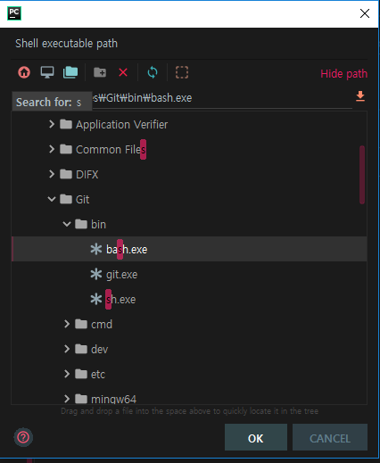
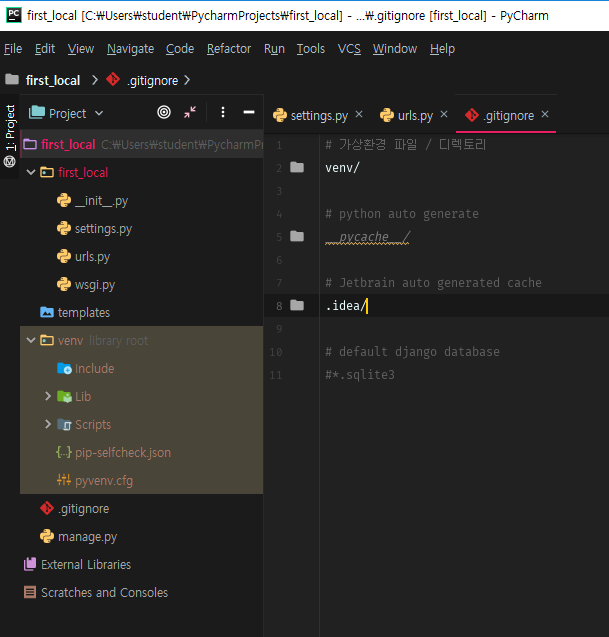
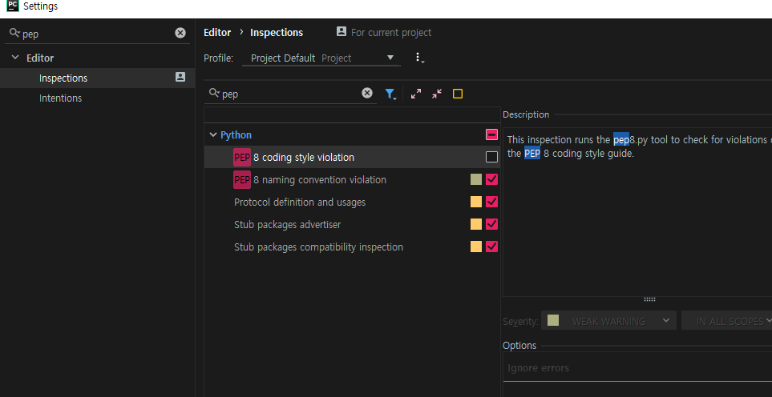
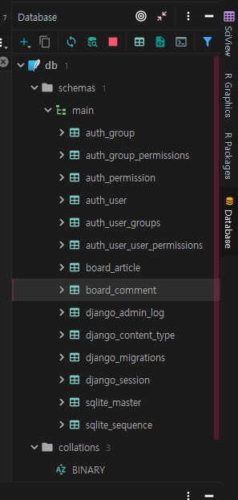
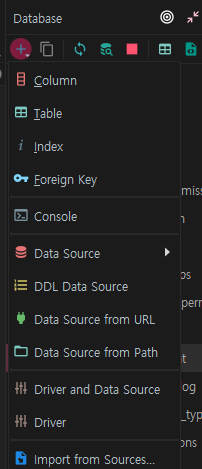
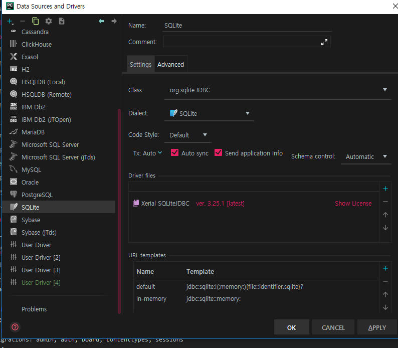

chocolatey 설치 : 

`@"%SystemRoot%\System32\WindowsPowerShell\v1.0\powershell.exe" -NoProfile -InputFormat None -ExecutionPolicy Bypass -Command "iex ((New-Object System.Net.WebClient).DownloadString('https://chocolatey.org/install.ps1'))" && SET "PATH=%PATH%;%ALLUSERSPROFILE%\chocolatey\bin"`

**cmd**

`choco` : 설치 확인

**pycharm 설치**

`choco install pycharm`

**pycharm 실행** 

`no import` 체크

---

python new project =>> django

---

settings - plugins -{{{ csv plugin, .ignore, material theme ui }}}download

settings - terminal - bash.exe 확인

폰트바꾸기 : console font 

---

### .gitignore

`touch .gitignore`

---

pep 끄기

---

database

database => 

driver

sqlite 설치