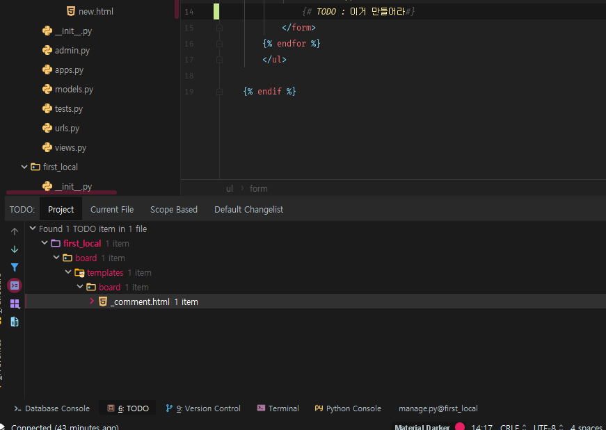
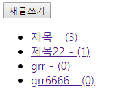
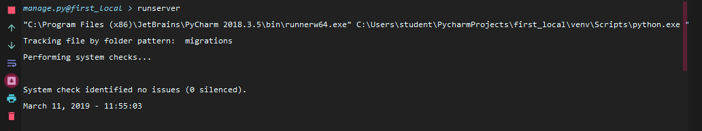
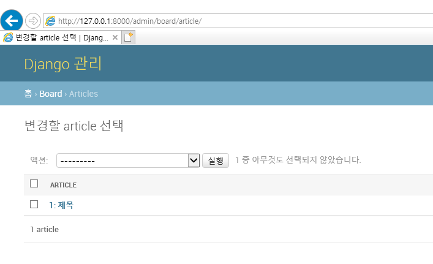
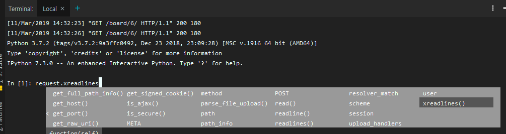

shift shift 로 file열수있음 

---

pip다운 리스트 확인   : `pip list`

`$ django-admin startapp board`

`$ pip install django-extensions ipython`


해야할일 TODO list



---

**settings.py**

```python
INSTALLED_APPS = [
    'django_extensions',
    'IPython',
    'django.contrib.admin',
    'django.contrib.auth',
    'django.contrib.contenttypes',
    'django.contrib.sessions',
    'django.contrib.messages',
    'django.contrib.staticfiles',
    'board', 
]

LANGUAGE_CODE = 'ko-kr'

TIME_ZONE = 'Asia/Seoul'

USE_I18N = True

USE_L10N = True

USE_TZ = False
```

**git bash**

```shell
student@M7027 MINGW64 ~/PycharmProjects/first_local (master)
$ touch board/urls.py
$ mkdir -p board/templates/board    # board에 templates가 없으면 만들고 만들어

# templates밑에 html파일 만들기
$ cd board/templates/board/
$ touch base.html list.html detail.html new.html edit.html
$ cd -
```

---

**first_local/urls.py**

```python
from django.contrib import admin
from django.urls import path, include

urlpatterns = [
    path('admin/', admin.site.urls),
    path('board/', include('board.urls'))
]
```


**board/urls.py**

```python
from django.urls import path
from . import views

app_name = 'board'

urlpatterns = [
    path('', views.article_list, name='article_list'),           # 글목록
    # path('new/', views.new_article, name='new_article'),         # new.html
    path('create/', views.create_article, name='create_article'),   # 글쓰기

    path('<int:article_id>/', views.article_detail, name='article_detail'),# detail.html
    path('<int:article_id>/edit', views.edit_article, name='edit_article'),# edit.html
    path('<int:article_id>/update', views.update_article, name='update_article'),# update
    path('<int:article_id>/delete', views.delete_article, name='delete_article'),# delete
]
```

---

### Model

**board/models.py**

```python
from django.db import models

# Create your models here.
class Article(models.Model):
    title = models.TextField(default='')
    content = models.TextField(default='')
    like = models.IntegerField(default=0)

    def __str__(self):
        return f'{self.id}: {self.title[:20]}'


```

**board/admin.py**

```python
from django.contrib import admin
from .models import Article
# Register your models here.

admin.site.register(Article)

```


**git bash**

```Shell
$ python manage.py makemigrations

$ python manage.py migrate

$ python manage.py createsuperuser

```


---

**board/ views.py**

```python
from django.shortcuts import render, redirect, get_object_or_404
from .models import Article
from IPython import embed

# Create your views here.
def article_list(request):
    articles = Article.objects.all()
    return render(request, 'board/list.html', {
        'articles':articles,
    })

def article_detail(request, article_id):
    # 값이 없을 때 404 error!
    article = get_object_or_404(Article, id=article_id)
    return render(request, 'board/detail.html', {
        'article':article,
    })

# def new_article(request):
#     return render(request, 'board/new.html')

def create_article(request):
    if request.method=='GET':
        return render(request,'board/new.html')
    elif request.method=='POST':
        article = Article()
        article.title = request.POST.get('title')
        article.content = request.POST.get('content')
        article.save()
        return redirect('board:article_detail', article.id)

def update_article(request, article_id):
    article = get_object_or_404(Article, id=article_id)

    if request.method=='GET':
        return render(request,'board/edit.html', {
            'article':article,
        })
    else:
        article.title = request.POST.get('title')
        article.content = request.POST.get('content')
        article.save()
        return redirect('board:article_detail', article.id)

def delete_article(request, article_id):
    # 삭제시 post만 삭제하고 list로, get요청이면 바로 list로
    if request.method == 'POST':
        article = get_object_or_404(Article, id=article_id)
        article.delete()
    return redirect('board:article_list')
```


**base.html**

```html
<!doctype html>
<html lang="en">
<head>
    <meta charset="UTF-8">
    <title>Document</title>
</head>
<body>
    
    
</body>
</html>
```


**list.html**

```html



    
        <ul>
            
                <li>
                    <a href="">
                        {{ article.title }}
                    </a>
                </li>
            
        </ul>
    

```


**detail.html**

```html



    <h1>{{article.title}}</h1>
    <p>{{ article.content }}</p>
    <p>{{ article.like }}</p>

    <a href=""><button>목록으로</button></a>
    <a href=""><button>수정</button></a>
    <a href=""><button>삭제</button></a>

```


**new.html**

```python



    <h1>New Articles</h1>
{#    <form action="" method="post">#}
    <form method="post">     {# 내 자리로 점프! #}
        
        <div>
            <label for="title">Title</label>
            <input type="text" name="title" id="title">
        </div>
        <div>
            <label for="content">Content</label>
            <textarea name="content" id="content" cols="30" rows="10"></textarea>
        </div>
        <div>
            <input type="submit">
        </div>
    </form>

```


**edit.html**

```html



    <h1>New Articles</h1>
{#    <form action="" method="post">#}
    <form method="post">     {# 내 자리로 점프! #}
        
        <div>
            <label for="title">Title</label>
            <input type="text" name="title" id="title" value="{{ article.title }}">
        </div>
        <div>
            <label for="content">Content</label>
            <textarea name="content" id="content" cols="30" rows="10">{{article.content}}</textarea>
        </div>
        <div>
            <input type="submit">
        </div>
    </form>

```

---

# 댓글

**models.py**

```python
class Comment(models.Model):
    article = models.ForeignKey(Article, on_delete=models.CASCADE)
    content = models.CharField(max_length=100)

    def __str__(self):
        return f'{self.article.title}:{self.content}'
```

`python manage.py makemigrations`

``python manage.py migrate`

**admin.py**

```python
from django.contrib import admin
from .models import Article,Comment
# Register your models here.

admin.site.register(Article)
admin.site.register(Comment)
```


**_comment.html**

```html
    <form action="" method ="POST">
        
        <label for="comment">댓글</label>
        <input type="text" name="comment" id="comment" autofocus>
    </form>

    
        <ul>
        
            <li>{{ comment.content }}</li>
            <form action="" method="post">
                
                <button type="submit">삭제</button>
            </form>
        
        </ul>

    
```

**detail.html**

```html

```

**list.html** -->  댓글 수 확인

```html
{{ article.title }} - ({{ article.comment_set.count }})
```




**views.py**

```python
from .models import Article,Comment

def article_detail(request, article_id):
    article = get_object_or_404(Article, id=article_id)
    comments = article.comment_set.all()
    return render(request, 'board/detail.html', {
        'article':article,
        'comments':comments,
    })

# 댓글부분!
def create_comment(request, article_id):
    if request.method == 'POST':
        comment = Comment()
        # 이 댓글의 글은 이 글이야
        comment.article = get_object_or_404(Article, id=article_id)
        comment.content = request.POST.get('comment')
        comment.save()
    return redirect('board:article_detail', article_id)

def delete_comment(request, article_id, comment_id):
    # article = get_object_or_404(Article, article_id)
    if request.method == 'POST':
        comment = get_object_or_404(Comment, id=comment_id)
        comment.delete()
    return redirect('board:article_detail', article_id)


```


**urls.py**

```python
urlpatterns = [
	...
    # 댓글
    path('<int:article_id>/create_comment/', views.create_comment, name='create_comment'),
    path('<int:article_id>/delete_comment/<int:comment_id>',
         views.delete_comment,
         name='delete_comment'),
]
```


---

## 서버 실행

**server 실행** :  `python manage.py runserver $IP:$PORT`

or

`ctrl+alt+r`    : python manage.py에 들어가는거임





---


## 디버깅 embed()

```python
def new_article(request):
    embed()
    return render(request, 'board/new.html')
```

브라우저

board/new하면 서버가 잠깐 멈추고,

프로젝트 서버 shell에서 변수 확인할수있음



