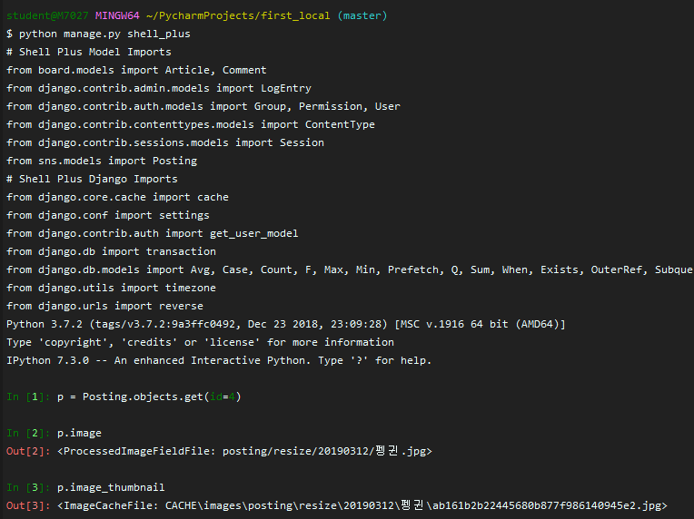
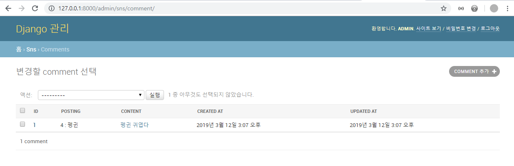
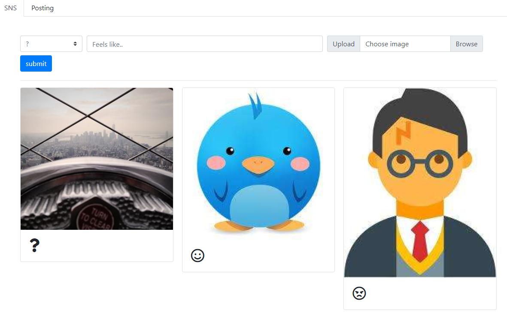
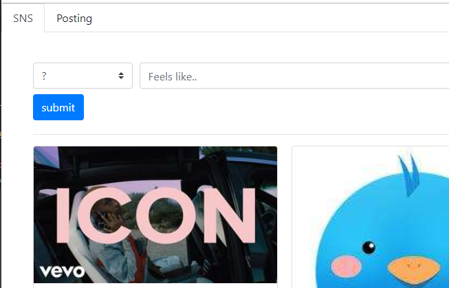
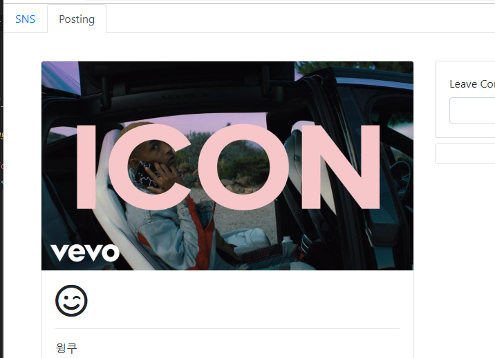

crtl+shift : 줄이동

ctrl+d : 복사

---

db 삭제하고 다시 만들기

`$ python manage.py migrate sns zero`

`$ rm -rf media/`

`$ python manage.py migrate`

---

**admin.py**를 통해 admin페이지에서 다른 컬럼도 확인하고 싶으면

```python
class PostingModelAdmin(admin.ModelAdmin):
    readonly_fields = ('created_at', 'updated_at') # 레코드 개별화면 확인
    list_display = ('id', 'content', 'created_at', 'updated_at') # 리스트에서 표시할 컬럼들
    list_display_links = ('id', 'content')  # list 목록에서 clickable할 속성

admin.site.register(Posting, PostingModelAdmin)
```


`$   pip install django-imagekit`

**settings.py**  imagekit추가

```python
INSTALLED_APPS = [
    'imagekit',
    'django_extensions',
    'IPython',
    'django.contrib.admin',
    'django.contrib.auth',
    'django.contrib.contenttypes',
    'django.contrib.sessions',
    'django.contrib.messages',
    'django.contrib.staticfiles',
    'board',
    'sns',
]
```

**sns/models.py**

```python
# ImageKit
from imagekit.models import ImageSpecField, ProcessedImageField
from imagekit.processors import ResizeToFit

    # 원본 유지 저장
    # upload URL => /media/posting/origin/그날날짜
    # image = models.ImageField(blank=True, upload_to='posting/origin/%Y%m%d')

    # resize된 이미지 저장
    image = ProcessedImageField(
        upload_to='posting/resize/%Y%m%d',
        processors=[ResizeToFit(width=960, upscale=False)], # 크면 960으로줄이는데, 작은게 들어오면 늘리진 X
        format='JPEG',
    )

    # thumbnail
    image_thumbnail = ImageSpecField(
        source='image',
        processors=[ResizeToFit(width=320, upscale=False)],
        format='JPEG',
        options={'quality':60},  # 원본 퀄리티의 60% 
    )
```

`$ python manage.py makemigrations`

`$ python manage.py migrate`

**thumbnail사진은 호출하는 순간 생성됨**



---

댓글

**sns/models.py**

```python
from django.db import models
# ImageKit
from imagekit.models import ImageSpecField, ProcessedImageField
from imagekit.processors import ResizeToFit

class Posting(models.Model):
    content = models.TextField(default='')
    icon = models.CharField(max_length=20)

    # 원본 유지 저장
    # upload URL => /media/posting/origin/그날날짜
    # image = models.ImageField(blank=True, upload_to='posting/origin/%Y%m%d')

    # resize된 이미지 저장
    image = ProcessedImageField(
        upload_to='posting/resize/%Y%m%d',
        processors=[ResizeToFit(width=960, upscale=False)], # 크면 960으로줄이는데, 작은게 들어오면 늘리진 X
        format='JPEG',
    )

    # thumbnail
    image_thumbnail = ImageSpecField(
        source='image',
        processors=[ResizeToFit(width=320, upscale=False)],
        format='JPEG',
        options={'quality':60},  # 원본 퀄리티의 60%
    )


    created_at = models.DateTimeField(auto_now_add=True)
    updated_at = models.DateTimeField(auto_now=True)

    def __str__(self):
        return f'{self.id} : {self.content[:20]}'

    def save(self,*args, **kwargs):
        super().save(*args, **kwargs)
        print()
        print(f'==== Save Posting with id : {self.id} ===')
        print(f'     content: {self.content}')
        if self.image:
            print(f'     image_size: {self.image.width}px * {self.image.height}px : {round(self.image.size / 1024)}kb')
        print('============================================')

class Comment(models.Model):
    posting = models.ForeignKey(Posting, on_delete=models.CASCADE)
    content = models.CharField(max_length=100)
    created_at = models.DateTimeField(auto_now_add=True)
    updated_at = models.DateTimeField(auto_now=True)

    def __str__(self):
        return f'{self.posting.content[:10] : {self.content[:20]}}'
```

`$ python manage.py makemigrations`

`$ python manage.py migrate`

**admin.py**

```python
from django.contrib import admin
from .models import Posting, Comment
# Register your models here.

class PostingModelAdmin(admin.ModelAdmin):
    readonly_fields = ('created_at', 'updated_at') # 레코드 개별화면 확인
    list_display = ('id', 'content', 'created_at', 'updated_at') # 리스트에서 표시할 컬럼들
    list_display_links = ('id', 'content')  # list 목록에서 clickable할 속성

admin.site.register(Posting, PostingModelAdmin)

class CommentModelAdmin(admin.ModelAdmin):
    readonly_fields = ('created_at', 'updated_at')
    list_display = ('id', 'article', 'content', 'created_at', 'updated_at')
    list_display_links = ('id', 'content')

admin.site.register(Comment, CommentModelAdmin)
```



---

**sns/urls.py**

```python
from django.urls import path
from . import views

app_name='sns'

urlpatterns = [
    path('', views.posting_list, name='posting_list'),
    path('<int:posting_id>/', views.posting_detail, name='posting_detail'),
    path('create/', views.create_posting, name='create_posting'),
    
    path('<int:posting_id>/comment/create/', views.create_comment, name='create_comment'),
]
```

**sns/views.py**

```python
from django.shortcuts import render, get_object_or_404, redirect
from .models import Posting,Comment

def posting_list(request):
    # postings = Posting.objects.all().order_by('updated_at')  # 마지막 수정이 맨뒤
    postings = Posting.objects.all().order_by('-updated_at') # 마지막 수정이 맨위,
    return render(request, 'sns/list.html', {
        'postings':postings,
    })

def posting_detail(request, posting_id):
    posting = get_object_or_404(Posting, id=posting_id)
    comments = posting.comment_set.all().order_by('-created_at')
    return render(request, 'sns/detail.html', {
        'posting':posting,
        'comments':comments,
    })

def create_posting(request):
    if request.method == 'POST':
        posting = Posting.objects.create(
            content=request.POST.get('content'),
            icon = request.POST.get('icon'),
            image=request.FILES.get('image'),
        )
        return redirect('sns:posting_detail', posting.id)
    else:
        return redirect('sns:posting_list')

def create_comment(request, posting_id):
    posting = get_object_or_404(Posting, id=posting_id)
    if request.method=='POST':
        comment = Comment()
        comment.content = request.POST.get('comment')
        comment.posting = posting
        comment.save()
    return redirect('sns:posting_detail', posting.id)
```


`touch sns/templates/sns/_forms.html`

**base.html**

```html
<!doctype html>
<html lang="en">
<head>
    <meta charset="UTF-8">
    <meta name="viewport"
          content="width=device-width, user-scalable=no, initial-scale=1.0, maximum-scale=1.0, minimum-scale=1.0">
    <meta http-equiv="X-UA-Compatible" content="ie=edge">
    <link rel="stylesheet" href="https://stackpath.bootstrapcdn.com/bootstrap/4.3.1/css/bootstrap.min.css" integrity="sha384-ggOyR0iXCbMQv3Xipma34MD+dH/1fQ784/j6cY/iJTQUOhcWr7x9JvoRxT2MZw1T" crossorigin="anonymous">
    <title>Document</title>
</head>
<body>
    {# ul.nav.nav-tabs>li.nav-item*2 #}
    <ul class="nav nav-tabs">
        <li class="nav-item">
            <a href="" class="nav-link active">SNS</a>
        </li>
        <li class="nav-item">
            <a class="nav-link" aria-disabled="true">Posting</a>
        </li>
    </ul>
    <br>

    <div class="container">
        
        
    </div>

    <script src="https://code.jquery.com/jquery-3.3.1.slim.min.js" integrity="sha384-q8i/X+965DzO0rT7abK41JStQIAqVgRVzpbzo5smXKp4YfRvH+8abtTE1Pi6jizo" crossorigin="anonymous"></script>
    <script src="https://cdnjs.cloudflare.com/ajax/libs/popper.js/1.14.7/umd/popper.min.js" integrity="sha384-UO2eT0CpHqdSJQ6hJty5KVphtPhzWj9WO1clHTMGa3JDZwrnQq4sF86dIHNDz0W1" crossorigin="anonymous"></script>
    <script src="https://stackpath.bootstrapcdn.com/bootstrap/4.3.1/js/bootstrap.min.js" integrity="sha384-JjSmVgyd0p3pXB1rRibZUAYoIIy6OrQ6VrjIEaFf/nJGzIxFDsf4x0xIM+B07jRM" crossorigin="anonymous"></script>
</body>
</html>
```

**list.html**

```html




<hr>
    
        <section class="card-columns">
            
                <article class="card mb-2">
                    <a href="">
                        
                    </a>
                    <div class="card-body">
                        <i>{{ posting.icon }}</i>
                    </div>
                </article>
            
        </section>
    

```

**detail.html**

```html



    <div class="row mt-3">
        <div class="col-12 col-md-6">
            <div class="card">
                

                <div class="card-body">
                    <i>{{ posting.icon }}</i>
                    <hr>
                    <p class="card-text">
                        {{ posting.content }}
                    </p>
                </div>
            </div>
        </div>
        {# TODO: Comment form & list #}
        <div class="col-12 col-md-6">
            <div class="card mb-2">
                <div class="card-body">
                    <form action="" method="post">
                        
                        <label for="comment">Leave Comment</label>
                        <input type="text" name="comment" id="comment" class="form-control" autofocus>
                    </form>
                </div>
            </div>
            <div class="card">
                <ul class="list-group list-group-flush">
                    
                        
                            <li class="list-group-item mb1">
                            {{ comment.id }} : {{ comment.content }}
                            </li>
                        
                    
                        <li class="list-group-item mb-1"></li>
                    
                </ul>
            </div>
        </div>
    </div>

```

**_forms.html**

```html
<header class="mt-3">
    <form action="" method="post" enctype="multipart/form-data">
        
        {# div.form-row.align-items.center #}
        <div class="form-row align-items center">
            <!-- icon select tag -->
            <div class="col-auto my-1">
                <label for="icon" class="sr-only">icon</label>
                <select name="icon" id="icon" class="custom-select mr-sm-2">
{#                    TODO: change icon value to FontAwesome icons #}
                    <option value=":)">:)</option>
                    <option value=":(">:(</option>
                    <option value=";)">;)</option>
                    <option value="?">?</option>
                </select>
            </div>

            <!-- content input tag -->
            <div class="col-sm-6 my-1">
                <label for="content" class="sr-only">content</label>
                <input type="text" name="content" id="content" class="form-control" placeholder="Feels like...">
            </div>

            <!-- image/file input tag -->
            <div class="col-sm-4 my-1 input-group">
                <div class="input-group-prepend">
                    <span class="input-group-text">
                        Upload
                    </span>
                </div>
                <div class="custom-file">
                    <label for="image" class="custom-file-label">Choose image</label>
                    <input type="file" id="image" name="image" class="custom-file-input" accept="image/*">
                </div>
            </div>

            <!--  submit button -->
            <div class="col-auto my-1">
                <button type="submit" class="btn btn-primary">submit</button>
            </div>
        </div>
    </form>
</header>
```


---

### 랜덤이미지 넣기

**list.html**

```html
<a href="">
    {#                    이미지가 없을 때 #}
    
    
    
    
    
</a>
```

**detail.html**

```html





```

---


---

**fontawesome**

**base.html**

```html
<link rel="stylesheet" href="https://use.fontawesome.com/releases/v5.7.2/css/all.css" integrity="sha384-fnmOCqbTlWIlj8LyTjo7mOUStjsKC4pOpQbqyi7RrhN7udi9RwhKkMHpvLbHG9Sr" crossorigin="anonymous">
```

**_forms.html**

```html
<select name="icon" id="icon" class="custom-select mr-sm-2">
    <option value="fas fa-question">?</option>
    <option value="far fa-smile">:)</option>
    <option value="far fa-angry">:(</option>
    <option value="far fa-smile-wink">;)</option>
    <option value="fab fa-angrycreative">angrycreative</option>
</select>
```

**sns/models.py** 수정

```python
icon = models.CharField(max_length=20, default='fas fa-question')
```

**detail.py**  17번라인 수정

```html
<i class="{{ posting.icon }}"></i>
```

**list.py** 22번라인 수정

```html
<i class="{{ posting.icon }} fa-2x"></i>
```

**db 삭제하고 다시 만들기**

`$ python manage.py migrate sns zero`

`$ rm -rf media/`

`$ python manage.py migrate`



---


---

**navbar active 효과**

**base.html**

```html
<ul class="nav nav-tabs">
    <li class="nav-item">
        <a class="nav-link " href="" >SNS</a>
    </li>
    <li class="nav-item">
        <a class="nav-link " aria-disabled="true">Posting</a>
    </li>
</ul>
```

**detail.html**

```html

    active

```

**list.html**

```html

    active

```




