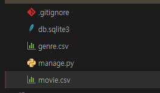
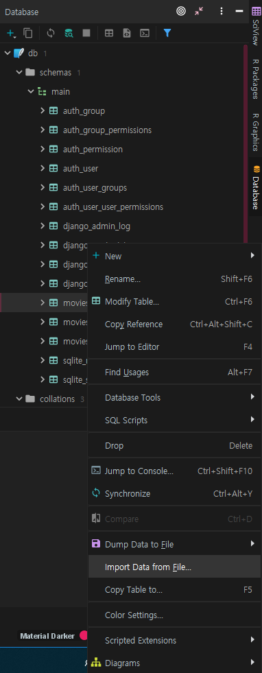
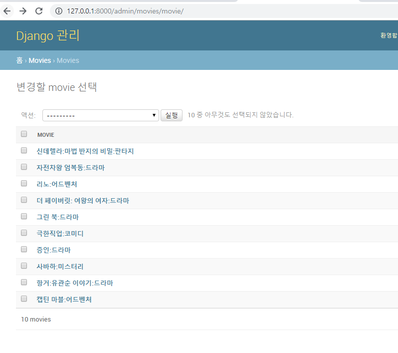

**pycharm new project**

`$ touch .gitignore`

`$ pip list`

`$ django-admin startapp movies`

`$ pip install django-extensions ipython`


`$ touch movies/urls.py`

`$ mkdir -p movies/templates/movies`

**settings.py**

```python 
INSTALLED_APPS = [
    'django.contrib.admin',
    'django.contrib.auth',
    'django.contrib.contenttypes',
    'django.contrib.sessions',
    'django.contrib.messages',
    'django.contrib.staticfiles',
    'movies',
]
LANGUAGE_CODE = 'ko-kr'

TIME_ZONE = 'Asia/Seoul'

USE_I18N = True

USE_L10N = True

USE_TZ = False
```


**database_07/urls.py**

```python 
from django.contrib import admin
from django.urls import path, include

urlpatterns = [
    path('admin/', admin.site.urls),
    path('movies/', include('movies.urls'))
]
```


**movies/urls.py**

```python
from django.urls import path
from . import views

app_name = 'movie'

urlpatterns = [
    path('', views.movie_list, name='movie_list'),
]
```


**views.py**

```python
from django.shortcuts import render, redirect, get_object_or_404
from .models import Movie, Score, Genre

# Create your views here.
def movie_list(request):
    return render(request, 'movies/list.html')


```


**models.py**

```python
from django.db import models

class Genre(models.Model):
    name = models.TextField(default='')

    def __str__(self):
        return f'{self.id}: {self.name[:20]}'

class Movie(models.Model):
    title = models.TextField(default='')
    audience = models.IntegerField(default=0)
    poster_url = models.TextField(default='')
    description = models.TextField(default='')
    genre_id = models.ForeignKey(Genre, on_delete=models.CASCADE)

    def __str__(self):
        return f'{self.title}:{self.genre_id.name}'

class Score(models.Model):
    content = models.TextField(default='')
    score = models.IntegerField(default=0)
    movie_id = models.ForeignKey(Movie, on_delete=models.CASCADE)

    def __str__(self):
        return f'{self.score}:{self.content}:{self.movie_id.title}'


```


**admin.py**

```python
from django.contrib import admin
from .models import Movie,Genre,Score
# Register your models here.

admin.site.register(Movie)
admin.site.register(Genre)
admin.site.register(Score)
```


runserver admin 페이지 확인!

### csv파일 import

csv파일 가져온 뒤





이렇게 import하면



잘들어옴!

---

**영화정보 CRUD**, 평점

**views.py**

```python
from django.shortcuts import render, redirect, get_object_or_404
from .models import Movie, Score, Genre

# Create your views here.
def movie_list(request):
    movies = Movie.objects.all()
    return render(request, 'movies/list.html', {
        'movies': movies,
    })

def movie_detail(request, movie_id):
    movie = get_object_or_404(Movie, id=movie_id)
    scores = movie.score_set.all().order_by('id')

    return render(request, 'movies/detail.html', {
        'movie': movie,
        'scores': scores,
    })

def create_movie(request):
    if request.method=='GET':
        return render(request,'movies/new.html')
    elif request.method=='POST':
        movie = Movie()
        movie.title = request.POST.get('title')
        movie.audience = request.POST.get('audience')
        movie.poster_url = request.POST.get('poster_url')
        movie.description = request.POST.get('description')
        genre_id = request.POST.get('genre_id')
        movie.genre_id = get_object_or_404(Genre, id=genre_id)
        movie.save()
        return redirect('movie:movie_detail', movie.id)

def update_movie(request, movie_id):
    movie = get_object_or_404(Movie, id=movie_id)

    if request.method=='GET':
        return render(request,'movies/edit.html', {
            'movie': movie,
        })
    else:
        movie.title = request.POST.get('title')
        movie.audience = request.POST.get('audience')
        movie.poster_url = request.POST.get('poster_url')
        movie.description = request.POST.get('description')
        genre_id = request.POST.get('genre_id')
        movie.genre_id = get_object_or_404(Genre, id=genre_id)
        movie.save()
        return redirect('movie:movie_detail', movie.id)

def delete_movie(request, movie_id):
    if request.method == 'POST':
        movie = get_object_or_404(Movie, id=movie_id)
        movie.delete()
    return redirect('movie:movie_list')

# 평점
def create_score(request, movie_id):
    if request.method == 'POST':
        score = Score()
        score.movie_id = get_object_or_404(Movie, id=movie_id)
        score.content = request.POST.get('content')
        score.score = request.POST.get('score')
        score.save()
    return redirect('movie:movie_detail', movie_id)

def delete_score(request, movie_id, score_id):
    score = get_object_or_404(Score, id=score_id)
    score.delete()
    return redirect('movie:movie_detail', movie_id)
```


**urls.py**

```python
from django.urls import path
from . import views

app_name = 'movie'

urlpatterns = [
    path('', views.movie_list, name='movie_list'),
    path('create/', views.create_movie, name='create_movie'),
    path('<int:movie_id>/', views.movie_detail, name='movie_detail'),
    path('<int:movie_id>/update/', views.update_movie, name='update_movie'),
    path('<int:movie_id>/delete/', views.delete_movie, name='delete_movie'),

    # 평점
    path('<int:movie_id>/scores/new/', views.create_score, name='create_score'),
    path('<int:movie_id>/scores/<int:score_id>/delete/',
         views.delete_score,
         name='delete_score'),
]
```

---

## HTML

**base.html**

```html
<!doctype html>
<html lang="en">
<head>
    <meta charset="UTF-8">
    <meta name="viewport"
          content="width=device-width, user-scalable=no, initial-scale=1.0, maximum-scale=1.0, minimum-scale=1.0">
    <meta http-equiv="X-UA-Compatible" content="ie=edge">
    <link rel="stylesheet" href="https://stackpath.bootstrapcdn.com/bootstrap/4.3.1/css/bootstrap.min.css" integrity="sha384-ggOyR0iXCbMQv3Xipma34MD+dH/1fQ784/j6cY/iJTQUOhcWr7x9JvoRxT2MZw1T" crossorigin="anonymous">
    <title>Document</title>
</head>
<body>
    {# ul.nav.nav-tabs>li.nav-item*2 #}
    <ul class="nav nav-tabs">
        <li class="nav-item">
            <a href="">Movie</a>
        </li>
    </ul>
    <br>

    <div class="container">
        
        
    </div>

    <script src="https://code.jquery.com/jquery-3.3.1.slim.min.js" integrity="sha384-q8i/X+965DzO0rT7abK41JStQIAqVgRVzpbzo5smXKp4YfRvH+8abtTE1Pi6jizo" crossorigin="anonymous"></script>
    <script src="https://cdnjs.cloudflare.com/ajax/libs/popper.js/1.14.7/umd/popper.min.js" integrity="sha384-UO2eT0CpHqdSJQ6hJty5KVphtPhzWj9WO1clHTMGa3JDZwrnQq4sF86dIHNDz0W1" crossorigin="anonymous"></script>
    <script src="https://stackpath.bootstrapcdn.com/bootstrap/4.3.1/js/bootstrap.min.js" integrity="sha384-JjSmVgyd0p3pXB1rRibZUAYoIIy6OrQ6VrjIEaFf/nJGzIxFDsf4x0xIM+B07jRM" crossorigin="anonymous"></script>
</body>
</html>
```

**detail.html**

```html



            <div class="card">
                <div class="card-body">
                    
                    <hr>
                    <h1> {{ movie.title }}</h1>
                    <hr>
                     <h4>관객수: {{ movie.audience }}</h4>
                    <hr>
                     {{ movie.description }}
                    <hr>
                    장르 : {{ movie.genre_id.name }}
                    <hr>

                </div>
            </div>
        <div>
            <a href=""><button class="btn btn-danger">목록으로</button></a>
            <a href=""><button class="btn btn-danger">수정</button></a>
            <form action="" method="post" style="float:left;">
                
                <button type="submit" class="btn btn-danger">삭제</button>&nbsp;
            </form>
         </div>

    <br><br>


    <div class="card mb-2">
        <div class="card-body">
            <form action="" method="post">
                
                <label for="score">score</label>
                <input type="number" min = "0" max = "10" step = "1"name="score" id="score" class="form-control" autofocus>

                <label for="content">content</label>
                <input type="text" name="content" id="content" class="form-control" autofocus>
                <input type="submit" class="btn btn-success">
            </form>
        </div>
     </div>

        <table class="table">
          <thead>
            <tr>
              <th scope="col">평점</th>
              <th scope="col">한줄평</th>
            </tr>
          </thead>
          <tbody>
          
            <tr>
              <th scope="row" width="10%"><span class="badge badge-primary badge-pill">{{ score.score }}</span></th>
              <td>{{ score.content }} <a href="" > 삭제</a></td>

            </tr>
          
          </tbody>
        </table>




```

**edit.html**

```html



    <h1>New Movie</h1>
    <form method="post">     {# 내 자리로 점프! #}
        
        <div>
            <label for="title">Title</label>
            <input type="text" name="title" id="title" value="{{ movie.title }}">
        </div>
        <div>
            <label for="audience">audience</label>
            <input type="number" name="audience" id="audience" value="{{ movie.audience }}">
        </div>
        <div>
            <label for="poster_url">poster_url</label>
            <input type="text" name="poster_url" id="poster_url" value="{{ movie.poster_url }}">
        </div>
        <div>
            <label for="genre_id">genre_id</label>
            <input type="number" name="genre_id" id="genre_id" value="{{ movie.genre_id.name }}">
        </div>
        <div>
            <label for="description">description</label>
            <textarea name="description" id="description" cols="30" rows="10">
                {{ movie.description }}
            </textarea>
        </div>
            <input type="submit" class="btn btn-success">
    </form>
    <a href=" " ><button class="btn btn-success" > 취소 </button></a>

```

**list.html**

```html



    <a href="" class="btn btn-info">새 영화 등록</a>
<hr>
    
        <section class="card-columns" style="width:60%;">
            
                <article class="card mb-4" >
                        
                    <div class="card-body">
                        <a href="">
                            <i>{{ movie.title }}</i>
                        </a>
                    </div>
                </article>
            
        </section>
    

```

**new.html**

```html



    <h1>Edit Movie</h1>
    <form method="post">     {# 내 자리로 점프! #}
        
        <div>
            <label for="title">Title</label>
            <input type="text" name="title" id="title">
        </div>
        <div>
            <label for="audience">audience</label>
            <input type="number" name="audience" id="audience">
        </div>
        <div>
            <label for="poster_url">poster_url</label>
            <input type="text" name="poster_url" id="poster_url">
        </div>
        <div>
            <label for="genre_id">genre_id</label>
            <input type="number" name="genre_id" id="genre_id">
        </div>
        <div>
            <label for="description">description</label>
            <textarea name="description" id="description" cols="30" rows="10"></textarea>
        </div>

        <div>
            <input type="submit" class="btn btn-success">
        </div>
    </form>

```

