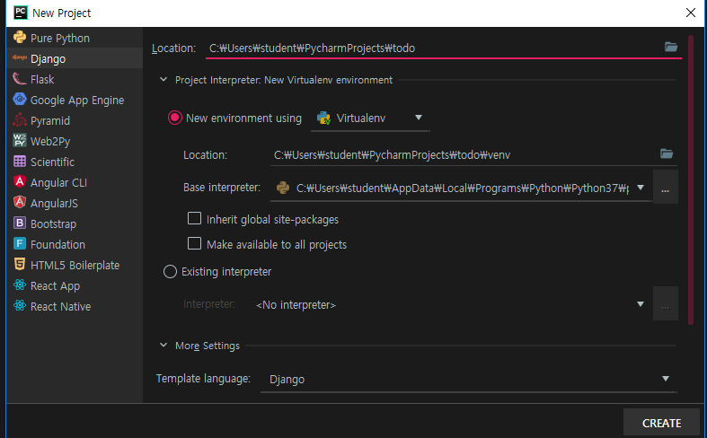
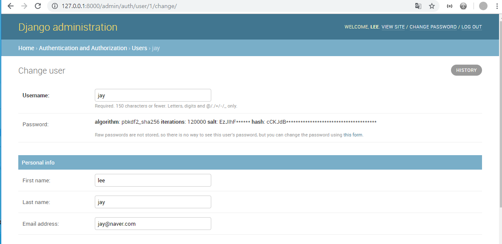
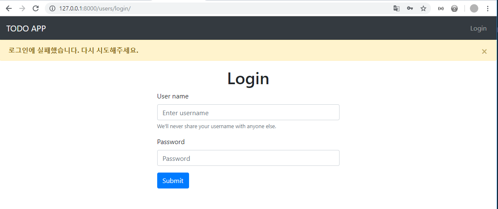
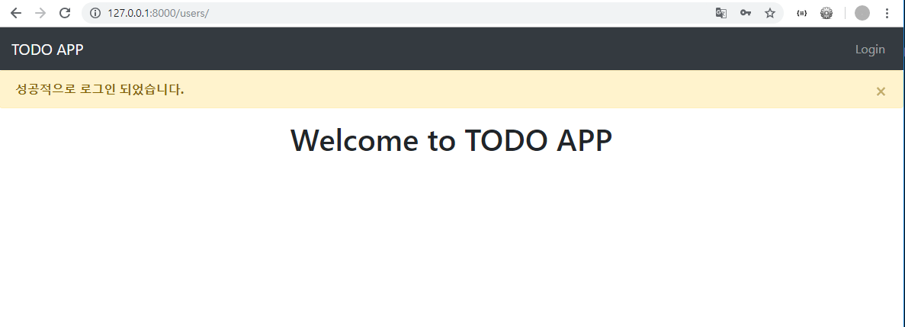
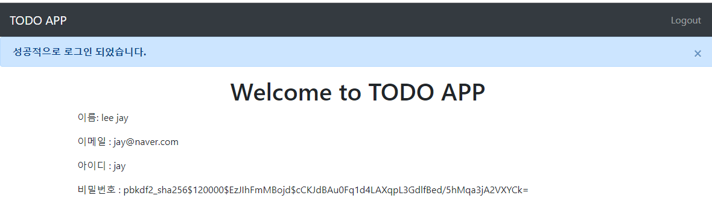
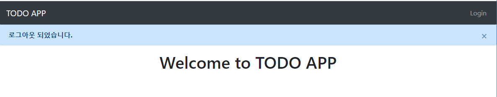

new project




`$ django-admin startapp users`

**todo/urls.py**

```python
from django.contrib import admin
from django.urls import path,include

urlpatterns = [
    path('admin/', admin.site.urls),
    path('users/', include('users.urls'))
]
```

---

왼쪽으로: mr-auto

오른쪽으로: ml-auto

**base.html**  - navbar

```html
<nav class="navbar navbar-expand-lg navbar-dark bg-dark">
    <a class="navbar-brand" href="">TODO APP</a>
    <button class="navbar-toggler" type="button" data-toggle="collapse" data-target="#navbarSupportedContent" aria-controls="navbarSupportedContent" aria-expanded="false" aria-label="Toggle navigation">
        <span class="navbar-toggler-icon"></span>
    </button>
    <div class="collapse navbar-collapse" id="navbarSupportedContent">
        <ul class="navbar-nav ml-auto">
            <li class="nav-item">
                <a class="nav-link" href="">Login</a>
            </li>
        </ul>
    </div>
</nav>

<div class="container">
    
    
</div>
```


**login.html**

```html



    <h1 class="text-center">Login</h1>
    <div style="width:50%;" class="container">
        <form method="post" action="">
         
          <div class="form-group">
            <label for="exampleInputEmail1">User name</label>
            <input type="text" class="form-control" name="username" id="username" aria-describedby="emailHelp" placeholder="Enter username">
            <small id="emailHelp" class="form-text text-muted">We'll never share your username with anyone else.</small>
          </div>
          <div class="form-group">
            <label for="exampleInputPassword1">Password</label>
            <input type="password" class="form-control" name="password" id="exampleInputPassword1" placeholder="Password">
          </div>
          <button type="submit" class="btn btn-primary">Submit</button>
        </form>
    </div>

```

**home.html**

```html



    <h1 class="text-center">Welcome to TODO APP</h1>

```

---

### **django의 login기능 활용**

`$ python manage.py migrate`

`$ python manage.py createsuperuser`

`$ python manage.py runserver`



### **암호화 알고리즘**

`Khan Academy : Cryptography 강의`

`coursera : https://www.coursera.org/learn/cryptocurrency`


**MD5 : digest하기 편함**   

https://md5decrypt.net/en/   

내용물이 변했는지, 중복됐는지에 대한 check로써는 좋음

```python
import hashlib

msg = b"hello"
result = hashlib.md5(msg)
print(result)   # <md5 HASH object @ 0x000001AAA9B72BE8>
```


**SHA256 Hash** : 16진수  

https://emn178.github.io/online-tools/sha256.html

---

### Django Login logic

https://docs.djangoproject.com/en/2.1/topics/auth/

https://docs.djangoproject.com/en/2.1/topics/auth/default/#auth-web-requests

### Cookie, Session

> **Cookie** : 사용자의 특정 정보를, server가 client local에 저장함
>
> **Session** : 사용자의 특정 정보를, server에 저장함 

**views.py**

>  **authenticate**()
>
> 사용자가 입력한 username과 password가 DB에 저장된 값과 일치하는지 확인
>
> 1. DB에 있는 사용자라는 것이 확인이 되면, 해당 유저의 정보를 리턴한다.
> 2. 확인이 되지 않으면 None값을 리턴한다.

> **Login()**
>
> : 세션에 해당유저의 정보를 저장한다.

```python
def login_user(request):
    if request.method == 'GET':
        return render(request, 'users/login.html')
    elif request.method == 'POST':
        # 만약 username, paseeword로 넘어온 값이 DB에 저장된 값과 같다면, 로그인!!!
        # 로그인 유저 검증
        username = request.POST['username']
        password = request.POST['password']
        user = authenticate(request, username=username, password=password)
        if user is not None:
            login(request, user)
            return redirect('users:home')
        else:
            return redirect('users:login')
```

### Flash 메세지

Django messages : https://docs.djangoproject.com/en/2.1/ref/contrib/messages/

- Messages
- `messages.success(request, "성공적으로 로그인 되었습니다.")`

**settings.py**

```python
MESSAGE_STORAGE = 'django.contrib.messages.storage.session.SessionStorage'
```

**views.py**

```python
from django.contrib import messages

def login_user(request):
    if request.method == 'GET':
        return render(request, 'users/login.html')
    elif request.method == 'POST':
        # 만약 username, paseeword로 넘어온 값이 DB에 저장된 값과 같다면, 로그인!!!
        # 로그인 유저 검증
        username = request.POST['username']
        password = request.POST['password']
        user = authenticate(request, username=username, password=password)
        if user is not None:
            # 로그인 성공
            login(request, user)
            messages.success(request, "성공적으로 로그인 되었습니다.")
            return redirect('users:home')
        else:
            # 로그인 실패
            messages.success(request, "로그인에 실패했습니다. 다시 시도해주세요.")
            return redirect('users:login')
```

**base.html**

```html
      
          
            <div class="alert alert-warning alert-dismissible fade show" role="alert">
              <strong>{{ message }}</strong> 
              <button type="button" class="close" data-dismiss="alert" aria-label="Close">
                <span aria-hidden="true">&times;</span>
              </button>
            </div>
          
      
```





---

### Logout

**urls.py**

```python
urlpatterns = [
    path('', views.home, name="home"),
    path('login/', views.login_user, name="login"),
    path('logout/', views.logout_user, name="logout")
]
```

**views.py**

```python
from django.contrib.auth import authenticate, login, logout

def logout_user(request):
    logout(request)
    messages.success(request, "로그아웃 되었습니다.")
    return redirect('users:home')
```

---

navbar 다르게 보이게 하기

**base.html**

``

```html
<li class="nav-item">
    
    <a class="nav-link" href="">Logout</a>
    
    <a class="nav-link" href="">Login</a>
    
</li>
```

**home.html**

```html



    <h1 class="text-center">Welcome to TODO APP</h1>
    
        <p>이름: {{ user.first_name }} {{ user.last_name }}</p>
        <p>이메일 : {{ user.email }}</p>
        <p>아이디 : {{ user.username }}</p>
        <p>비밀번호 : {{ user.password }}</p>
    

```






