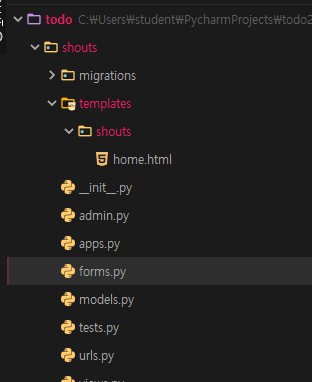
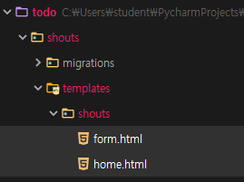
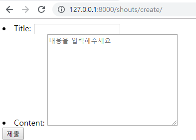

https://docs.djangoproject.com/en/2.1/ref/request-response/

## TODO 에 고객센터 앱 만들기

`$ python manage.py startapp shouts`

**models.py**

```python
from django.db import models

# Create your models here.
class Shout(models.Model):
    title = models.CharField(max_length=30)
    content = models.CharField(max_length=100)

    def __str__(self):
        return self.title + ": " + self.content
```

**urls.py**

```python
from django.urls import path
from . import views
app_name="shouts"

urlpatterns = [
    path('', views.home, name="home"),
]

메인 urls.py
urlpatterns = [
    path('admin/', admin.site.urls),
    path('users/', include('users.urls')),
    path('', include('todos.urls')),
    path('shouts/', include('shouts.urls')),
]

```


---

**사용자 입력 control**



**forms.py** https://github.com/django/django/blob/master/django/forms/forms.py

```python
from django import forms
from .models import Shout

class ShoutForm(forms.Form):
    title = forms.CharField(max_length=30)
    content = forms.CharField(max_length=100)
```

**views.py**

```python
from django.shortcuts import render, redirect
from .models import Shout
from .forms import ShoutForm

# Create your views here.
def home(request):
    # POST : 고객센터 문의 작성
    # GET : 그냥 form html 보여주기
    if request.method == "POST":
        # 빈값이 왔을 때 이렇게 하면 복잡해.
        # if title == "" or content = "":
        #     messages.success('내용 입력해주세요')
        #     return redirect()
        form = ShoutForm(request.POST)
        if form.is_valid(): #알맞은 값이면.
            # title = request.POST.get('title');  content = request.POST.get('content')
            title = form.cleaned_data.get('title')
            content = form.cleaned_data.get('content')
            Shout.objects.create(title=title, content=content)
        return redirect('shouts:home')
    else:
        form = ShoutForm()
        shouts = Shout.objects.all()
        return render(request, 'shouts/home.html', {'shouts':shouts, 'form':form})

```

**home.html**

```html



    <h1>고객센터</h1>
    {# 액션 안적으면 나한테 돌아와서 이렇게 해도 되는데 명시적으로 하는게 좋음#}
    <form action="" method="POST">
    
        {{ form.as_ul }}
        <input type="submit">
    </form>

    <hr>

    <h2>문의내용</h2>
    
        제목 : {{ shout.title }}
        내용 : {{ shout.content }}
        <br>
    
    

```

---

### ModelForm

**forms.py**

```python
from django import forms
from .models import Shout

class ShoutForm(forms.Form):
    title = forms.CharField(max_length=30)
    content = forms.CharField(max_length=100)

class ShoutModelForm(forms.ModelForm):
    class Meta:
        model = Shout
        fields = '__all__'
```

**views.py**

```python
from django.shortcuts import render, redirect
from .models import Shout
from .forms import ShoutModelForm

# Create your views here.
def home(request):
    if request.method == "POST":
        form = ShoutModelForm(request.POST)
        if form.is_valid():
            form.save()
            return redirect('shouts:home')
    else:
        form = ShoutModelForm()
        shouts = Shout.objects.all()
        return render(request, 'shouts/home.html', {'shouts':shouts, 'form':form})

```

**home.html**

```html



    <h1>고객센터</h1>
    <form action="" method="POST">
    
        {{ form.as_ul }}
        <input type="submit">
    </form>

    <hr>

    <h2>문의내용</h2>
    
        <p>제목 : {{ shout.title }}<br>
            내용 : {{ shout.content }}</p>
    
    

```

---


---

update

**urls.py**

```python
path('<int:shout_id>/update/', views.update, name="update"),
```

**home.html**

```html
..
    <h2>문의내용</h2>
    
        <p>
            제목 : {{ shout.title }}<br>
            내용 : {{ shout.content }}
            <a href="">수정</a>
            <a href="">삭제</a>
        </p>
    
...
```

**update.html**

```html
<form action="" method="POST">
    
    {{ form.as_p }}
    <input type="submit">
</form>
```

**views.py**

```python
def update(request, shout_id):
    shout = Shout.objects.get(pk=shout_id)
    if request.method == "POST": # 수정하기
        form = ShoutModelForm(request.POST, instance=shout)
        if form.is_valid():
            form.save()
        return redirect('shouts:home')
    else: # 수정 html
        form = ShoutModelForm(instance=shout)
        context = {
            'form':form
        }
        return render(request, 'shouts/update.html', context)
```

---

### create 와 update form 공유



---

**form.html**

resolver_match

```html


    
        <h1>작성 페이지</h1>
    
        <h1>수정 페이지</h1>
    
    <h1></h1>
    <form method="POST">
        
        {{ form.as_ul }}
        <input type="submit">
    </form>

```

in

```html


    
        <h1>작성 페이지</h1>
    
        <h1>수정 페이지</h1>
    
    <h1></h1>
    <form method="POST">
        
        {{ form.as_ul }}
        <input type="submit">
    </form>

```

---

**home.html**

```html



    <br>
    <h1>고객센터</h1>

    <a href="" class="btn btn-info">문의하기</a>

    <hr>

    <h2>문의내용</h2>
    
        <p>
            제목 : {{ shout.title }}<br>
            내용 : {{ shout.content }}
            <a href="">수정</a>
            <a href="">삭제</a>
        </p>
    
    

```

**urls.py**

```python
path('create/', views.create, name="create"),
```

**views.py**

```python
from django.shortcuts import render, redirect
from .models import Shout
from .forms import ShoutModelForm

# Create your views here.
def home(request):
    shouts = Shout.objects.all()
    return render(request, 'shouts/home.html', {'shouts':shouts})

def create(request):
    if request.method == "POST":
        form = ShoutModelForm(request.POST)
        if form.is_valid():
            form.save()
            return redirect('shouts:home')
    else:
        form = ShoutModelForm()
        return render(request, 'shouts/form.html', {"form":form})


def update(request, shout_id):
    shout = Shout.objects.get(pk=shout_id)
    if request.method == "POST": # 수정하기
        form = ShoutModelForm(request.POST, instance=shout)
        if form.is_valid():
            form.save()
        return redirect('shouts:home')
    else: # 수정 html
        form = ShoutModelForm(instance=shout)
        context = {
            'form':form
        }
        return render(request, 'shouts/form.html', context)

```


---

**form 태그 속성**

**forms.py**

```python
class ShoutModelForm(forms.ModelForm):
    class Meta:
        model = Shout
        fields = '__all__'
        widgets = {
            'content':forms.Textarea(attrs={
                'class':'form-control',
                'placeholder':'내용을 입력해주세요',
            })
        }
```




