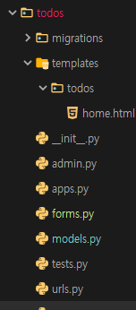

### **1:N 관계 ModelsForm**



**forms.py**

```python
from django import forms
from .models import Todo

class TodoForm(forms.ModelForm):
    class Meta:
        model = Todo
        fields = "__all__"

# class ScoreForm(forms.ModelForm):
#     class Meta:
#         model = Score
#         fields = "__all__"
```


**views.py**

```python
from .forms import TodoForm

def create(request):
    # todos 작성하기
    # Todo.objects.create(content=request.POST.get('content'), user_id=request.user.id)
    user = request.user
    todo = Todo(user=user)
    form = TodoForm(request.POST, instance=todo)
    if form.is_valid():
        form.save()
    return redirect('todos:home')
```