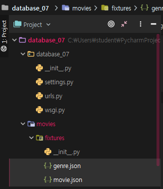
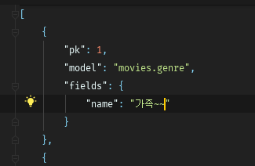
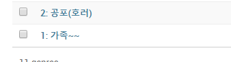

### Data Seed

> 초기 데이터 지밥을 사용하여 데이터베이스를 채우는 프로세스
>
> `/.json` 데이터를 movies/fixtures/ 로



**movies/models.py**

```python
from django.db import models

class Genre(models.Model):
    name = models.TextField(default='')

    def __str__(self):
        return f'{self.id}: {self.name[:20]}'

class Movie(models.Model):
    title = models.TextField(default='')
    audience = models.IntegerField(default=0)
    poster_url = models.TextField(default='')
    description = models.TextField(default='')
    genre_id = models.ForeignKey(Genre, on_delete=models.CASCADE)

    def __str__(self):
        return f'{self.title}:{self.genre_id.name}'

class Score(models.Model):
    content = models.TextField(default='')
    score = models.IntegerField(default=0)
    movie_id = models.ForeignKey(Movie, on_delete=models.CASCADE)

    def __str__(self):
        return f'{self.score}:{self.content}:{self.movie_id.title}'
```

**genre.json**   "model" 을 정의 해줘야 함

```json
[
    {
        "pk": 1,
        "model": "movies.genre",
        "fields": {
            "name": "가족~~"
        }
    },
    {
        "pk": 2,
        "model": "movies.genre",
        "fields": {
            "name": "공포(호러)"
        }
    }
]
```

**movie.json**

```json
[
    {
        "pk": 1,
        "model": "movies.movie",
        "fields": {
            "title": "캡틴 마블",
            "audience": 3035808,
            "poster_url": "... .jpg",
            "description": "1995년, 공군 파일럿 시절의 기억을 잃고...",
            "genre_id": 9
        }
    }
]
```

---

Seed Data 넣기

`$ python manage.py loaddata genre.json`

`$ python manage.py loaddata mpvie.json`

---


### /admin에서 확인

>  genre.json
>
> 
>
> /admin
>
> 


---

### form radio box

**new.html**

```html
'''
<div class="radio">
    <label for="genre_id">genre</label>
    
    <input type="radio" name="genre_id" id="genre_id" value="{{ g.id }}">{{ g.name }}
    
</div>
'''
```

**edit.html **    

```html
<div class="radio">
    <label for="genre_id">genre</label>
    
    
    <input type="radio" name="genre_id" id="genre_id" value="{{ g.id }}" checked>{{ g.name }}
    
    <input type="radio" name="genre_id" id="genre_id" value="{{ g.id }}">{{ g.name }}
    
    
</div>
```


