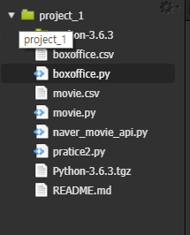

```python
import requests
import json
import os 
from pprint import pprint as pp
import csv
date2 = ["20181111","20181118","20181125","20181202","20181209","20181216","20181223","20181230","20190106","20190113"]
movie_key = os.getenv('MOVIE_TOKEN')
url = 'http://www.kobis.or.kr/kobisopenapi/webservice/rest/boxoffice/searchWeeklyBoxOfficeList.json'
movie_list = []
for targetDt in date2 : 
    params = {
        'key': movie_key,
        'targetDt':targetDt,
        'weekGb':"0"
    }
    res = requests.get(url, params=params).text
    document = json.loads(res)
    movie_info = document['boxOfficeResult']['weeklyBoxOfficeList']
    for i in movie_info:
        b = {"영화대표코드" : i["movieCd"], "영화명" : i["movieNm"], 
              "해당일누적관객수": int(i["audiAcc"]), "해당일" : document['boxOfficeResult']['showRange'].split("~")[1]}
        movie_list.append(b)

check = []    

# 누적 관객 수로 정렬
movie_list = sorted(movie_list, key=lambda k: k['해당일누적관객수']) 

with open('boxoffice.csv','a') as f:
    field = ("영화대표코드", "영화명", "해당일누적관객수", "해당일")
    writer = csv.DictWriter(f, fieldnames=field)
    writer.writeheader()
    
    for movie in movie_list:
        if(movie["영화명"] not in check):
            writer.writerow(movie)
            check.append(movie["영화명"])
        #### 여기에 관객수 더 크면 넣어주는 코드 작성해야해!!!!!

# 영화 대표 코드 movieCd , 영화명 movieNm, 해당일 누적관색수 audiAcc, 해당일 showRange
# 해당일 누적관객수 중복 -> 최신정보 반영
```

**boxoffice.py**

---

---


박스오피스.csv

```
영화대표코드,영화명,해당일누적관객수,해당일
20189869,해피 투게더,15745,20181118
20182966,투 프렌즈,20419,20181202
20182693,구스범스: 몬스터의 역습,21400,20181111
20182669,툴리,24325,20181125
20183007,거미줄에 걸린 소녀,25172,20181202
20186822,너의 췌장을 먹고 싶어,33882,20181118
20182935,출국,36975,20181118
20183073,베일리 어게인,45254,20181125
20179006,여곡성,55997,20181111
20184481,성난황소,78606,20181118
20183375,극장판 포켓몬스터 모두의 이야기,86997,20181223
20182082,부탁 하나만 들어줘,87501,20181216
20184574,그린 북,99569,20190113
20175547,스윙키즈,100989,20181216
20181171,바울,108996,20181111
20183479,극장판 짱구는 못말려: 아뵤! 쿵후 보이즈 ~라면 대란~,112539,20181223
20183745,런닝맨 : 풀룰루의 역습,122873,20181209
20184105,말모이,152181,20190106
20184187,언니,172340,20190106
20182421,그린치,199383,20181223
20178825,모털 엔진,203372,20181209
20181404,벽 속에 숨은 마법시계,211233,20181111
20181905,후드,227258,20181202
20189843,호두까기 인형과 4개의 왕국,229936,20181209
20183050,번 더 스테이지: 더 무비,235068,20181118
20010291,해리포터와 마법사의 돌,259733,20181111
20183915,극장판 공룡메카드: 타이니소어의 섬,289873,20190113
20183785,점박이 한반도의 공룡2 : 새로운 낙원,333626,20181230
20170513,동네사람들,352215,20181111
20183238,스파이더맨: 뉴 유니버스,390327,20181216
20180523,스타 이즈 본,458917,20181111
20189463,주먹왕 랄프 2: 인터넷 속으로,758353,20190106
20176251,내안의 그놈,765383,20190113
20179230,도어락,827565,20181209
20170658,PMC: 더 벙커,1013905,20181230
20186281,범블비,1056143,20181230
20168773,마약왕,1210192,20181223
20180290,아쿠아맨,1250061,20181223
20176814,신비한 동물들과 그린델왈드의 범죄,1519853,20181118
20177552,국가부도의 날,1571881,20181202
20174981,창궐,1588443,20181111
20185485,보헤미안 랩소디,1843165,20181111
20177538,완벽한 타인,3375748,20181111
```


---

---

**movie.py**

```python
import requests
import json
import os 
from pprint import pprint as pp
import csv
movie_code = []
with open('boxoffice.csv', newline='') as f:
    reader = csv.reader(f)
    for row in reader:
        movie_code.append(row[0])

movie_key = os.getenv('MOVIE_TOKEN')
url = 'http://www.kobis.or.kr/kobisopenapi/webservice/rest/movie/searchMovieInfo.json'
movie_info_list = []
for i in range(1, len(movie_code)):
    params = {
        'key': movie_key,
        'movieCd': movie_code[i]
    }
    res = requests.get(url, params=params).text
    document = json.loads(res)
    document = document["movieInfoResult"]["movieInfo"]
    pp(document)


#     b = {
#         "영화대표코드" : movie_code[i],
#         "영화명(국문)" : document["movieNm"],
#         "영화명(영문)" : document["movieNmEn"],
#         "영화명(원문)" : document["movieNmOg"],
#         "개봉연도" : document["openDt"],
#         "상연시간" : document["movieNm"],
#         "장르" : document["genres"][0]["genreNm"],
#         "감독명" : document["directors"][0]["peopleNm"],
#         "관람등급" : document["audits"][0]["watchGradeNm"]
#         # "배우1" : document["actors"][0]["peopleNm"],
#         # "배우2" : document["actors"][1]["peopleNm"],
#         # "배우3" : document["actors"][2]["peopleNm"]
#     }
#     movie_info_list.append(b)
# pp(movie_info_list)


#----------------------------------------------------------------------------
# params = {
#     'key': movie_key,
#     'movieCd': "20189463"
# }
# res = requests.get(url, params=params).text
# document = json.loads(res)
# document = document["movieInfoResult"]["movieInfo"]   
# print(document["movieNm"])
# print(document["movieNmEn"])
# print(document["movieNmOg"])
# print(document["openDt"])
# print(document["genres"][0]["genreNm"])
# print(document["directors"][0]["peopleNm"])
# print(document["audits"][0]["watchGradeNm"])

# print(document["actors"][0]["peopleNm"])
# print(document["actors"][1]["peopleNm"])
# print(document["actors"][2]["peopleNm"])
#----------------------------------------------------------------------------


# 영화 대표 코드를 가져와(boxoffice.csv)
# 영화대표코드, 영화명(국문),(영문),(원문),개봉연도,상연시간,장르,감독명,관람등급,배우1,배우2,배우3


```


**네이버.py**

```python
import requests
import json
import os 
import urllib

naver_id = os.getenv('NAVER_MOVIE_ID')
naver_pw = os.getenv('NAVER_MOVIE_PW')

encText = "말모이"

url = "https://openapi.naver.com/v1/search/movie.xml?query=" + encText

headers = {
    'X-Naver-Client-Id': naver_id ,
    'X-Naver-Client-Secret': naver_pw
}

res = requests.post(url, headers=headers)

print(res)


```

