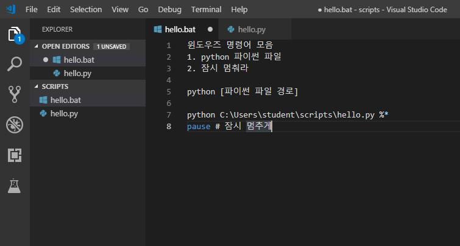
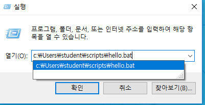
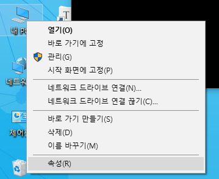
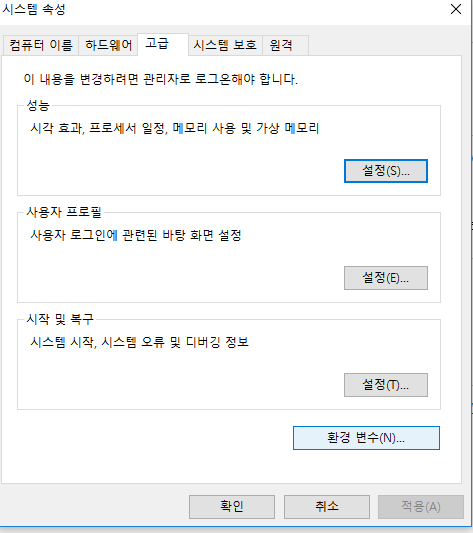
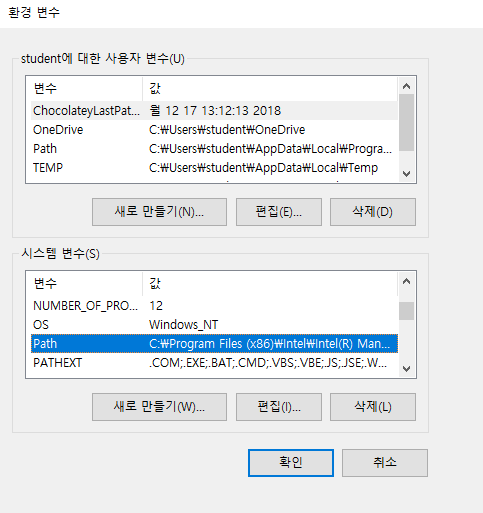
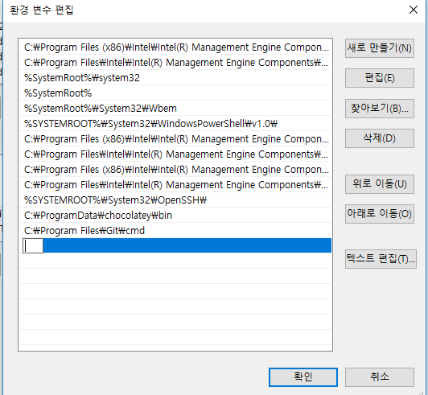
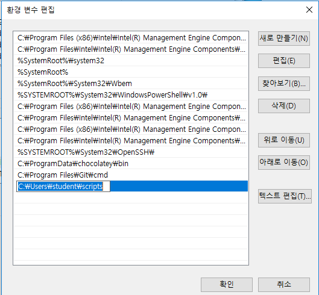
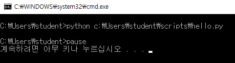

# 2019-01-14 - batch script

> >  **batch script**
>
> 



---

**hello.bat**

```bat
:: 윈도우즈 커맨드들을 모아 한번에 실행해주는 스크립트 
python c:\Users\student\scripts\hello.py %*
pause
```




> ---
>
> **경로 줄이기 -> 환경변수에 넣기**
>
> ---

### 환경변수설정






​								**>> 환경변수 <<**



​								**>> 편집  <<**




​								**>> 새로만들기<<**



​								**>> 그 경로 추가 <<**

---

​						이제 윈도우 + R 에 bat파일 이름만 치면 됨

---

**hello.py**

```python
# 자동화 할 기능들을 파이썬으로 구현.
import webbrowser

url = "https://search.naver.com/search.naver?sm=top_hty&fbm=1&ie=utf8&query=%EB%AA%A8%EB%AA%A8%EB%9E%9C%EB%93%9C+%EC%97%B0%EC%9A%B0"
webbrowser.open(url)
```


​								**자동으로 창이 뜸 !**  

---

**bello.bat**

```bat
:: 윈도우즈 커맨드들을 모아 한번에 실행해주는 스크립트 
@python c:\Users\student\scripts\hello.py %*
@pause
:: @를 넣으면 깔끔하게 바뀜

:: %*는 뭐지? 
:: --> arguments, 모든 파라미터는 %* 를 의미
```



​					▼▼▼▼▼▼▼▼▼▼▼▼▼▼▼▼▼▼▼▼▼▼▼▼▼


---


