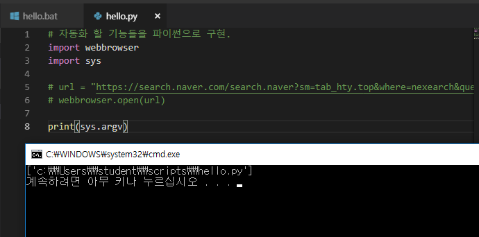
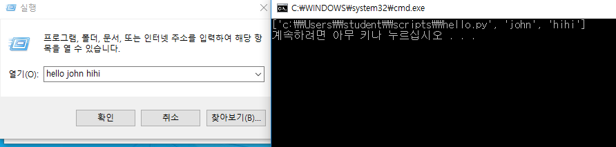
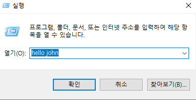

# 2019-01-14 - batch script 2



**sys.argv : 우리가 입력한 명령어들이 list로 다 들어가 있음**

**ex) hello john** 

**["hello파일 전체 경로", "john"]**



---




---

---

**google.bat**

```bat
:: 입력 받은 명령어는 google
:: 입력 > google  검색어
:: 결과 > 검색어의 구글 검색 결과를 브라우저로 띄워주는 스크립트 
@python c:\Users\student\scripts\google.py %*
@pause 
```

**google.py**

```python
import webbrowser
import sys

url = "https://www.google.com/search?q="
keyword = sys.argv[1]
webbrowser.open(url+keyword)

```


---

---


