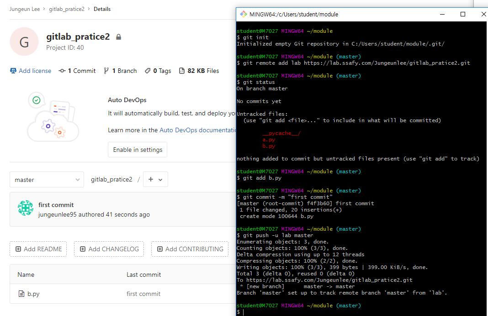

# 2019-01-14 - 4 GitLab

github원격 저장소(remote)        **origin** 

​		▼

gitlab원격 저장소(remote)          **lab**


---

---


​								>> **new project** <<


```gitbash
$ git remote add lab(별명) 주소
```


> 둘 다 업로드 하려면
>
> 


---

## git lab git init




