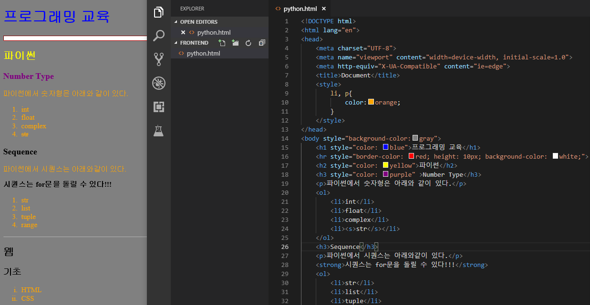
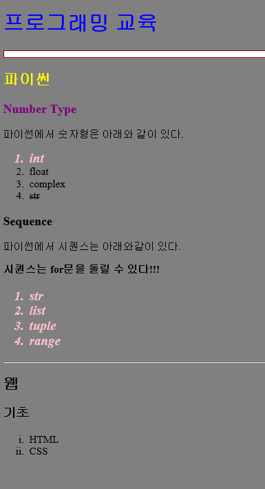
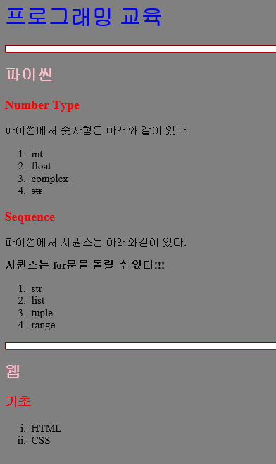

# 2019-01-21 3 frontend - css

### html, css 문서 정리 페이지

**poiemweb**    :  https://poiemaweb.com/

---

---

### **★ cascading** https://poiemaweb.com/css3-inheritance-cascading

요소는 하나 이상의 CSS 선언에 영향을 받을 수 있다. 이때 충돌을 피하기 위해 **CSS 적용 우선순위**가 필요한데 이를 **캐스캐이딩(Cascading Order)**이라고 한다.

캐스캐이딩에는 다음과 같이 세가지 규칙이 있다.

- 중요도

  CSS가 **어디에 선언 되었는지**에 따라서 우선순위가 달라진다.

- 명시도

  대상을 **명확하게 특정**할수록 명시도가 높아지고 우선순위가 높아진다.

- 선언순서

  **선언된 순서**에 따라 우선 순위가 적용된다. 즉, 나중에 선언된 스타일이 우선 적용된다.

  

---



---

**css  클래스**

```html
    <style>
        .salmon{
            color: pink;
            font-size : 20px;
            font-style : italic;
            font-family: 'Times New Roman', Times, serif;
            font-weight : bold;
        }
    </style>
...
    <ol>
        <li class="salmon">int</li>
        <li>float</li>
        <li>complex</li>
        <li><s>str</s></li>
    </ol>
...
    <ol class="salmon">
        <li>str</li>
        <li>list</li>
        <li>tuple</li>
        <li>range</li>
    </ol>
...
```




---

파일 분리

**style.css**

```css
.salmon{
    color: pink;
    font-size : 20px;
    font-style : italic;
    font-family: 'Times New Roman', Times, serif;
    font-weight : bold;
}

body{
    background-color: gray;
}

h1{
    color: blue;
}

h2{
    color: pink;
}

h3{
    color: red;
}

h4{
    color: green;
}

hr{
    border-color: red; 
    height: 10px; 
    background-color: #FFFFFF; /* ->흰색 */
}


```


**python.html**  -> link

```python
<!DOCTYPE html>
<html lang="en">
<head>
    <meta charset="UTF-8">
    <meta name="viewport" content="width=device-width, initial-scale=1.0">
    <meta http-equiv="X-UA-Compatible" content="ie=edge">
    <title>Document</title>

    <link rel="stylesheet" href="style.css">

</head>
<body>
    <h1>프로그래밍 교육</h1>
    <hr>
    <h2>파이썬</h2>
    <h3>Number Type</h3>
    <p>파이썬에서 숫자형은 아래와 같이 있다.</p>
    <ol>
        <li>int</li>
        <li>float</li>
        <li>complex</li>
        <li><s>str</s></li>
    </ol>
    <h3>Sequence</h3>
    <p>파이썬에서 시퀀스는 아래와같이 있다.</p>
    <strong>시퀀스는 for문을 돌릴 수 있다!!!</strong>
    <ol>
        <li>str</li>
        <li>list</li>
        <li>tuple</li>
        <li>range</li>
    </ol>
    <hr>
    <h2>웹</h2>
    <h3>기초</h3>
    <ul style="list-style-type: lower-roman;">
        <li>HTML</li>
        <li>CSS</li>
    </ul>

</body>
</html>
```




