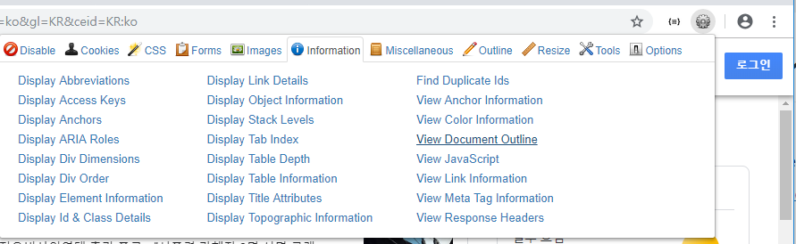
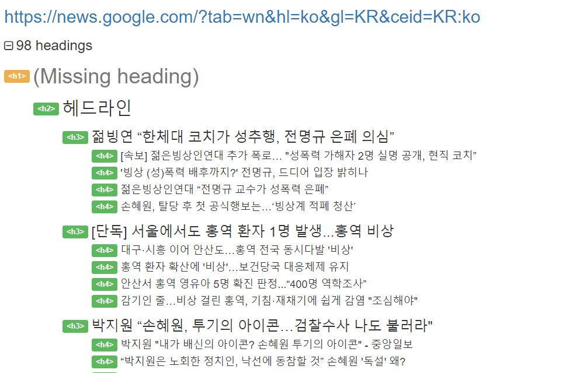
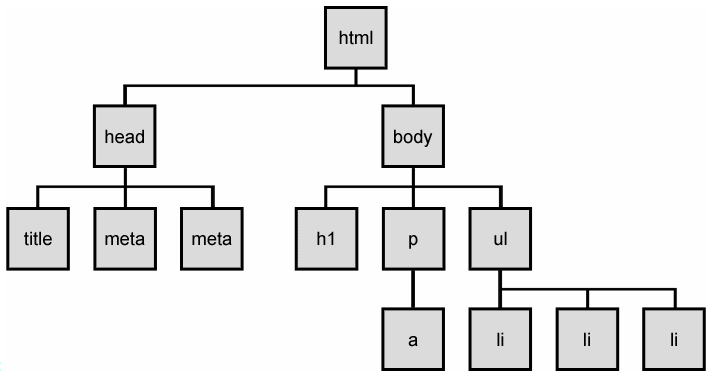
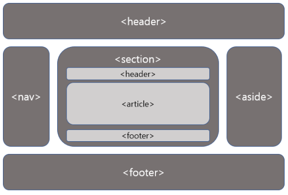
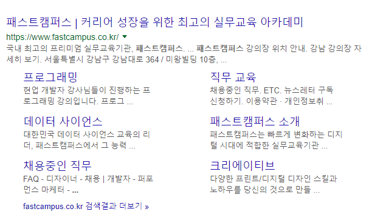
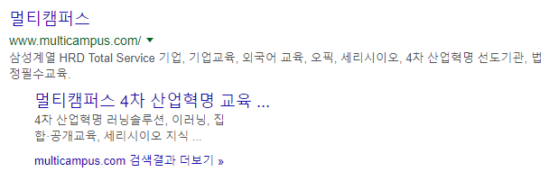

# 2019-01-21 1 Web

- **json viewer 깔기**

- **web developer extension (크롬 확장팩 다운)**

  - > https://chrome.google.com/webstore/detail/web-developer/bfbameneiokkgbdmiekhjnmfkcnldhhm?hl=ko

- **W3C = 웹표준**

- **mozilla - https://developer.mozilla.org/ko/**
- **검색엔진최적화(SEO)**  https://www.twinword.co.kr/blog/search-engine-optimization-guide/

---

---



▼▼▼▼▼▼▼▼▼▼▼▼▼▼▼▼▼▼▼▼▼▼▼▼▼▼▼▼▼▼▼▼▼▼▼▼▼▼▼▼




---

---

### HTTP, HTTPS

- **HTTP**

```
Http는 이런 HTML 같은 문서를 웹 브라우저가 웹 서버에 요청하는 프로토콜이다. 
프로토콜이라는 것은 일종의 대화 규칙이다. 

우리가 폰뱅킹할 때를 보면 지정된 코드를 누르면 정해진 응답이 온다. 그런 것이다. 
이게 없다면 웹 서버는 웹 브라우저가 무슨 페이지를 달라고 하는 건지도 모를 것이고, 
웹 브라우저도 웹 서버가 무슨 페이지를 보내는 건지 알 수가 없다. 

Http도 그냥 텍스트 교환일 뿐이다. 복잡한 바이너리 데이터가 아니라 그냥 텍스트 메시지를 주고 받는다. 물론 그 텍스트 메시지 안에 HTML 페이지도 들어 있다. 텍스트이기 때문에 만약 내가 있는 네트워크 안에서 누가 그 신호를 가로채어 본다면 내용이 그대로 보이게 된다. 만약 내가 메일을 읽고 있는데 누가 그 신호를 가로챈다면 메일 내용을 읽을 수 있을 것이다.
```

- **HTTPS**

```
Https는 http하고 거의 같지만 모든 통신 내용을 암호화하는 것이 다르다. 
사실 s가 secure socket, 즉 안전한 통신망을 뜻한다. 
우리는 파일에 암호를 많이 걸어 봤다. 어떤 키를 설정해서 걸면 나중에 풀 때에도 그걸 입력해 푸는 것이다. 키라는 것은 암호화를 푸는 암호 즉 패스워드같은 것이다. 웹 서버가 키 하나를 정해서 페이지를 암호화해서 사용자의 웹 브라우저로 보내고 웹 브라우저는 그 키를 이용해서 페이지를 복원한다... 이러면 좋겠지만 이렇게 간단하지 않다. 웹 서버는 하나이지만 사용자는 불특정 다수이다. 

그런데 키를 사용자들에게 줘 버리면 아무나 암호화를 풀 수 있게 된다. 영희에게 갈 페이지를 철수도 풀어서 볼 수 있게 되는데, 이러면 암호화의 효과가 없다.

 즉, 페이지 암호화 키가 그 페이지를 보는 특정 사용자에게만 알려져야 한다. 
 어떻게 이렇게 할 수 있을까? 이것이 바로 https 프로토콜이 하는 것이다. 

위에서 말한 암호화 방식을 사용하되, 그 키를 다시 공개 키로 암호화하고 인증하는 것이다. 공개 키는 쉽게 말해서 데이터를 암호화하는데 키가 두 개 필요하다는 것이다. 

암호화를 푸는 데에는 그 두 개 중 하나의 키만 있으면 된다. (수학적으로 로그 지수를 찾는 것이 어려운 문제에 기초하고 있다. 이렇게 자세한 것까지 알고 싶은 사람은 없겠지만.) 

이게 무슨 뜻일까? 

 옥션 사이트에서는 A,B라는 키를 가지고 있다. 그리고 이 B라는 키만 사용자들에게 알려 준다. 그리고 옥션 사이트에 웹 브라우저가 연결을 시도할 때, 파일 암호화 키를 이 A,B 키로 암호화해서 보내 준다. 그러면 사용자들은 B라는 키로 데이터를 풀어 볼 수 있다. A는 옥션 관리자 말고는 아무도 모르기 때문에, B만 알아서는 옥션과 똑같이 암호화를 할 수 없다. 즉 사용자는 B로 풀어 봐서 풀어지면 이 데이터는 A키를 아는 옥션 관리자가 암호화한 것이라는 걸 알 수 있는 것이다. 

http 프로토콜의 경우 중간에서 네트워크 데이터를 가로채어서 마치 자기가 옥션 사이트인 것처럼 해서 가짜 페이지를 보낼 수도 있다. 하지만 https의 경우에는 A키를 모르기 때문에 중간에서 누가 그렇게 할 수가 없다. 이렇게 해서 반대편이 옥션이라는 것을 우리는 믿을 수 있다.

   이렇게 믿을 수 있으면 IE같은 브라우저에서는 주소 창의 색을 다르게 해서 안전하다고 알려 준다. 이렇게 해서 웹 서버와 사용자가 교환한 키로 전체 이후로는 HTML을 암호화해서 교환하는 것이다. 이렇게 되면 중간에서 웹 페이지를 누가 가로채어도 내용을 전혀 읽을 수 없다. 사실 시간이 주어진다면 암호화를 풀 수도 있다. 예를 들어 1024비트 암호화를 사용한다면 암호 키가 1024비트, 즉 2의 1024승이라는 것이다. 암호를 계산해서 푸는 방법은 없다 (있다면 그런 암호화는 폐기된다). 키를 모르고 암호화를 푼다는 것은 모든 키를 하나씩 다 대입해서 풀릴 때까지 해 보는 것이다. 그러면 위의 경우 평균적으로 2의 512승 번을 해 봐야 한다. 2의 512승과 2 x 512는 차원이 다르다. 2의 20승만 해도 백 만이 넘는다. 아무리 빠른 컴퓨터로 대입해도 아마 몇 천 년은 해야 할 것이다. 그래서 안전한 것이다.
```


>그러면 https가 안전한데 다 https를 쓰지 http를 뭐하러 쓰느냐고 할 것이다. https 암호화를 하려면 **웹 서버에 부하가** 생기고, 위에서 말한 B가 그 서버의 인증서가 되는데, 이것은 Verisign 같은 업체에서 비싼 돈을 주고 사야하므로, 특히 우리 나라 웹 사이트들은 잘 쓰지 않는다. 하지만 외국 금융 사이트에서는 https는 필수이다. 또 http는 비연결형으로 웹 페이지를 보는 중 인터넷 연결이 끊겼다가 다시 연결되어도 페이지를 계속 볼 수 있지만 https의 경우에는 소켓 (데이터를 주고 받는 경로) 자체에서 인증을 하기 때문에 인터넷 연결이 끊기면 소켓도 끊어져서 다시 https 인증을 해야 한다. 그래서 시간이 또 걸린다.
>
>   그래서 아무나 봐도 상관 없는 페이지는 http로, 남에게 보이면 안 되는 금융 정보나 메일 등 중요한 것은 https로 하는 것이다. GMail은 https를 지원한다. 다른 메일을 사용하는 사람은 보안 문제를 좀 더 생각해 보자


---

---

**dom tree**



---

---

**시맨틱태그**




---

---

**검색엔진최적화**





**--> 차이가 있지  ==> 태그들이 중심으로 가기 때문에 태그를 잘 적어야 검색엔진이 좋게 나옴!**

**==> h1태그는 페이지당 하나**


---

---


