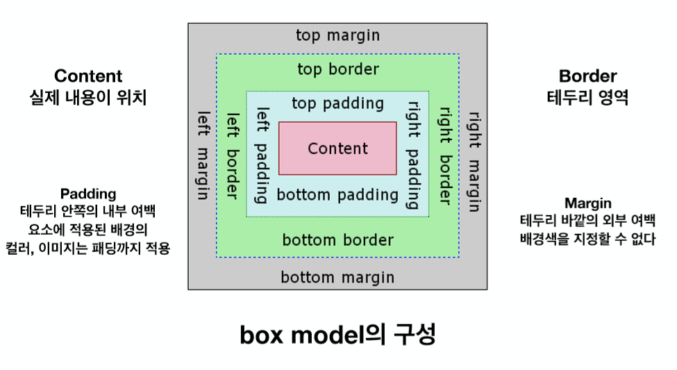
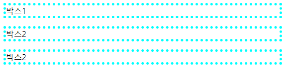
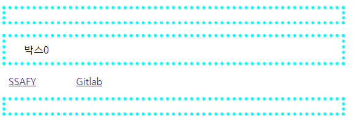
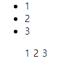
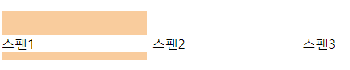
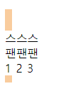

# 2019-01-22 1 CSS

> 


---

### google font

https://fonts.google.com/?sort=popularity&selection.family=Anton

---


px, em, rem

em : 배수를 나타냄


---

**box.html**

### CSS margin과 padding 한줄에 적을 때 순서
> margin: 10px 20px 15px 5px;
>
> 이때, 순서는 상우하좌 . 시계방향으로 

> 상하의 margin 이 같고, 좌우의 margin 이 같을 때
> margin: 10px 5px;

> 셋째. 좌우는 같은데, 상하가 다를 때
> margin: 10px 5px 25px;
> 이때, 처음나오는 10px는 margin-top 의 값이고, 마지막에 나오는 25px는 margin-bottom이고 
> 가운데, 5px 가 좌우 마진

**borderm padding의 경우도 마찬가지**

> **정리하면, 아래 4가지.**
> **margin: [margin-top] [margin-right] [margin-bottom] [margin-left];**
> **margin: [margin-top] [margin-left = margin-right] [margin-bottom];**
> **margin: [margin-top=margin-bottom] [margin-left = margin-right];**
> **margin: [margin-top = margin-bottom = margin-left = margin-right];**

---

**border의 경우 항상 스타일과 width(간단히 border)를 같이 써줘야함**

```html
p {
    margin: 16px 20px;
    border: 5px;
    border-style:solid;
}

/*이렇게 한번에 정의 해도 됨*/
p {
    margin: 16px 20px;
    border: 5px dotted aqua;
}
```



---

---

**p태그 안에 p태그 넣기 ㄴㄴㄴ**

```html
    <p> 
        <p>박스0</p>
        <a href="https://edu.ssafy.com">SSAFY</a>
        <a href="https://lab.ssafy.com/users/sign_in">Gitlab</a>
    </p>
```

>

---> <p></p>    <p>박스0</p>   사피 깃랩    <p></p>

**style**

```html
a {
    margin: 20px;
    padding: 10px;
}
```

--> a태그는 margin 좌우만 적용, 상하는 안됨


---

**inline**

```html
    <ul>
        <li>1</li>
        <li>2</li>
        <li>3</li>
    </ul>
    <ul style="display: inline;">
        <li style="display: inline;">1</li>
        <li style="display: inline;">2</li>
        <li style="display: inline;">3</li>
    </ul>
```



---

**span**

```html
span{
    display: inline-block;
    margin-top: 30px;
    margin-bottom: 10px;
    width: 30%;
    height: 20%;
}
  <span>스팬1</span> <span>스팬2</span> <span>스팬3</span> 
```



**span**

```html
span{
    display: inline-block;
    margin-top: 30px;
    margin-bottom: 10px;
    width: 10px;
    height: 20%;
}
  <span>스팬1</span> <span>스팬2</span> <span>스팬3</span> 
```



---

### **None -> 공간조차 사라짐**

### **visibility:hidden; -> 공간은 있음, 안보이게 하는 것 뿐** 

---

