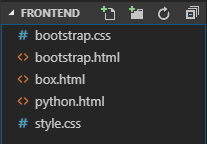
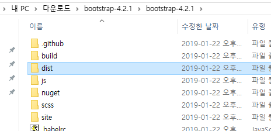
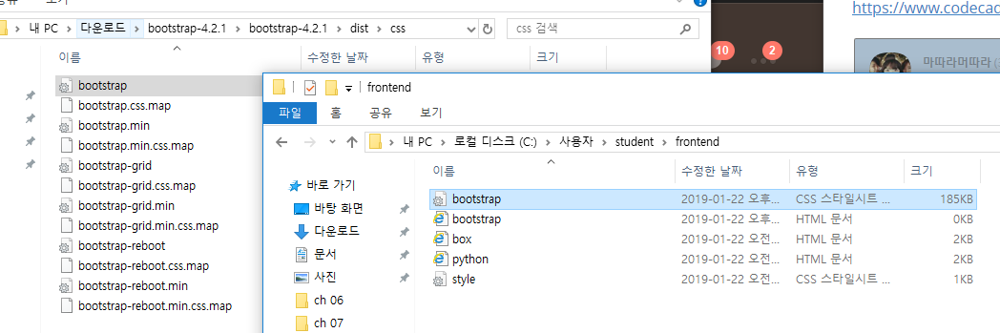
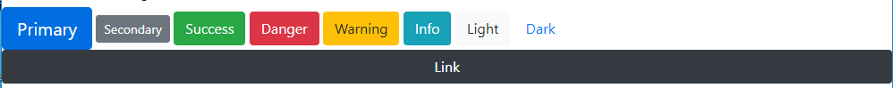
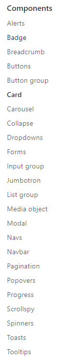
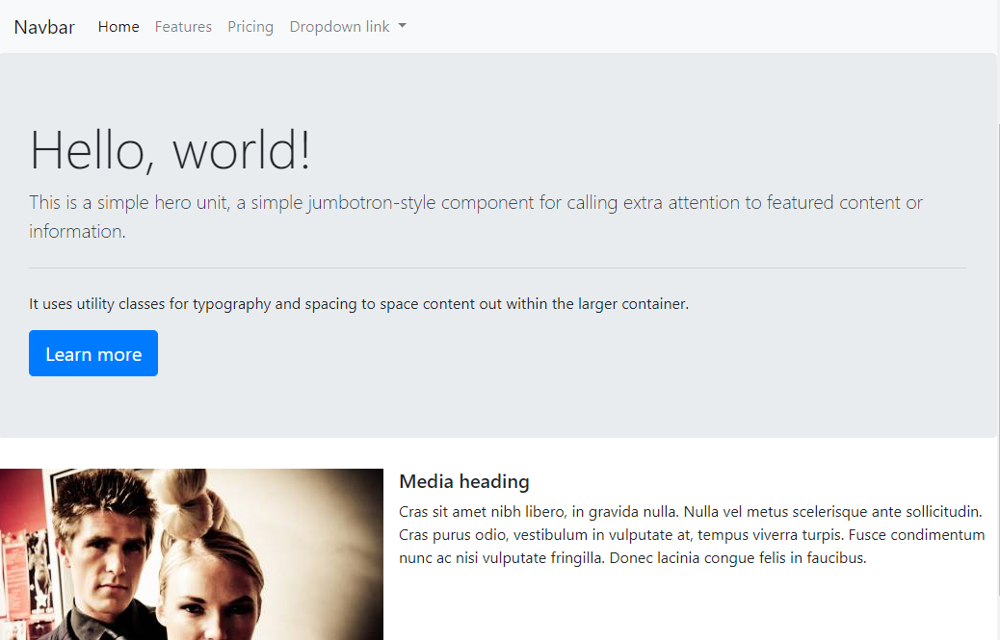
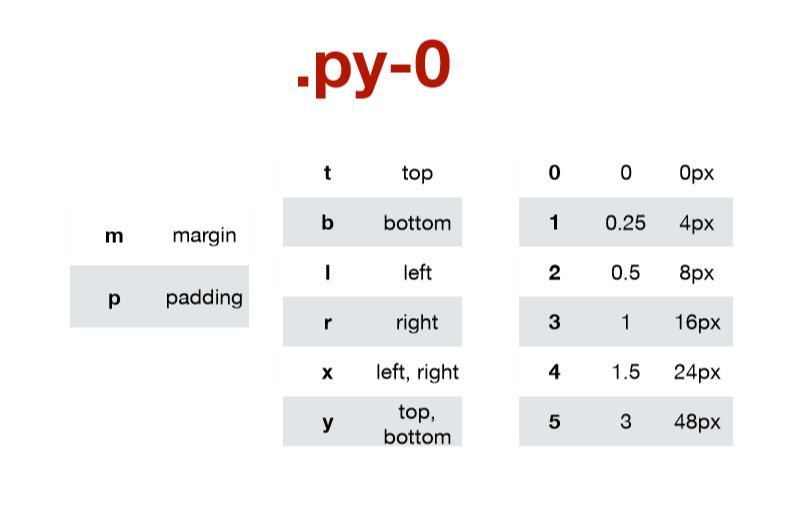

# 2019-01-22 2 Bootstrap

### HTML/CSS 학습 웹사이트

Codecademy - 코딩 연습

https://www.codecademy.com/catalog/subject/all


FreeCodeCamp - 코딩 연습

https://learn.freecodecamp.org/responsive-web-design/basic-html-and-html5/say-hello-to-html-elements/


사진 액박 깨질때 (bootstrap) = lorempixel

http://lorempixel.com/

-> 표준 이미지 가져와서 붙이면 됨 http://lorempixel.com/400/200/


표준 텍스트 체울 때 = lipsum

https://www.lipsum.com/

---

---



**bootstrap 가져오기**

https://getbootstrap.com/docs/4.2/getting-started/download/

**--> Download Source**



**현재 workspace로 복사 붙여넣기**




**`<link rel="stylesheet" href="bootstrap.css">`  : 이것만 넣으면 바로 사용 가능**


---

**button**

```html
<button type="button" class="btn btn-primary btn-lg">Primary</button>
<button type="button" class="btn btn-secondary btn-sm">Secondary</button>
<button type="button" class="btn btn-dark btn-block">Link</button>
```




---


---

## CDN(Content Delivery Network)

컨텐츠(CSS, JS, Image, Text 등)를 효율적으로 전달하기 위해  여러 노드에 가진 네트워크에 데이터를 제공하는 시스템. 

개별 end-user의 가까운 서버를 통해 빠르게 전달 가능(지리적 이점) 외부 서버를 활용함으로써 본인 서버의 부하가 적어짐. CDN은 보통 적절한 수준의 캐시 설정으로 빠르게 로딩할 수 있음. 

**css**

`<link rel="stylesheet" href="https://stackpath.bootstrapcdn.com/bootstrap/4.2.1/css/bootstrap.min.css" integrity="sha384-GJzZqFGwb1QTTN6wy59ffF1BuGJpLSa9DkKMp0DgiMDm4iYMj70gZWKYbI706tWS" crossorigin="anonymous">`

**JS**

`<script src="https://code.jquery.com/jquery-3.3.1.slim.min.js" integrity="sha384-q8i/X+965DzO0rT7abK41JStQIAqVgRVzpbzo5smXKp4YfRvH+8abtTE1Pi6jizo" crossorigin="anonymous"></script>`




--> Card, Buttons, Jumbotron, Navbar ..

--> lorempixel

```html
<!DOCTYPE html>
<html lang="en">
<head>
    <meta charset="UTF-8">
    <meta name="viewport" content="width=device-width, initial-scale=1.0">
    <meta http-equiv="X-UA-Compatible" content="ie=edge">
    <title>Document</title>
    
    <link rel="stylesheet" href="https://stackpath.bootstrapcdn.com/bootstrap/4.2.1/css/bootstrap.min.css" integrity="sha384-GJzZqFGwb1QTTN6wy59ffF1BuGJpLSa9DkKMp0DgiMDm4iYMj70gZWKYbI706tWS" crossorigin="anonymous">
    <script src="https://code.jquery.com/jquery-3.3.1.slim.min.js" integrity="sha384-q8i/X+965DzO0rT7abK41JStQIAqVgRVzpbzo5smXKp4YfRvH+8abtTE1Pi6jizo" crossorigin="anonymous"></script>
    <script src="https://cdnjs.cloudflare.com/ajax/libs/popper.js/1.14.6/umd/popper.min.js" integrity="sha384-wHAiFfRlMFy6i5SRaxvfOCifBUQy1xHdJ/yoi7FRNXMRBu5WHdZYu1hA6ZOblgut" crossorigin="anonymous"></script>
    <script src="https://stackpath.bootstrapcdn.com/bootstrap/4.2.1/js/bootstrap.min.js" integrity="sha384-B0UglyR+jN6CkvvICOB2joaf5I4l3gm9GU6Hc1og6Ls7i6U/mkkaduKaBhlAXv9k" crossorigin="anonymous"></script>

</head>
<body>
    <h1>Bootstrap</h1>
    <button type="button" class="btn btn-primary btn-lg">Primary</button>
    <button type="button" class="btn btn-secondary btn-sm">Secondary</button>
    <button type="button" class="btn btn-success">Success</button>
    <button type="button" class="btn btn-danger">Danger</button>
    <button type="button" class="btn btn-warning">Warning</button>
    <button type="button" class="btn btn-info">Info</button>
    <button type="button" class="btn btn-light">Light</button>
    <button type="button" class="btn btn-link">Link</button>
    
    <button type="button" class="btn btn-dark btn-block">Dark</button>
    <br><hr><br>

    <nav class="navbar navbar-expand-lg navbar-light bg-light">
        <a class="navbar-brand" href="#">Navbar</a>
        <button class="navbar-toggler" type="button" data-toggle="collapse" data-target="#navbarNavDropdown" aria-controls="navbarNavDropdown" aria-expanded="false" aria-label="Toggle navigation">
            <span class="navbar-toggler-icon"></span>
        </button>
        <div class="collapse navbar-collapse" id="navbarNavDropdown">
            <ul class="navbar-nav">
            <li class="nav-item active">
                <a class="nav-link" href="#">Home <span class="sr-only">(current)</span></a>
            </li>
            <li class="nav-item">
                <a class="nav-link" href="#">Features</a>
            </li>
            <li class="nav-item">
                <a class="nav-link" href="#">Pricing</a>
            </li>
            <li class="nav-item dropdown">
                <a class="nav-link dropdown-toggle" href="#" id="navbarDropdownMenuLink" role="button" data-toggle="dropdown" aria-haspopup="true" aria-expanded="false">
                Dropdown link
                </a>
                <div class="dropdown-menu" aria-labelledby="navbarDropdownMenuLink">
                <a class="dropdown-item" href="#">Action</a>
                <a class="dropdown-item" href="#">Another action</a>
                <a class="dropdown-item" href="#">Something else here</a>
                </div>
            </li>
            </ul>
        </div>
    </nav>


    <div class="jumbotron">
        <h1 class="display-4">Hello, world!</h1>
        <p class="lead">This is a simple hero unit, a simple jumbotron-style component for calling extra attention to featured content or information.</p>
        <hr class="my-4">
        <p>It uses utility classes for typography and spacing to space content out within the larger container.</p>
        <a class="btn btn-primary btn-lg" href="#" role="button">Learn more</a>
    </div>


    <div class="media">
        
        <div class="media-body">
            <h5 class="mt-0">Media heading</h5>
            Cras sit amet nibh libero, in gravida nulla. Nulla vel metus scelerisque ante sollicitudin. Cras purus odio, vestibulum in vulputate at, tempus viverra turpis. Fusce condimentum nunc ac nisi vulputate fringilla. Donec lacinia congue felis in faucibus.
        </div>
    </div>
    <div class="media">
        
        <div class="media-body">
            <h5 class="mt-0">Media heading</h5>
            Cras sit amet nibh libero, in gravida nulla. Nulla vel metus scelerisque ante sollicitudin. Cras purus odio, vestibulum in vulputate at, tempus viverra turpis. Fusce condimentum nunc ac nisi vulputate fringilla. Donec lacinia congue felis in faucibus.
        </div>
    </div>
    <div class="media">
        
        <div class="media-body">
            <h5 class="mt-0">Media heading</h5>
            Cras sit amet nibh libero, in gravida nulla. Nulla vel metus scelerisque ante sollicitudin. Cras purus odio, vestibulum in vulputate at, tempus viverra turpis. Fusce condimentum nunc ac nisi vulputate fringilla. Donec lacinia congue felis in faucibus.
        </div>
    </div>

    <br><hr><br>

    <div class="card-group">
        <div class="card">
            
            <div class="card-body">
            <h5 class="card-title">Card title</h5>
            <p class="card-text">This is a wider card with supporting text below as a natural lead-in to additional content. This content is a little bit longer.</p>
            </div>
            <div class="card-footer">
            <small class="text-muted">Last updated 3 mins ago</small>
            </div>
        </div>
        <div class="card">
            
            <div class="card-body">
            <h5 class="card-title">Card title</h5>
            <p class="card-text">This card has supporting text below as a natural lead-in to additional content.</p>
            </div>
            <div class="card-footer">
            <small class="text-muted">Last updated 3 mins ago</small>
            </div>
        </div>
        <div class="card">
            
            <div class="card-body">
            <h5 class="card-title">Card title</h5>
            <p class="card-text">This is a wider card with supporting text below as a natural lead-in to additional content. This card has even longer content than the first to show that equal height action.</p>
            </div>
            <div class="card-footer">
            <small class="text-muted">Last updated 3 mins ago</small>
            </div>
        </div>
    </div>
</body>
</html>
```




---

---

bootstrap h1

```html
<h1 class="m-0">Bootstrap으로 적용하는 박스 스타일</h1>
--> 마진 없애줌
<h1 class="my-4 mx-2">Bootstrap으로 적용하는 박스 스타일</h1>
--> y축 x축 
<h1 class="mt-4 mr-3 mb-4 ml-2">Bootstrap으로 적용하는 박스 스타일</h1>
--> top right bottom left
```




