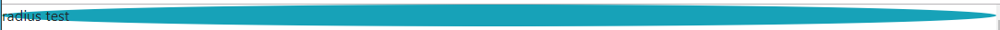
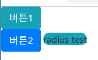
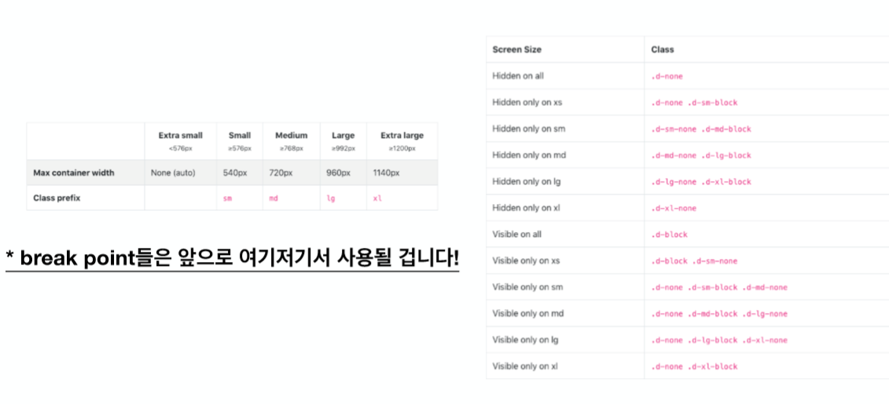

# 2019-01-22 3 Bootstrap2

### radius

```html
    <div class="bg-info rounded-pill">
        radius test
    </div>
    <div class="bg-info rounded-circle">
        radius test
    </div>
```





### display - inline, block

```html
    <button class="btn btn-info ">
        버튼1
    </button>
    <button class="btn btn-primary">
        버튼2
    </button>  
--------------------------------------------------------------
    <button class="btn btn-info ">
        버튼1
    </button>
    <button class="btn btn-primary">
        버튼2
    </button>  
---------------------------------------------------------------
    <button class="btn btn-info d-block">
        버튼1
    </button>
    <button class="btn btn-primary">
        버튼2
    </button>    
    <div class="bg-info rounded-pill d-inline">  
        radius test
    </div>
```




- *d-sm-none* -> 웹 창이 작아지면 다시 보임.
-  *d-none* -> 사라짐




