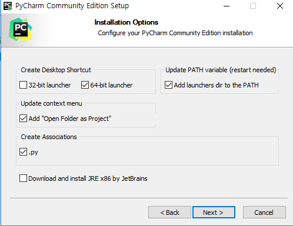
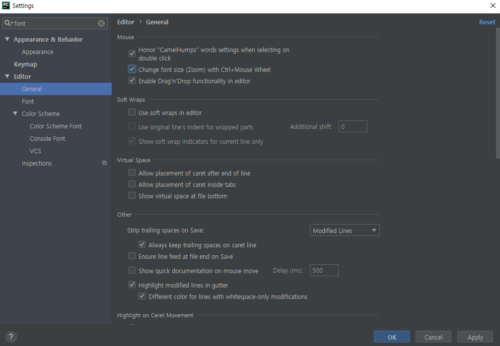
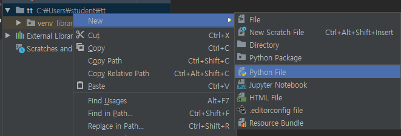
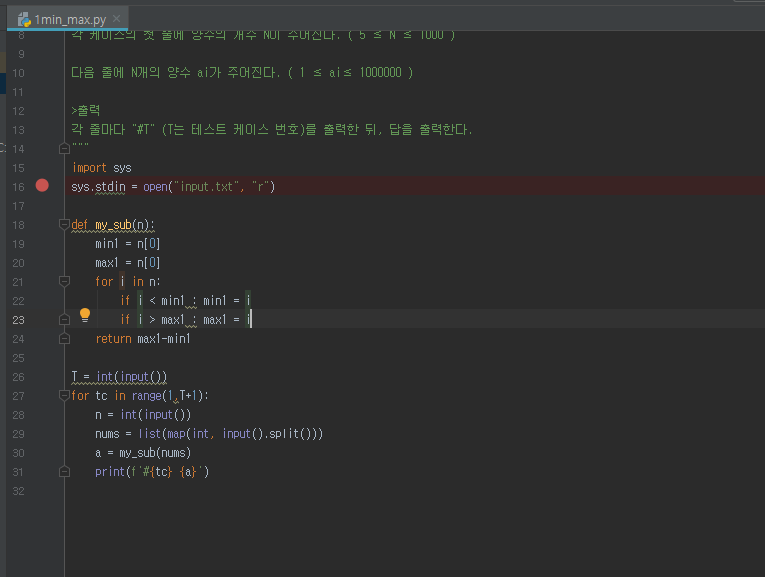
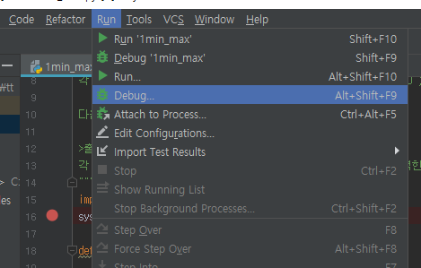
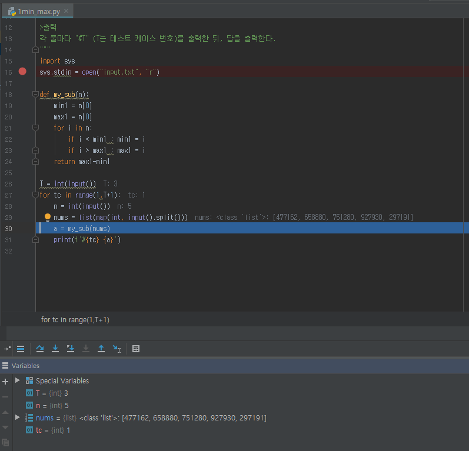
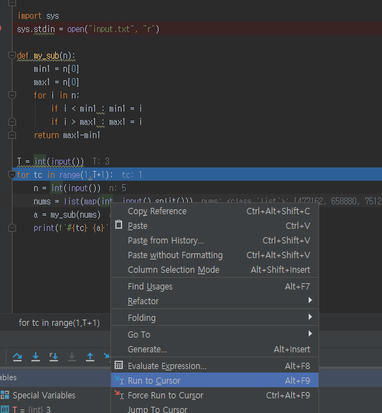
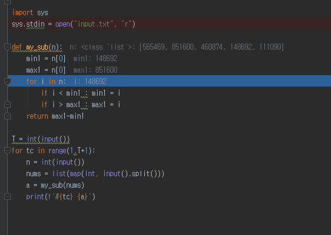

https://www.jetbrains.com/pycharm/

커뮤니티 버전 다운로드

**new project\tt** 만들기

**settings**

파이썬파일, 그냥 file(input.txt)

### Debugger

- break point 잡기

  >

- debug

  >

- F8을 누르면서 한 라인 씩 실행 

  > 

- 중간에 옮기고 싶으면

  > 

- 해당 함수로 가고 싶다? F7

  >

- 함수 빠져나오려면 shift+f8

