# 2019-01-28 3- sql기초 CRUD

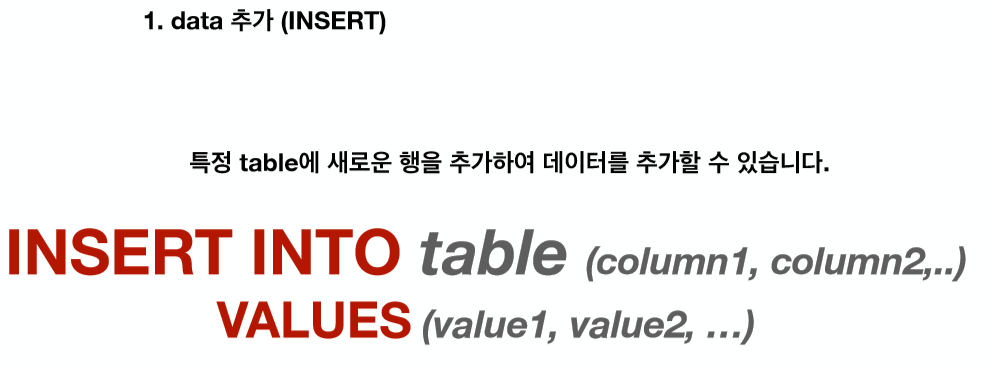


>  **classmates 테이블에 이름이 홍길동이고 나이가 23인 데이터를 넣어보기**
>
> 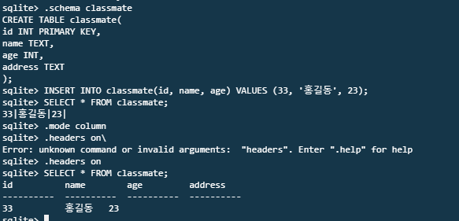
>
> `INSERT INTO classmate(id, name, age) VALUES (33, '홍길동', 23);`
>
> ` INSERT INTO classmate VALUES (3, '이정은', 25, '경기도');`


---

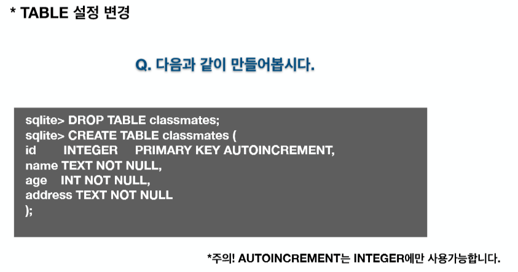

### create_classmates.sql 파일 만들기

**create_classmates.sql** 

```sqlite
CREATE TABLE classmates(
    id      INTEGER     PRIMARY KEY AUTOINCREMENT,  -- 자동으로 증가
    name    TEXT    NOT NULL,
    age     INT     NOT NULL,
    address TEXT    NOT NULL
);
```


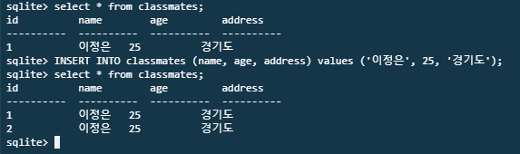

---

---

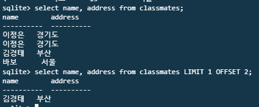

> LIMIT 1 OFFSET 2: 앞의 2개를 뺀 나머지  1개


---

## 조건문

>  `SELECT * FROM {{table}} WHERE {{조건문}}`
>
> 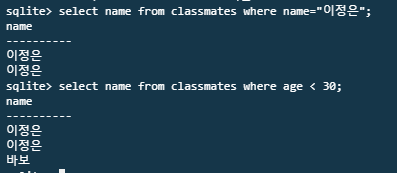

---

---


## 삭제 DELETE

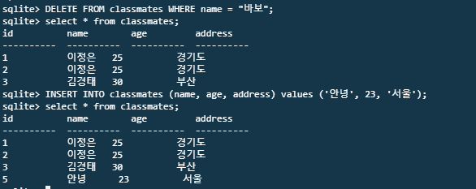

> 삭제 후 다시 data넣으면 id는 그 다음 숫자부터.

> **TRUNCATE TABLE** 문은 table 에서 모든 행을 삭제


## 데이터 수정 UPDATE

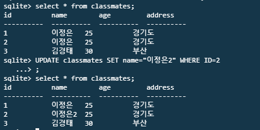


---

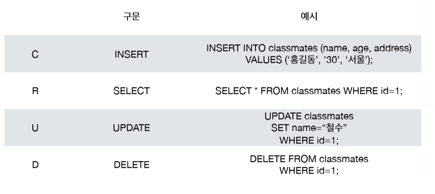

---


```sql
$ .mode csv
$ .import users.csv users

$ SELECT first_name, age FROM users where age > 30 and last_name="김";
$ SELECT count(*) from users where last_name="김";

-- 가장 많은 나이, 적은나이
SELECT MAX(age), MIN(age) FROM users;
-- 다 더한 값, 평균
SELECT SUM(age), AVG(age) FROM users;

```

---


## ALTER 컬럼 수정

```sql 
-- persons 테이블에 DATE형의 Birthday 컬럼 추가
ALTER TABLE Persons
ADD Birthday DATE;

-- persons 테이블에 Birthday 컬럼 삭제
ALTER TABLE Persons
DROP COLUMN Birthday;
```


---

## LIKE  정확한 값에 대한 비교가 아닌, 패턴을 확인하여 해당하는 값을 반환

`SELECT * FROM table WHERE column LIKE ""`

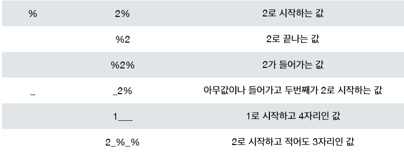

**20대 인사람**

`SELECT * FROM users WHERE age >= 20 and age < 30;`

`SELECT * FROM users where age LIKE "2%";`

```sql
SELECT * FROM table

-- 두번째에 a가 있는거
WHERE column LIKE '_a%';

--a로 시작해서 b로 끝나는거
WHERE column LIKE 'a%b';

--a나 b나 c로 시작하는거
WHERE column LIKE '[abc]%';

-- a나 f까지 아무거나 시작하는거 
WHERE column LIKE '[a-f]%';

-- a, b, c 로 시작하지 않는 것
WHERE column LIKE '[!abc]%';

-- a로 시작하지 않는 것
WHERE column NOT LIKE 'a%';

-- a나 b인 것, 아닌 것
WHERE Country IN ('Norway','France');
WHERE Country NOT IN ('Norway','France');

```


---

## 정렬 ORDER

`SELECT columns FROM table ORDER BY column1, column2 [ASC/DESC]`


`SELECT * FROM users ORDER BY age ASC LIMIT 10;`

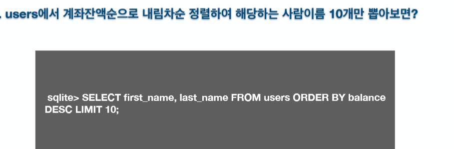


---

---

## BETWEEN

```sql
SELECT * FROM Products

-- 가격이 10 20 사이인 것, 아닌것
WHERE Price BETWEEN 10 AND 20;
SELECT * FROM ProductsWHERE Price NOT BETWEEN 10 AND 20;

-- 알파벳 순으로 제품 
SELECT * FROM Products
WHERE ProductName 
BETWEEN 'Geitost' AND 'Pavlova';

```


---

---

## JOIN

### left join

```sql
SELECT * FROM Orders
LEFT JOIN Customers
ON Orders.CustomerID=Customers.CustomerID;
```

### right join

```sql
SELECT * FROM Orders
RIGHT JOIN Customers
ON Orders.CustomerID=Customers.CustomerID;
```

### Inner join

```sql
SELECT * FROM Orders
INNER JOIN Customers
ON Orders.CustomerID=Customers.CustomerID;
```


---

---

## GROUP BY

```sql
-- 같은 country끼리 묶어서, 그 나라의 customerID 개수 , 나라이름
SELECT COUNT(CustomerID),Country
FROM Customers
GROUP BY Country;
```

```sql
SELECT COUNT(CustomerID),Country
FROM Customers
GROUP BY Country
ORDER BY COUNT(CustomerID) DESC;
```


