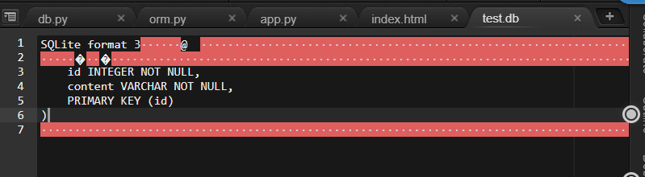
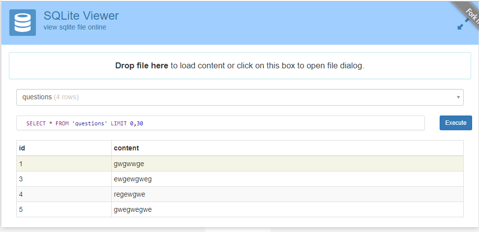
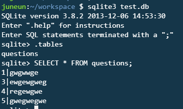

##  SQLalchemy

> **ORM**
>
> **객체 관계 매핑**(Object-relational mapping; ORM)은 데이터베이스와 객체 지향 프로그래밍 언어 간의 호환되지 않는 데이터를 변환하는 프로그래밍 기법이다. 객체 관계 매핑 라고도 부른다. 객체 지향 언어에서 사용할 수 있는 "가상" 객체 데이터베이스를 구축하는 방법이다. 


---

### **c9 - aksed**

**< 다양한 데이터 저장 법 >**

```python

# 1. csv, nested-list version
student1 = [
    ['id', 'name', 'phone' ,'address'],
    [1, '이정은', '01011112222', '서울'],
    [2, '이정남', '01033334444', '경기']
]


# 2. json, dictionary version
student2 = [
    {'id': 1, 'name':'이정은', 'phone':'01011112222', 'address':'서울'},
    {'id': 2, 'name':'이정남', 'phone':'01033334444', 'address':'경기'}
]

# 3. object version
class Student:
    def __init__(self, id1, name, phone, address):
        self.id1 = id1
        self.name = name
        self.phone = phone
        self.address = address
        
student3 = [
    Student(1, '이정은', '01011112222', '서울'),    
    Student(2, '이정남', '01033334444', '경기')    
]
# # create
# Student.new()
# # Read
# Student.get()
# # update
# Student.update()
# # delete
# Student.destroy()
```


---

## **ORM**!

설치

```
$ sudo pip3 install flask-sqlalchemy
```

참고 문서 : http://flask-sqlalchemy.pocoo.org/2.3/quickstart/

**app.py**

```python
from flask import Flask, render_template, request
from flask_sqlalchemy import SQLAlchemy


app = Flask(__name__)

# ORM을 하기 위한 준비 ! 
# app.config['SQLALCHEMY_DATABASE_URI'] = 'sqlite:////tmp/test.db'
app.config['SQLALCHEMY_DATABASE_URI'] = 'sqlite:///test.db'  # --> 현재경로
app.config['SQLALCHEMY_TRACK_MODIFICATIONS'] = False
db = SQLAlchemy(app)

                    #.init_app() :  SQLAlchemy가 갖고있는 객체 중 하나 
db.init_app(app)    # flask app과 orm이 하나가 됨 

class Quest(db.Model):
    __tablename__ = "questions"
    id = db.Column(db.Integer, primary_key=True)
    content = db.Column(db.String, nullable=False)
    
db.create_all()

@app.route("/")
def index():
    # DB에 저장된 모든 질문들을 불러온다.
    quests = Quest.query.all()
    # print(quests[0].content) # 테이블의 첫번째 데이터의 content 값!
    return render_template('index.html', quests=quests)

@app.route("/ask")
def ask():
    # 데이터 베이스에 저장
    q = request.args.get('question')  # 파라미터 받아오기
    
    '''ORM을 통해 데이터를 저장하는 방법!!!'''
    # ==> INSERT INTO  questions (id, content) VALUES(1, 사용자가 입력한 값)
    quest = Quest(content=q) # 파라미터 값을 content에
    db.session.add(quest)    # db에 넣을겨
    db.session.commit()      # db야 기록해라
    
    return render_template('ask.html')
```


**index.html**

```html
<!DOCTYPE html>
<html lang="en">
<head>
    <meta charset="UTF-8">
    <meta name="viewport" content="width=device-width, initial-scale=1.0">
    <meta http-equiv="X-UA-Compatible" content="ie=edge">
    <title>Document</title>
</head>
<body>
    <!-- 질문 받을거야 -->
    <h1>익명 질문 앱</h1>
    <p>익명으로 질문하세요.</p>
    <form action="/ask">
        <input type="text" name="question"/>
        <input type="submit" value="Submit"/>
    </form>
    
    <!-- quests(리스트)안에 담긴 모든 질문 객체들을 보여준다 -->
    
        <p>{{q.id}} : {{q.content}}</p>
    
</body>
</html>
```


---

### redirect

- 질문 등록하고 다시 index.html로 갈래!

```python
from flask import Flask, render_template, request, redirect

@app.route("/ask")
def ask():
    # 데이터 베이스에 저장
    q = request.args.get('question')  # 파라미터 받아오기
    
    '''ORM을 통해 데이터를 저장하는 방법!!!'''
    # ==> INSERT INTO  questions (id, content) VALUES(1, 사용자가 입력한 값)
    quest = Quest(content=q) # 파라미터 값을 content에
    db.session.add(quest)    # db에 넣을겨
    db.session.commit()      # db야 기록해라
    
    return redirect('/')
```


---

## 글 수정, 삭제

**index.html**

```html
...  
    <!-- quests(리스트)안에 담긴 모든 질문 객체들을 보여준다 -->
    
        <p>{{q.id}} : {{q.content}} <a href="/delete/{{ q.id }}">[삭제]</a></p> 
    
...
```

**app.py**

```python
...
@app.route("/delete/<int:id>")  # int형 자료인 id라는 친구가 들어올거얌
def delete(id):
    # 특정 데이터 레코드를 지워준다  ==> DELETE FROM questions WHERE id = ? 
    q = Quest.query.get(id)  # 레코드 찾기
    db.session.delete(q)     # 해당 객체 삭제 ! 
    db.session.commit()
    
    return redirect('/')
```


---




# db를 시각화해서 보고 싶다면?

## 1 SQLite Viewer

test.db 파일을 다운받아 

http://inloop.github.io/sqlite-viewer/ 에 올림



---

## 2 console

**Terminal**

```
$ sqlite3 test.db
sqlite > .tables
sqlite > SELECT * FROM questions;
```




