# 2019-01-30 - String


# 문자의 표현

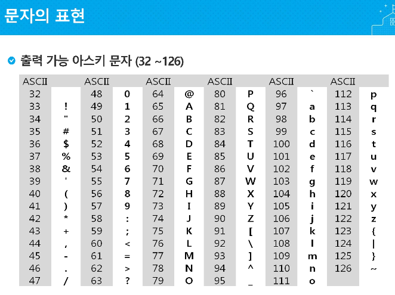

# ↓

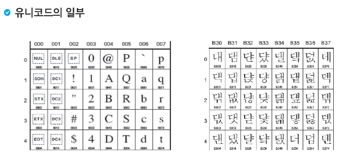

 # 

**big-endian, little-endian**

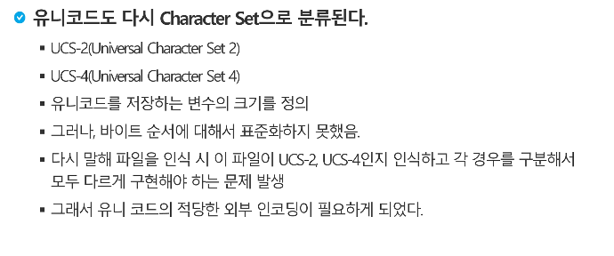

# ↓

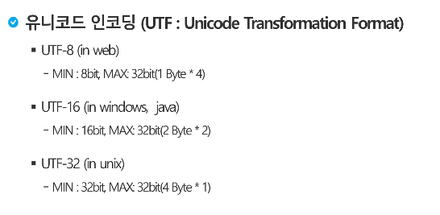

---

---

---


# 문자열

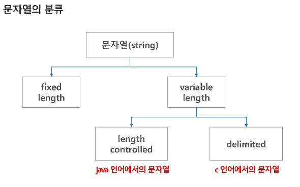

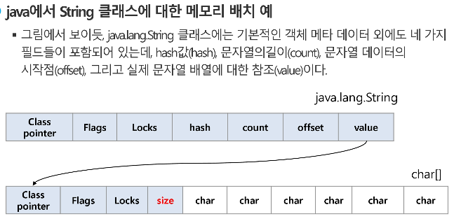

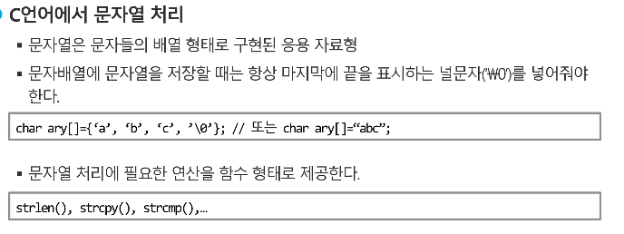

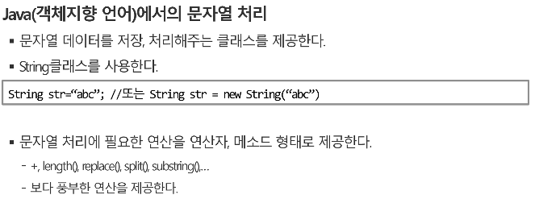

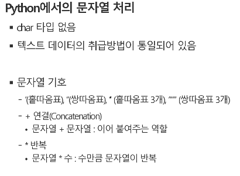

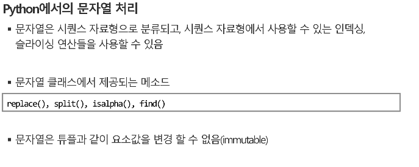

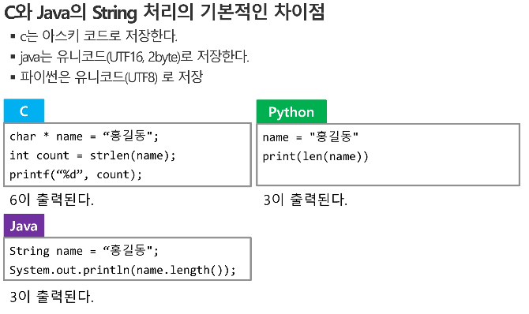

---

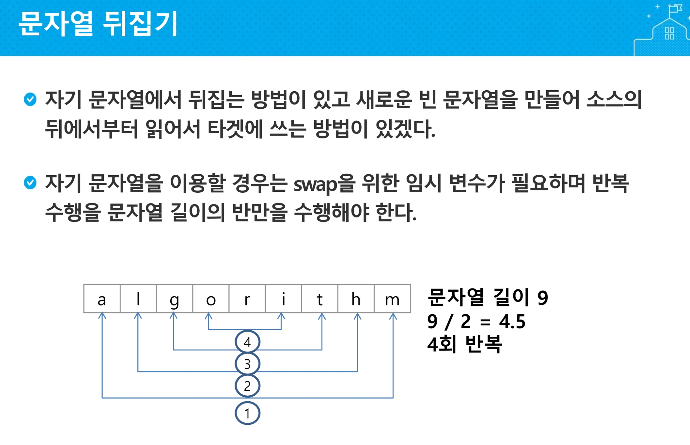

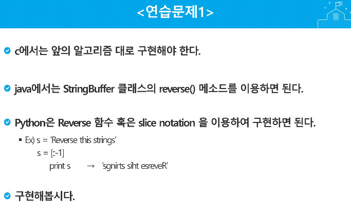

---


---

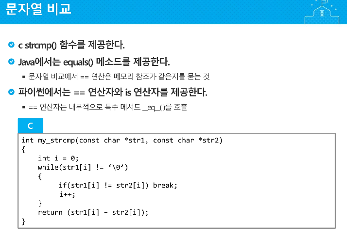

---


---

### 타입 캐스팅

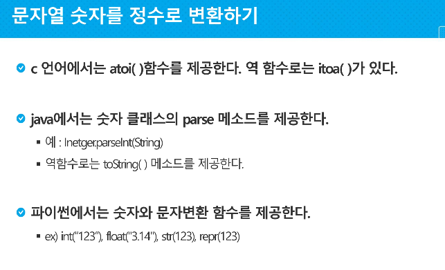

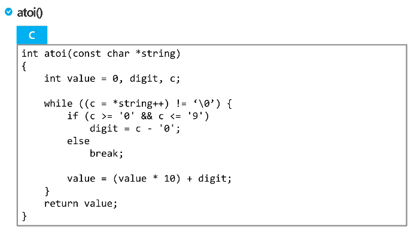

```python
ord('A')  # 65
chr(65)	  # 'A'
```


---


---

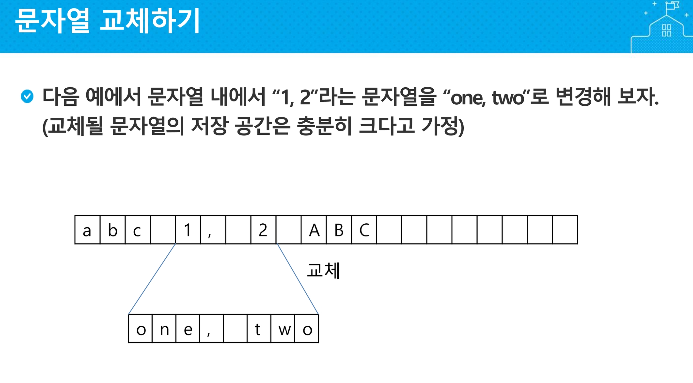

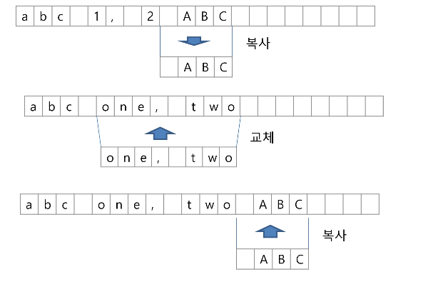


**python 식으로  구현해보기**

```python
def itoa(x):
    sr = ''
    while True:
        r = x % 10
        sr = sr + str(r + ord('0'))
        x //= 10
        if x == 0: break

    s = ''
    for i in range(len(sr) - 1, -1, -1):
        s = s + sr[i]
    return s


print(itoa(1234))
```


---


