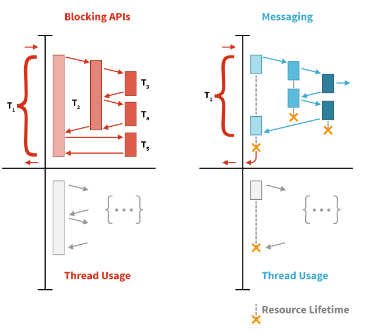

[TOC]

## [1] Reactive Programming(RP)

- 데이터 스트림과 변화의 전파에 대해 고려하는 **선언적인 프로그래밍 패러다임**
- array와 같은 static 또는 event emitter와 같은 dynamic 데이터 스트림을 쉽게 표현할 수 있도록 만들어줌
- 연관된 실행 모델 내에서 추론된 dependency가 존재함을 알려 변경된 데이터 흐름의 자동 전파를 용이하게

>  **즉, 비동기 데이터 스트림으로 프로그래밍하는 방식**

<br>

### 명령형 vs 리액티브 프로그래밍 방식 비교

ex) `a = b + c`

- 명령형 프로그래밍 방식에서는, a에 b+c 의 결과가 할당됨

- 할당된 b와 c는 a의 값에 그 어떠한 영향도 끼치지 않고 변경될 수 있다. 
- **반면에 리액티브 프로그래밍에서는** a는 b와 c의 값이 변경될 때마다, 프로그램이 `a = b + c` 문을 다시 실행하지 않고도, **자동으로 업데이트**되어 현재 할당된 a의 값을 결정하게 된다. 이런 것이 바로 Reactive Programming ! 

Reactive Programming은 기본적으로 변수든 속성이든,  캐시, 데이터 구조, 이벤트 등등 모든 것을 스트림(Stream)으로 보고, 모든 데이터의 흐름을 시간 순서에 의해 전달되어지는 **스트림으로 처리**한다. (여기에서 스트림은 시간 순서에 의해 전달되어진 값들의 collection 혹은 나열이라고 생각) 

각각의 스트림은 새로 만들어질 수도 있고, 여러 개의 스트림이 합쳐(merge)질 수도, 필터링이되거나 스트림이 다른 스트림의 input이 될 수도 있습니다. map, filter와 같은 함수형 메서드를 이용하여 immutable하게 처리할 수 있습니다.

```
Reactive Stream에 대해 참고
http://www.reactive-streams.org/ 
https://en.wikipedia.org/wiki/Reactive_Streams
```


- Reactive Programming은 하나의 문제를 각각 아래의 두가지 방식으로 실행될 수 있는 여러 단계로 분리할 수 있다.
  - 비동기
  - 논블로킹 방식

- 그리고, 무한한 입력이나 출력을 생성할 수 있는 작업흐름(workflow)를 만들기 위해 결합.  

- 비동기는 클라이언트에서 서비스로 전송된 요청이 이후, 임의의 시점에 처리된다는 의미인데, 

- 이것은 논블럭킹을 가능하게 하는 리액티브 프로그래밍에서 굉장히 중요한 기술 

- 실행 스레드들이 공유 자원을 점유하기 위해 경쟁할 때(현재 수행하는 일이 끝날 때까지 실행 스레드의 실행을 막는) 블럭킹으로 기다릴 필요가 없는 것. 

- 대신 자원을 점유하기 전까지 다른 유용한 작업을 수행할 수 있다.
- 블럭킹 방식은 비동기 데이터처리가 끝날때까지 쓰레드를 대기시키거나 콜백을 받아서 처리하기 때문에 불필요한 컴퓨터 리소스 사용이 발생
- 반면에 메시징 기반의 Reactive Programming에서는 필요한 경우에만 스레드를 생성후 메시지 형태로 전달하기 때문에 더 효율적으로 컴퓨터 리소스를 사용할 수 있다.




---

## [2] 4가지 Reactive 원칙

**(1) 반응성(Responsive)**

**즉각 반응**. 지속적으로 긍정적인 사용자 환경을 보장하기 위해서, 환경이 좋을 때나 좋지 않을 때나 Reactive System은 모든 사용자에게 신속하게 반응. 

이 응답성을 촉진하기 위해서는 탄력성과 복원성이 있어야 함. 이를 성취하기 위해서는 시스템이 메시지 구동 방식이어야 한다고 리액티브 선언문은 규정하고 있다.

<br>

**(2) 탄력성(Resilient)**

탄력적인 시스템은 일반적인 상황뿐만 아니라 **장애 등의 상황에서도 응답성**을 보장하기 위해 적절한 설계 및 아키텍처 원칙을 적용. 

**탄력성은 실패시의 대응성**에 대한 것이며, 이상적이지 않은 상황성에서 반응성을 보장

<br>

**(3) 유연성(Elastic)**

응답성이 뛰어난 어플리케이션을 지속적으로 생성할 때 탄력성과 유연성이 함께 작용. **부하의 상황에서도 응답성**을 보장합니다. 

 <br>

**(4) 메시지 중심(Message-driven)**

메시지 기반 아키텍처는 Reactive Application의 기반. 메시지 기반 어플리케이션은 이벤트 기반, 액터 기반 또는 이 둘의 조합일 수 있다.  

```
*참고. 이벤트 중심과 메시지 중심을 혼동하지 않아야 함.*
 - 메시지 : 특정 대상으로 보내지는 데이터 항목.
 - 이벤트 : 주어진 상태에 도달했을 때 구성요소가 내보낸 신호.

이 두가지 개념의 주요한 차이점은 메시지는 본질적으로 전달되고 이벤트는 그렇지 않다는 점
메시지에는 깨끗한 단일 대상이 있다. 이벤트는 다른 누군가가 관찰하는 사실. 
메시지 기반 시스템에서 주소 지정 가능한 수신자는 메시지 도착을 기다리고, 메시지에 응답하고. 그렇지 않으면 휴면. 
이벤트 중심 시스템에서는 리스너는 이벤트 소스가 첨부되어 이벤트가 발생할 때 호출됩니다.
```

---

## [3] 장점, 단점

[장점]

- 멀티 코어, 멀티 CPU 하드웨어에서 연산 자원 활용의 증가
- 콜백 지옥에서 탈출
- 쓰레드 관리 용이
- backpressure. 과도한 사용과 무한한 자원 소비를 회피.

 

[단점]

- 가파른 학습곡선
  - 다양한 오퍼레이션 제공
  - 멀티스레드와 함수형 프로그래밍에 대한 개념이해 필수
- 디버깅이 어려움

<br>

---

## [4] Reactive Programming(RP)? Functional Programming(FP)? Functional Reactive Programming(FRP)?

**Reactive Programming(RP)**

- 간단히 말해 비동기 데이터 스트림을 이용한 프로그래밍

- 비동기 데이터 스트림에서 일어나는 변화를 지속적으로 관찰(Observe)하고 이에 따른 동작을 수행해야 합니다. 

**Functional Programming(FP)**

- 자료 처리를 수학적 함수의 계산으로 취급하고 상태과 가변 데이터를 멀리하는 프로그래밍 패러다임의 하나
- 어떤 문제를 해결하기 위해서 그 과정이나 공식에 치중하기 보다는 이미 만들어진 함수의 응용을 강조
- FP는 고계함수(higher-order functions)를 다루며, 1급 객체(first-class)로 간주
- 그래서 FP는 동일한 매개 변수를 사용하여 함수를 호출할 때마다 동일한 결과를 반환
- 이를 달성하기 위해서 FP는 어떠한 상태도 가져선 안되고 이는 FP가 immutable함을 보장함니다. 

**Functional Reactive Programming(FRP)**

- RP에 FP에서 제공하는 함수를 활용하는 것
- 위 두 가지 개념을 염두에 두고 FRP의 개념을 보자면, 입력에 대해 직접적인 선언적 방식으로 모델링하는 것
- FRP의 모델은 이벤트와 행동이라는 두 가지 데이터 유형을 도입하여 시간이 지남에 따라 변화
- 이벤트는 특정 시간의 값이며, 동작은 시간이 지남에 따라 지속적으로 변하는 값을 의미
- 이러한 개념을 기능적 방식으로 결합하면 전체 프로그램이 이벤트와 행동의 결합
- FRP는 코드의 추상화 수준을 높이므로 구현 세부사항을 둘러 보는 대신 비즈니스 논리를 정의하는 이벤트의 상호 의존성에 집중할 수 있다. 


RP = 데이터 스트림을 처리하여 코드의 변경 내용을 전파하는 비동기 프로그래밍 패러다임

FP = 자료의 처리를 부작용 없이 수학적 함수로 취급하는 프로그래밍 패러다임

FRP = FP의 기본 요소들을 사용하는 Reactive Programming 패러다임

 

```
ReactiveX(Rx)?

- 관측 가능한(Observable) 스트림을 이용한 비동기, 이벤트 기반 프로그래밍을 위한 라이브러리이자 API
- Observer 패턴과 Iterator 패턴, 그리고 functional programming의 최고의 아이디어를 결합한 것
- Rx를 FRP와 다름. Rx는 FRP를 할 수 있게 도와주는 API를 제공하고 있으므로 FRP의 장단점이 곧 Rx의 장단점이 될 수도 있습니다.

- Rx에서는 RP의 비동기 데이터 스트림을 Observable이라는 용어로 표현
- 이 Observable은 변화를 지속적으로 관찰하고 이에 따른 동작을 수행하는 데 그치지 않고 필터링, select, 변환, 결합 등 여러 함수(Operators)를 이용할 수 있다.
```


