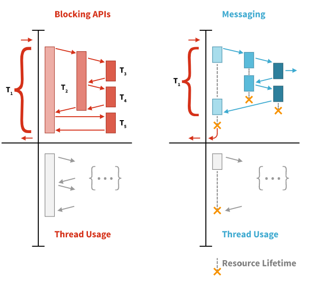

[TOC]

## Reactive Programming(RP)

- 데이터 스트림과 변화의 전파에 대해 고려하는 **선언적인 프로그래밍 패러다임**
- array와 같은 static 또는 event emitter와 같은 dynamic 데이터 스트림을 쉽게 표현할 수 있도록 만들어줌
- 연관된 실행 모델 내에서 추론된 dependency가 존재함을 알려 변경된 데이터 흐름의 자동 전파를 용이하게

>  **즉, 비동기 데이터 스트림으로 프로그래밍하는 방식**

<br>

## 명령형 vs 리액티브 프로그래밍 방식 비교

ex) `a = b + c`

- 명령형 프로그래밍 방식에서는, a에 b+c 의 결과가 할당됨

- 할당된 b와 c는 a의 값에 그 어떠한 영향도 끼치지 않고 변경될 수 있다. 
- **반면에 리액티브 프로그래밍에서는** a는 b와 c의 값이 변경될 때마다, 프로그램이 `a = b + c` 문을 다시 실행하지 않고도, **자동으로 업데이트**되어 현재 할당된 a의 값을 결정하게 된다. 이런 것이 바로 Reactive Programming ! 

Reactive Programming은 기본적으로 변수든 속성이든,  캐시, 데이터 구조, 이벤트 등등 모든 것을 스트림(Stream)으로 보고, 모든 데이터의 흐름을 시간 순서에 의해 전달되어지는 **스트림으로 처리**한다. (여기에서 스트림은 시간 순서에 의해 전달되어진 값들의 collection 혹은 나열이라고 생각) 

각각의 스트림은 새로 만들어질 수도 있고, 여러 개의 스트림이 합쳐(merge)질 수도, 필터링이되거나 스트림이 다른 스트림의 input이 될 수도 있습니다. map, filter와 같은 함수형 메서드를 이용하여 immutable하게 처리할 수 있습니다.

```
Reactive Stream에 대해 참고
http://www.reactive-streams.org/ 
https://en.wikipedia.org/wiki/Reactive_Streams
```


- Reactive Programming은 하나의 문제를 각각 아래의 두가지 방식으로 실행될 수 있는 여러 단계로 분리할 수 있다.
  - 비동기
  - 논블로킹 방식

- 그리고, 무한한 입력이나 출력을 생성할 수 있는 작업흐름(workflow)를 만들기 위해 결합.  

- 비동기는 클라이언트에서 서비스로 전송된 요청이 이후, 임의의 시점에 처리된다는 의미인데, 

- 이것은 논블럭킹을 가능하게 하는 리액티브 프로그래밍에서 굉장히 중요한 기술 

- 실행 스레드들이 공유 자원을 점유하기 위해 경쟁할 때(현재 수행하는 일이 끝날 때까지 실행 스레드의 실행을 막는) 블럭킹으로 기다릴 필요가 없는 것. 

- 대신 자원을 점유하기 전까지 다른 유용한 작업을 수행할 수 있다.
- 블럭킹 방식은 비동기 데이터처리가 끝날때까지 쓰레드를 대기시키거나 콜백을 받아서 처리하기 때문에 불필요한 컴퓨터 리소스 사용이 발생
- 반면에 메시징 기반의 Reactive Programming에서는 필요한 경우에만 스레드를 생성후 메시지 형태로 전달하기 때문에 더 효율적으로 컴퓨터 리소스를 사용할 수 있다.




