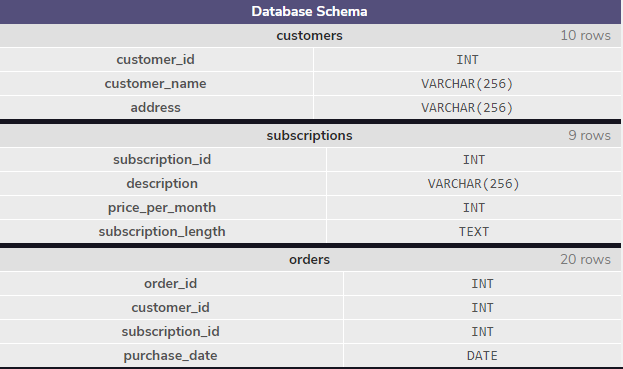

#  Join



> customers
>
> 

> subscriptions
>
> 

> orders
>
> 

```sql
-- subscription으로 조인
SELECT *
FROM orders
JOIN subscriptions
  ON orders.subscription_id = subscriptions.subscription_id;
-- 조인으로 값 찾기
SELECT *
FROM orders
JOIN subscriptions
  ON orders.subscription_id = subscriptions.subscription_id
WHERE subscriptions.description = 'Fashion Magazine';
```


------

# Inner Join

> newspaper
>
> 

> online
>
> 

```sql
SELECT COUNT(*) --60
FROM newspaper;

SELECT COUNT(*) --65
FROM online;

SELECT COUNT(*) --50
FROM newspaper
JOIN online
	ON newspaper.id = online.id;
```


# Left Join

### 왼쪽 기준에 맞춰

> 
>
> 
>
> 

```sql
-- 1
SELECT *
FROM newspaper
LEFT JOIN online
  ON newspaper.id = online.id;

--2
SELECT *
FROM newspaper
LEFT JOIN online
  ON newspaper.id = online.id
WHERE online.id IS NULL;
```

> ### 1
>
> 
>
> ### 2
>
> 


---

# Primary Key vs Foreign Key

Let's return to our example of the magazine subscriptions. Recall that we had three tables: `orders`, `subscriptions`, and `customers`.

Each of these tables has a column that uniquely identifies each row of that table:

- `order_id` for `orders`
- `subscription_id` for `subscriptions`
- `customer_id` for `customers`

These special columns are called **primary keys**.

Primary keys have a few requirements:

- None of the values can be `NULL`.
- Each value must be unique (i.e., you can't have two customers with the same `customer_id` in the `customers` table).
- A table can not have more than one primary key column.

Let's reexamine the `orders` table:

| order_id | customer_id | subscription_id | purchase_date |
| -------- | ----------- | --------------- | ------------- |
| 1        | 2           | 3               | 2017-01-01    |
| 2        | 2           | 2               | 2017-01-01    |
| 3        | 3           | 1               | 2017-01-01    |

Note that `customer_id` (the primary key for `customers`) and `subscription_id` (the primary key for `subscriptions`) both appear in this.

When the primary key for one table appears in a different table, it is called a **foreign key**.

So `customer_id` is a primary key when it appears in `customers`, but a foreign key when it appears in `orders`.

In this example, our primary keys all had somewhat descriptive names. Generally, the primary key will just be called `id`. Foreign keys will have more descriptive names.

*Why is this important?* The most common types of joins will be joining a foreign key from one table with the primary key from another table. For instance, when we join `orders` and `customers`, we join on `customer_id`, which is a foreign key in `orders` and the primary key in `customers`.

---


---

# Cross Join

So far, we've focused on matching rows that have some information in common.

Sometimes, we just want to combine all rows of one table with all rows of another table.

For instance, if we had a table of `shirts` and a table of `pants`, we might want to know all the possible combinations to create different outfits.

Our code might look like this:

```sql
SELECT shirts.shirt_color,
   pants.pants_color
FROM shirts
CROSS JOIN pants;
```

- The first two lines select the columns `shirt_color` and `pants_color`.
- The third line pulls data from the table `shirts`.
- The fourth line performs a `CROSS JOIN` with `pants`.

Notice that cross joins don't require an `ON` statement. You're not really joining on any columns!

If we have 3 different shirts (white, grey, and olive) and 2 different pants (light denim and black), the results might look like this:

| shirt_color | pants_color |
| ----------- | ----------- |
| white       | light denim |
| white       | black       |
| grey        | light denim |
| grey        | black       |
| olive       | light denim |
| olive       | black       |

3 shirts × 2 pants = 6 combinations!

This clothing example is fun, but it's not very practically useful.

A more common usage of `CROSS JOIN` is when we need to compare each row of a table to a list of values.

Let's return to our `newspaper` subscriptions. This table contains two columns that we haven't discussed yet:

- `start_month`: the first month where the customer subscribed to the print newspaper (i.e., `2` for February)
- `end_month`: the final month where the customer subscribed to the print newspaper

Suppose we wanted to know how many users were subscribed during each month of the year. For each month (`1`, `2`, `3`) we would need to know if a user was subscribed. Follow the steps below to see how we can use a `CROSS JOIN` to solve this problem.

```sql
SELECT COUNT(*)
FROM newspaper
WHERE start_month <= 3 
  AND end_month >= 3;
  
SELECT *
FROM newspaper
CROSS JOIN months;

SELECT *
FROM newspaper
CROSS JOIN months
WHERE start_month <= month 
  AND end_month >= month;

SELECT month, 
  COUNT(*)
FROM newspaper
CROSS JOIN months
WHERE start_month <= month 
  AND end_month >= month
GROUP BY month;
```


---

---


---

# Union

Sometimes we just want to stack one dataset on top of the other. Well, the `UNION` operator allows us to do that.

Suppose we have two tables and they have the same columns.

`table1`:

| pokemon    | type  |
| ---------- | ----- |
| Bulbasaur  | Grass |
| Charmander | Fire  |
| Squirtle   | Water |

`table2`:

| pokemon | type   |
| ------- | ------ |
| Snorlax | Normal |

If we combine these two with `UNION`:

```sql
SELECT *
FROM table1
UNION
SELECT *
FROM table2;
```


The result would be:

| pokemon    | type   |
| ---------- | ------ |
| Bulbasaur  | Grass  |
| Charmander | Fire   |
| Squirtle   | Water  |
| Snorlax    | Normal |

SQL has strict rules for appending data:

- Tables must have the same number of columns.
- The columns must have the same data types in the same order as the first table.

```sql
SELECT * 
FROM newspaper 
UNION 
SELECT * 
FROM online;
```

> 

---

---


---

# With

Often times, we want to combine two tables, but one of the tables is the result of another calculation.

Let's return to our magazine order example. Our marketing department might want to know a bit more about our customers. For instance, they might want to know how many magazines each customer subscribes to. We can easily calculate this using our `orders` table:

```sql
SELECT customer_id,
   COUNT(subscription_id) AS 'subscriptions'
FROM orders
GROUP BY customer_id;
```

This query is good, but a `customer_id` isn't terribly useful for our marketing department, they probably want to know the customer's name.

We want to be able to join the results of this query with our `customers`table, which will tell us the name of each customer. We can do this by using a `WITH` clause.

```sql
WITH previous_results AS (
   SELECT ...
   ...
   ...
   ...
)
SELECT *
FROM previous_results
JOIN customers
  ON _____ = _____;
```

- The `WITH` statement allows us to perform a separate query (such as aggregating customer's subscriptions)
- `previous_results` is the alias that we will use to reference any columns from the query inside of the `WITH` clause
- We can then go on to do whatever we want with this temporary table (such as join the temporary table with another table)

Essentially, we are putting a whole first query inside the parentheses `()` and giving it a name. After that, we can use this name as if it's a table and write a new query *using* the first query.

```sql
WITH previous_query AS (
   SELECT customer_id,
      COUNT(subscription_id) AS 'subscriptions'
   FROM orders
   GROUP BY customer_id
)
SELECT customers.customer_name, 
   previous_query.subscriptions
FROM previous_query
JOIN customers
  ON previous_query.customer_id = customers.customer_id;
```

> 


---

---

# Review

In this lesson, we learned about relationships between tables in relational databases and how to query information from multiple tables using SQL.

Let's summarize what we've learned so far:

- `JOIN` will combine rows from different tables if the join condition is true.
- `LEFT JOIN` will return every row in the *left* table, and if the join condition is not met, `NULL` values are used to fill in the columns from the *right* table.
- *Primary key* is a column that serves a unique identifier for the rows in the table.
- *Foreign key* is a column that contains the primary key to another table.
- `CROSS JOIN` lets us combine all rows of one table with all rows of another table.
- `UNION` stacks one dataset on top of another.
- `WITH` allows us to define one or more temporary tables that can be used in the final query.