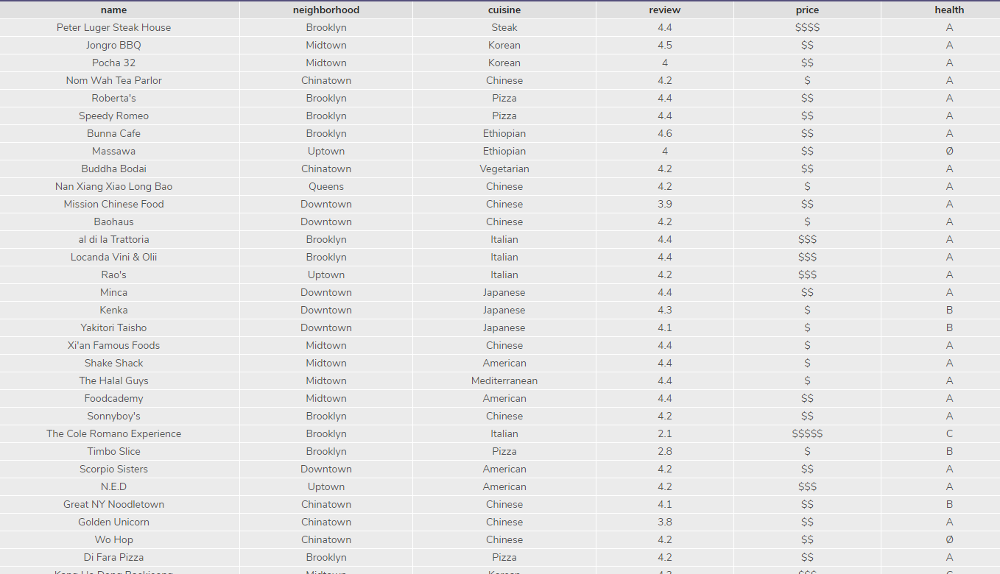
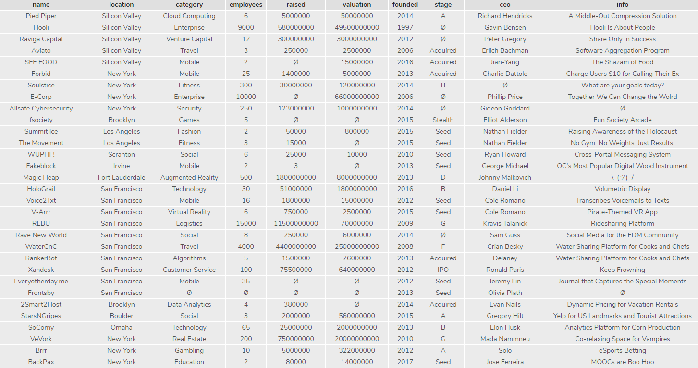

codecademy pratice

https://www.codecademy.com/learn/learn-sql

## 1

```sql
CREATE TABLE friends(
  id	INTEGER,
  name TEXT,
  birthday	DATE
);
-- ---------------------------------------------
INSERT INTO friends(name,birthday)
values('Jane Doe', 19900530);

INSERT INTO friends
values(1,'may', 19900530);

INSERT INTO friends
values(2,'Jay', 19900530);
-- ---------------------------------------------
update friends
set name = "Jane Smith"
where name = 'Jane Doe';
-- ---------------------------------------------
alter table friends add email;
-- ---------------------------------------------
update friends
set email = "jane@codecademy.com"
where name = "Jane Smith";

update friends
set email = "eggg@codecademy.com"
where id = 1;

update friends
set email = "egwgwe@codecademy.com"
where id = 2;
-------------------------------------------------
delete from friends
where id is null;
-------------------------------------------------
SELECT * 
FROM friends;
```


## 2



```sql
SELECT distinct neighborhood
FROM nomnom;
-------------------------------------
SELECT * 
FROM nomnom
WHERE cuisine = 'Chinese';
--------------------------------------
SELECT *
FROM nomnom
WHERE review >= 4;
--------------------------------------
SELECT *
FROM nomnom
WHERE cuisine = 'Italian'
   AND price = '$$$';
   
SELECT *
FROM nomnom
WHERE cuisine = 'Italian'
   AND price LIKE '%$$$%';
---------------------------------------
SELECT * 
FROM nomnom
WHERE name LIKE '%meatball%';
---------------------------------------
SELECT *
FROM nomnom
WHERE neighborhood = 'Midtown'
   OR neighborhood = 'Downtown'
   OR neighborhood = 'Chinatown';
---------------------------------------
SELECT *
FROM nomnom
WHERE health IS NULL;
---------------------------------------
SELECT *
FROM nomnom
ORDER BY review DESC
LIMIT 10;
---------------------------------------
SELECT name,
 CASE
  WHEN review > 4.5 THEN 'Extraordinary'
  WHEN review > 4 THEN 'Excellent'
  WHEN review > 3 THEN 'Good'
  WHEN review > 2 THEN 'Fair'
  ELSE 'Poor'
 END AS 'Review'
FROM nomnom;
---------------------------------------
```


---

- `COUNT()`: count the number of rows
- `SUM()`: the sum of the values in a column
- `MAX()`/`MIN()`: the largest/smallest value
- `AVG()`: the average of the values in a column
- `ROUND()`: round the values in the column

*Aggregate functions* combine multiple rows together to form a single value of more meaningful information.

- `GROUP BY` is a clause used with aggregate functions to combine data from one or more columns.
- `HAVING` limit the results of a query based on an aggregate property.

---


# 3



```sql
SELECT *
FROM startups;
-----------------------------------------
SELECT COUNT(*)
FROM startups;

SELECT SUM(valuation)
FROM startups;

SELECT MAX(raised)
FROM startups;

SELECT MAX(raised)
FROM startups
WHERE stage = 'Seed';

SELECT MIN(founded)
FROM startups;

SELECT category, ROUND(AVG(valuation),2)
FROM startups
GROUP BY category;

SELECT category, ROUND(AVG(valuation),2)
FROM startups
GROUP BY 1
ORDER BY 2 DESC;
-----------------------------------------
SELECT category, COUNT(*)
FROM startups
GROUP BY category;
----------------------------------------
SELECT category , count(*)
FROM startups
GROUP BY category
HAVING count(*)>3
ORDER BY 2 DESC;
----------------------------------------
SELECT location, AVG(employees) as size
FROM startups
GROUP BY location
HAVING size > 500;
```


