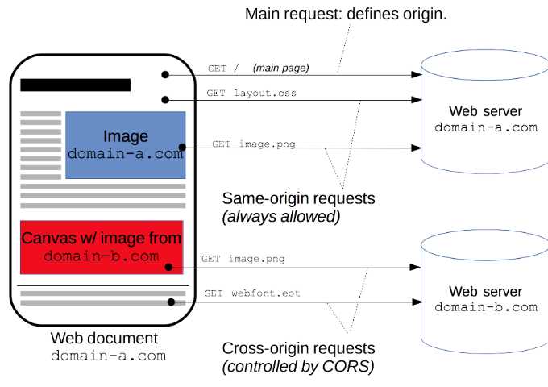

https://github.com/axios/axios/issues/475

https://developer.mozilla.org/en-US/docs/Web/HTTP/CORS

> https://developer.mozilla.org/ko/docs/Web/HTTP/Access_control_CORS

https://m.blog.naver.com/PostView.nhn?blogId=writer0713&logNo=220922066642&proxyReferer=https%3A%2F%2Fwww.google.com%2F

https://www.popit.kr/cors-preflight-%EC%9D%B8%EC%A6%9D-%EC%B2%98%EB%A6%AC-%EA%B4%80%EB%A0%A8-%EC%82%BD%EC%A7%88/

---

### WHAT?

- MSA 서비스와 같은 여러 어플리케이션에서 API를 호출해야 할 때, 서로 다른 도메인에서 리소스를 공유하는 방식이라 볼 수 있다. (Same-origin policy (동일 출처 정책)와 반대되는 개념으로 보면 된다.)

- CORS란 Cross Origin Resource Sharing의 약자로 브라우저의 현재 웹페이지가 이 페이지를 받은 서버가 아닌 다른 서버의 자원을 호출하는 것을 의미한다. 가장 쉬운 예로 CDN에 배포되어 있거나 공용 이미지 등을 그냥 단순 Link를 걸어서 사용하는 것도 CORS라고 할 수 있다.

- ex) http://www.popit.kr/123 에서 다음과 같이 link를 사용하는 경우

  ``

---

### WHY?

- 예를 들어, `www.example.com` 이라는 사이트에서 사용하는 api가 있다. 해당 api는 외부에 공개하려는 목적이 아닌, 자신들의 사이트에서 사용하기 위해 만들었다고 치자. 그런데 이 api를 다른 사이트에서 알게 되었고 허락없이 무단으로 가져다 사용하게 된다면 이 사이트 입장에서는 상당히 곤란할 것이다. 그래서 나온 것이 Same-origin policy 정책이다. 프로토컬, 도메인, 포트가 모두 같을시 동일 출처 정책을 따른다고 볼 수 있다.
- 보통 api를 사용할 때, ajax를 사용하는데 이 same-origin policy를 따르지 않을 경우, 오류가 나면서 api 사용이 거절된다.
- 하지만, 이 정책이 마냥 좋은것은 아니다. 만약 한 사이트에서 여러 도메인을 가지고 있을 경우에 문제가 생기게 된다. 단지 도메인만 다를뿐 똑같은 서비스라고 하더라도 동일 출처 정책을 따르지 않기 때문이다.
- 해결할 수 있는 방법은 JSONP 방식이 있다. js, css 등의 파일은 same-origin policy를 따르지 않아도 되기 때문에 서버에서 값을 돌려줄때 마치 js 파일처럼 값을 돌려주고, 클라이언트에서는 이 값을 콜백 함수로 재처리 하여 사용하는 방식이다.
- 또 다른 방식은 서버에서 CORS 설정을 해주는 방법이 있다. 


---

### HOW?

CORS 상황이 발생했을 때 브라우저는 다음과 같은 절차를 사용한다.

- 일반적인 요청에 대해서는 아무런 처리도 하지 않음, 일반적인 요청이라고 하면 다음 사항에 부합되는 요청을 의미한다
  - Accept, Accept-Language,  Content-Language,  Content-Type
- Content-Type은 다음만 허용
  - `application/x-www-form-urlencoded`
  - `multipart/form-data`
  - `text/plain`

<br>

이런 일반적인 요청이 아닌 경우 브라우저는 접근할 리소스를 가지고 있는 서버에 preflighted 요청을  보냄

- preflighted 요청은 특별한 목적을 가지는 요청으로 method = OPTIONS 으로 전송
- OPTIONS 요청을 받은 서버는 Response Header에 서버가 허용할 옵션을 설정하여 브라우저에게 전달.
- 브라우저는 서버가 보낸 Response 정보를 이용하여 허용되지 않은 요청인 경우 405 Method Not Allowed 에러를 발생시키고, 실제 페이지의 요청은 서버로 전송하지 않음
- 허용된 요청인 경우 전송

---



---

### Example Code

```java
package com.example.test.common.config;

import org.springframework.context.annotation.Bean;
import org.springframework.context.annotation.Configuration;
import org.springframework.web.servlet.config.annotation.CorsRegistry;
import org.springframework.web.servlet.config.annotation.WebMvcConfigurer;

@Configuration
public class CommonBean {

    @Bean
    public WebMvcConfigurer webMvcConfigurer() {
        return new WebMvcConfigurer() {
            @Override
            public void addCorsMappings(CorsRegistry registry) {
                registry.addMapping("/**")
                        .allowedOrigins("http://127.0.0.1:8080", "http://127.0.0.1", "https://test-web-dev.com") // 이 host만 allow
                        .allowedMethods("GET", "POST", "PUT", "DELETE", "PATCH")
                        .allowCredentials(false)
                        .maxAge(3600);
            }
        };
    }
}
```

