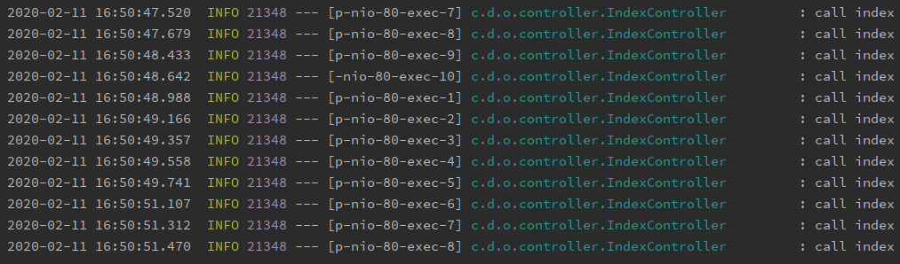
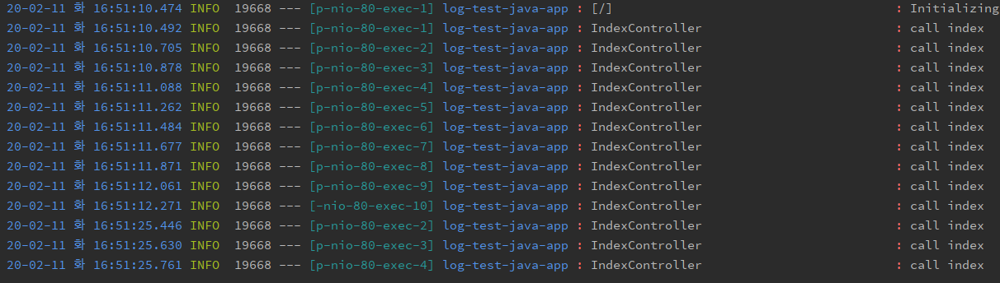

**build.gradle**

```gradle
testCompile group: 'org.slf4j', name: 'slf4j-simple', version: '1.6.1'
```


**application.yml**

```yaml
application:
  name: "log-test-java-app"

server:
  port: 80

spring:
  output:
    ansi:
      enabled: ALWAYS

logging:
  level:
    org.springframework: ERROR
    com.demo: DEBUG
  pattern:
    console: "%clr(%d{yy-MM-dd E HH:mm:ss.SSS}){blue} %clr(%-5p) %clr(${PID}){faint} %clr(---){faint} %clr([%8.15t]){cyan}
    %clr(${application.name} %clr(:){red} %-40.40logger{0}){blue} %clr(:){red} %clr(%m){faint}%n"
```


**IndexController.java**

```java
@RestController
@Slf4j
public class IndexController {

    @GetMapping("/")
    public String index() {
        log.info("call index");
        return "Hello world!!";
    }
}
```


**before**




**after**

