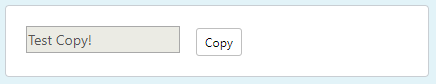
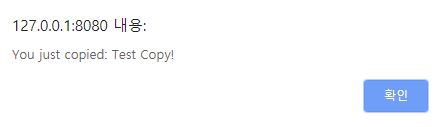

npm 설치: `npm install --save vue-clipboard2`

<br>

main.js 추가
```js

import VueClipboard from 'vue-clipboard2'

VueClipboard.config.autoSetContainer = true // add this line
Vue.use(VueClipboard)

```


<br>





example 코드

```html
<b-card>
    <input type="text" v-model="message" disabled>
    <b-button class="ml-3" size="sm" variant="light btn-border"
              v-clipboard:copy="message"
              v-clipboard:success="onCopy"
              v-clipboard:error="onError">Copy</b-button>
</b-card>
```

```js
export default {
    name: "ClusterList",
    data () {
        return {
            message: 'Test Copy!'
        }
    },
    methods: {
        onCopy: function (e) {
            alert('You just copied: ' + e.text)
        },
        onError: function () {
            alert('Failed to copy texts')
        }
    }
}
```

