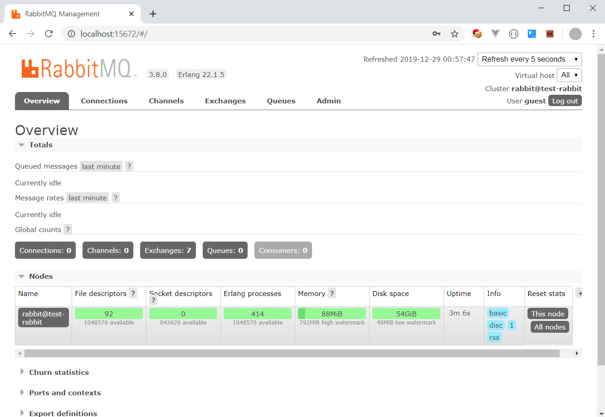

[TOC]

---

ref: [rabbitmq docker hub](https://hub.docker.com/_/rabbitmq?tab=description)

---

## 1. 이미지 다운

```powershell
D:>docker image pull rabbitmq:3.8.0-management
```

<br>

------

## 2. 이미지 확인

```powershell
D:>docker images
REPOSITORY          TAG                 IMAGE ID            CREATED             SIZE
postgres            latest              4a82a16ee75c        3 weeks ago         394MB
rabbitmq            3.8.0-management    8bdbe10dc73e        8 weeks ago         180MB
```

<br>

------

## 3. RabbitMQ 도커 컨테이너 띄우기

```powershell
D:>docker run -d --hostname test-rabbit --name some-rabbit -e RABBITMQ_DEFAULT_USER=admin -e RABBITMQ_DEFAULT_PASS=admin -p 5672:5672 -p 15672:15672 rabbitmq:3.8.0-management
```

<br>

------

## 4. RabbitMQ 도커 로그 확인

```powershell
D:>docker logs some-rabbit
 
...

 * rabbitmq_management
 * rabbitmq_web_dispatch
 * rabbitmq_management_agent
  completed with 3 plugins.
```

<br>

------

## 5. Docker RabbitMQ 프로세스 확인

```powershell
D:>docker ps --all
CONTAINER ID        IMAGE                       COMMAND                  CREATED              STATUS              PORTS                                                                     NAMES
a57b1f98de1b        rabbitmq:3.8.0-management   "docker-entrypoint.s…"   About a minute ago   Up About a minute   4369/tcp, 5671-5672/tcp, 15671/tcp, 25672/tcp, 0.0.0.0:15672->15672/tcp   some-rabbit
8ab61477a39b        postgres                    "docker-entrypoint.s…"   2 days ago           Up 2 days           0.0.0.0:5432->5432/tcp                                                    postgres_boot
```

<br>

------

## 6. RabbitMQ 관리자 페이지 접속

```powershell
URL : http://localhost:15672
ID / Password : admin/admin
```



<br>

------

## etc..

#### RabbitMQ가 설치된 컨테이너에 접속하기

```powershell
docker exec -it {{container id}} /bin/bash
```

<br>

#### RabbitMQ 프로세스 Stop

```powershell
docker stop {{container id}}
```

<br>

#### RabbitMQ 프로세스 시작

```powershell
docker start {{container id}}
```

<br>

#### docker stop` <container id>` 명령어로 중지 후 삭제

```powershell
docker rm {{container id}}
```

<br>

####  docker images 명령어로 image id 확인 후 삭제 : docker rmi `<image id>`

```powershell
docker rmi {{container id}}
```

<br>

#### RabbitMQ가 설치된 컨테이너에 접속하기

```powershell
docker exec -it {{container id}} /bin/bash
```

<br>

#### RabbitMQ가 설치된 컨테이너에 접속하기

```powershell
docker exec -it {{container id}} /bin/bash
```

