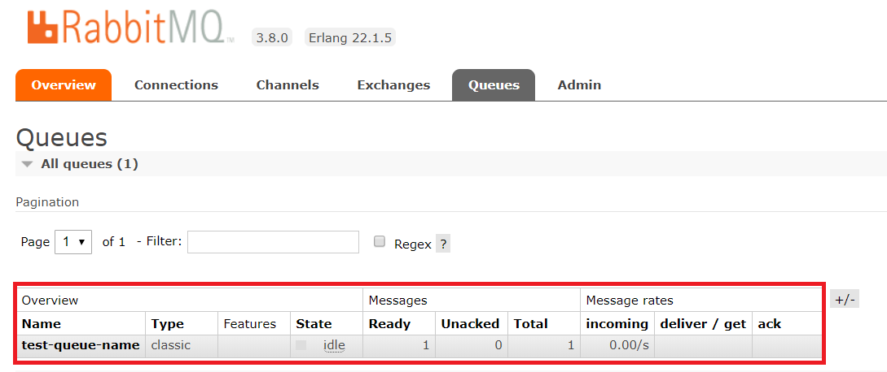
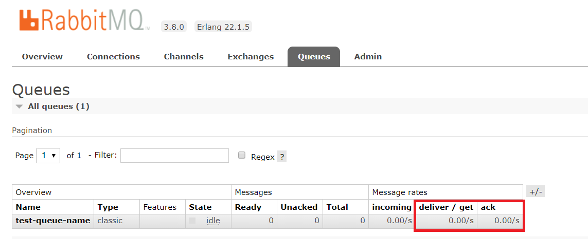
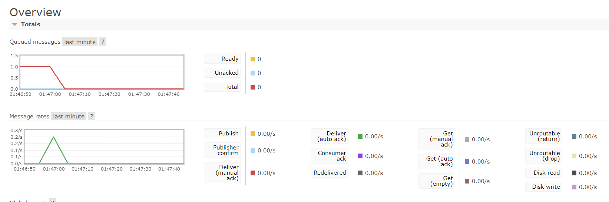
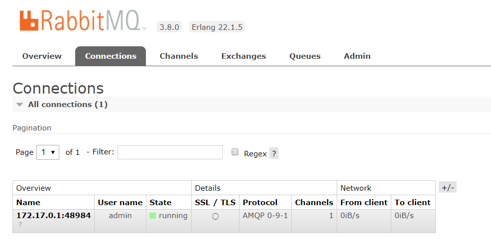

[TOC]

---

ref: https://www.rabbitmq.com/tutorials/tutorial-one-java.html

---

### pom.xml 추가

```xml
<dependency>
    <groupId>com.rabbitmq</groupId>
    <artifactId>amqp-client</artifactId>
    <version>4.1.0</version>
</dependency>
```

<br>

### host docker ip 확인

```powershell
C:\Users\leeap>ipconfig

...

이더넷 어댑터 vEthernet (DockerNAT):
   연결별 DNS 접미사. . . . :
   IPv4 주소 . . . . . . . . . : 10.0.75.1
   서브넷 마스크 . . . . . . . : 255.255.255.240
   기본 게이트웨이 . . . . . . :
   
...
```

<br>

### Queue Publisher

```java
package com.kongjung.rabbitmq;

import com.rabbitmq.client.Channel;
import com.rabbitmq.client.Connection;
import com.rabbitmq.client.ConnectionFactory;

public class Publisher {

    private final static String QUEUE_NAME = "test-queue-name";
    private final static String QUEUE_HOST = "10.0.75.1";
    private final static int QUEUE_PORT = 5672;
    private final static String QUEUE_USER_NAME = "admin";
    private final static String QUEUE_PASSWORD = "admin";

    public static void main(String[] args) throws Exception {
        ConnectionFactory factory = new ConnectionFactory();
        factory.setHost(QUEUE_HOST);
        factory.setPort(QUEUE_PORT);
        factory.setUsername(QUEUE_USER_NAME);
        factory.setPassword(QUEUE_PASSWORD);
        String message = "test message!";

        Connection connection = factory.newConnection();
        Channel channel = connection.createChannel();

        channel.queueDeclare(QUEUE_NAME, false, false, false, null);
        channel.basicPublish("", QUEUE_NAME, null, message.getBytes("UTF-8"));

        System.out.println(" [x] Sent '" + message + "'");

        channel.close();
        connection.close();
    }
}
```

```
 [x] Sent 'test message!'

Process finished with exit code 0
```



<br>

### Queue Receiver

```java
package com.kongjung.rabbitmq;

import com.rabbitmq.client.*;

import java.io.IOException;
import java.util.concurrent.TimeoutException;


public class Receiver {

    private final static String QUEUE_NAME = "test-queue-name";
    private final static String QUEUE_HOST = "10.0.75.1";
    private final static int QUEUE_PORT = 5672;
    private final static String QUEUE_USER_NAME = "admin";
    private final static String QUEUE_PASSWORD = "admin";

    public static void main(String[] args) throws IOException, TimeoutException {
        ConnectionFactory factory = new ConnectionFactory();
        factory.setHost(QUEUE_HOST);
        factory.setPort(QUEUE_PORT);
        factory.setUsername(QUEUE_USER_NAME);
        factory.setPassword(QUEUE_PASSWORD);
        String message = "test message!";

        Connection connection = factory.newConnection();
        Channel channel = connection.createChannel();

        channel.queueDeclare(QUEUE_NAME, false, false, false, null);
        System.out.println(" [*] Waiting for messages. To exit press CTRL+C");
        Consumer consumer = new DefaultConsumer(channel) {
            @Override
            public void handleDelivery(String consumerTag, Envelope envelope,
                                       AMQP.BasicProperties properties, byte[] body) throws IOException {
                String message = new String(body, "UTF-8");
                System.out.println(" [x] Received '" + message + "'");
            }
        };
        channel.basicConsume(QUEUE_NAME, true, consumer);
    }
}

```

```
 [*] Waiting for messages. To exit press CTRL+C
 [x] Received 'test message!'
```








