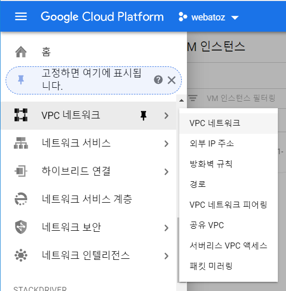
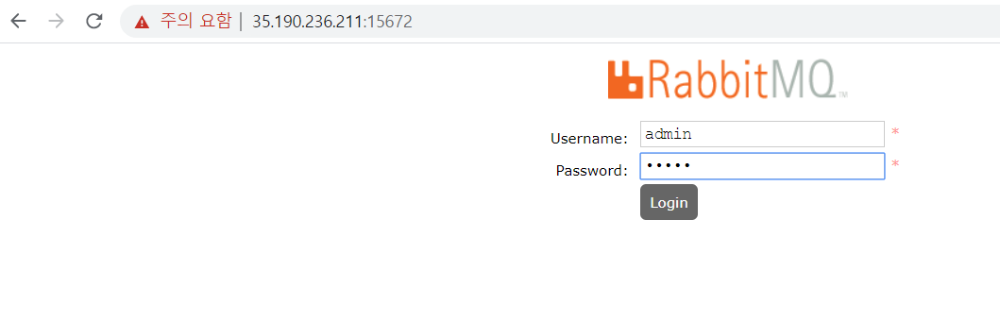
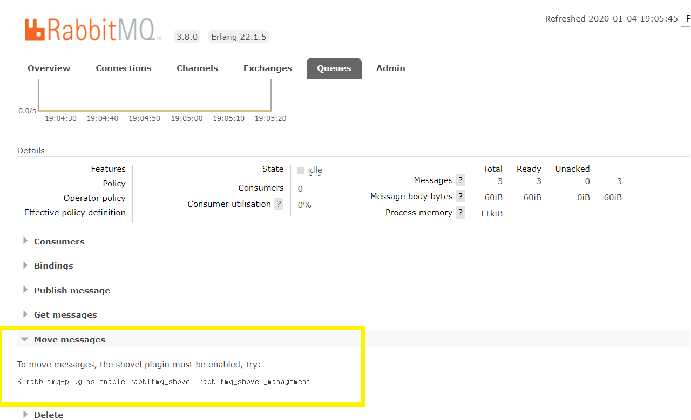

[TOC]

------

ref: [rabbitmq docker hub](https://hub.docker.com/_/rabbitmq?tab=description)

------

## 1. 이미지 다운

```powershell
[root@webatoz leeap1004]# docker image pull rabbitmq:3.8.0-management
```

<br>

------

## 2. 이미지 확인

```powershell
[root@webatoz leeap1004]# docker images
REPOSITORY            TAG                 IMAGE ID            CREATED             SIZE
docker.io/sonarqube   latest              211a9718b823        6 days ago          483 MB
docker.io/postgres    latest              ec5d6d5f5b34        6 days ago          394 MB
docker.io/sonarqube   7.9.1-community     ea9ce8f562b5        4 weeks ago         480 MB
docker.io/rabbitmq    3.8.0-management    8bdbe10dc73e        2 months ago        180 MB
docker.io/sonarqube   7.5-community       88a9b8f332d0        11 months ago       843 MB
docker.io/jenkins     latest              cd14cecfdb3a        17 months ago       696 MB
```

<br>

------

## 3. RabbitMQ 도커 컨테이너 띄우기

```powershell
[root@webatoz leeap1004]# docker run -d --hostname test-rabbit --name some-rabbit -e RABBITMQ_DEFAULT_USER=admin -e RABBITMQ_DEFAULT_PASS=admin -p 5672:5672 -p 15672:15672 rabbitmq:3.8.0-management
19160605cbd1503e9fbb3c6793854e143b6e8d29e1ad20447fe4a1cfed90a328
```

<br>

------

## 4. RabbitMQ 도커 로그 확인

```powershell
D:>docker logs some-rabbit
 
...

 * rabbitmq_management
 * rabbitmq_web_dispatch
 * rabbitmq_management_agent
  completed with 3 plugins.
```

<br>

------

## 5. Docker RabbitMQ 프로세스 확인

```powershell
[root@webatoz leeap1004]# docker ps
CONTAINER ID        IMAGE                       COMMAND                  CREATED             STATUS              PORTS                                                                                        NAMES
19160605cbd1        rabbitmq:3.8.0-management   "docker-entrypoint..."   32 seconds ago      Up 31 seconds       4369/tcp, 5671/tcp, 0.0.0.0:5672->5672/tcp, 15671/tcp, 25672/tcp, 0.0.0.0:15672->15672/tcp   some-rabbit
73a7bd186518        postgres                    "docker-entrypoint..."   28 hours ago        Up 28 hours         0.0.0.0:5432->5432/tcp                                                                       postgres
2aa8fb8160e3        jenkins                     "/bin/tini -- /usr..."   5 days ago          Up 5 days           0.0.0.0:50000->50000/tcp, 0.0.0.0:9090->8080/tcp                                             jenkins
```

<br>

## 6. VPC 방화벽 규칙 추가

> VPC 네트워크 > 방화벽 규칙 > 추가, 15672 & 5672




------

## 6. RabbitMQ 관리자 페이지 접속

```powershell
URL : http://35.190.236.211:15672/
ID / Password : admin/admin
```



<br>

------

## 7. RabbitMQ가 설치된 컨테이너에 접속하기

```powershell
docker exec -it {{container id}} /bin/bash
```

<br>

## 8. plugin 설치

```
rabbitmq-plugins enable rabbitmq_shovel rabbitmq_shovel_management
```



```
root@test-rabbit:/# rabbitmq-plugins list
Listing plugins with pattern ".*" ...
 Configured: E = explicitly enabled; e = implicitly enabled
 | Status: * = running on rabbit@test-rabbit
 |/
[  ] rabbitmq_amqp1_0                  3.8.0
[  ] rabbitmq_auth_backend_cache       3.8.0
[  ] rabbitmq_auth_backend_http        3.8.0
[  ] rabbitmq_auth_backend_ldap        3.8.0
[  ] rabbitmq_auth_backend_oauth2      3.8.0
[  ] rabbitmq_auth_mechanism_ssl       3.8.0
[  ] rabbitmq_consistent_hash_exchange 3.8.0
[  ] rabbitmq_event_exchange           3.8.0
[  ] rabbitmq_federation               3.8.0
[  ] rabbitmq_federation_management    3.8.0
[  ] rabbitmq_jms_topic_exchange       3.8.0
[E*] rabbitmq_management               3.8.0
[e*] rabbitmq_management_agent         3.8.0
[  ] rabbitmq_mqtt                     3.8.0
[  ] rabbitmq_peer_discovery_aws       3.8.0
[  ] rabbitmq_peer_discovery_common    3.8.0
[  ] rabbitmq_peer_discovery_consul    3.8.0
[  ] rabbitmq_peer_discovery_etcd      3.8.0
[  ] rabbitmq_peer_discovery_k8s       3.8.0
[  ] rabbitmq_prometheus               3.8.0
[  ] rabbitmq_random_exchange          3.8.0
[  ] rabbitmq_recent_history_exchange  3.8.0
[  ] rabbitmq_sharding                 3.8.0
[E*] rabbitmq_shovel                   3.8.0
[E*] rabbitmq_shovel_management        3.8.0
[  ] rabbitmq_stomp                    3.8.0
[  ] rabbitmq_top                      3.8.0
[  ] rabbitmq_tracing                  3.8.0
[  ] rabbitmq_trust_store              3.8.0
[e*] rabbitmq_web_dispatch             3.8.0
[  ] rabbitmq_web_mqtt                 3.8.0
[  ] rabbitmq_web_mqtt_examples        3.8.0
[  ] rabbitmq_web_stomp                3.8.0
[  ] rabbitmq_web_stomp_examples       3.8.0
```

