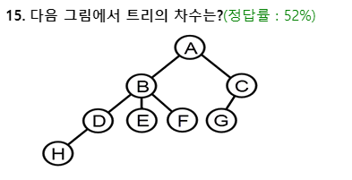
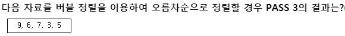

# 정처기 - 2018/08/19

1 -Linear Search 평균 검색 회수 : (n+1)/2

---

2 -

- 개체 무결성 : 기본 키를 구성하는 속성은 null, 중복값을 가질 수 XXX
- 참조 무결성 : 외래키 값은 null이거나, 참조 릴레이션의 기본키 값과 동일해야함. 
- 릴레이션은 참조할수없는 외래키 값 가질수X

---

​	<헤싱에서 홈주소>

3 -

- Synonym -> 충돌로 인해, 같은 home addres를 갖는 레코드들의 ★집합★
- Collision -> =충돌현상, 서로 다른 두개 이상의 레코드가 ★같은 주소를 같은 현상★
- Bucket -> 하나의 주소를 갖는 파일의 한 구역, 버킷의 크기는 같은 주소에 포함될 수 있는 레코드 수 
- Overflow -> 계산된 home address의 bucket내에 저장할 기억 공간이 없는 상태

---

4 -뷰는 사용자에게 접근이 허용된 자료만을 제한적으로 보여주기 위해 하나 이상의 
기본 테이블로부터 유도된 이름을 가지는 가상 테이블

- 뷰는 데이터 접근 제어로 보안을 제공
- 뷰는 독자적인 인덱스를 가질 수 XX
- 뷰는 데이터의 논리적 독립성을 제공함
- 뷰로 구성된 내용에 대한 삽입, 삭제, 갱신 연산에 제약이 따름 

---

5 -정규화

- 정규화는 데이터베이스의 논리적 설계 단계에서 수행
- 데이터 구조의 안정성을 최대화
- 중복을 베제하여, 삽입, 삭제, 갱신 이상의 발생을 방지
- 데이터 삽입 시 릴레이션을 재구성할 필요성을 줄임

---

6 - n개의 노드로 구성된 무방향 그래프의 최대 간 선수는?

- nC2 -> n(n-1)/2

---

7 - 다음 postfix로 표현된 연산식의 연산 결과로 옳은 것은?
3 4 * 5 6 * +
  ==> (3*4) + (5*6) = 12 + 30 = 42

---

8 - 

- 타임스탬프 기법 : 동시성 제어를 위한 직렬화 기법으로 토랜잭션 간의 순서를 미리 정하는 기법
- 로킹 기법 : 주요 데이터의 엑세스를 상호 배타적으로 함,트랜잭션들이 어떤 로킹 단위를 엑세스 하기 전에 잠금을 요청해, 잠금이 허락 되야 그 로킹 단위를 엑세스 할 수 있게 함
                : 하나의 트랜잭션이 데이터를 액세스하는 동안 다른 트랜잭션이 그 데이터 항목을 액세스할 수 없도록 하는 기법
- 검증 기법 : 병행수행하고자 하는 대부분의 트랜잭션이 읽기 전용 트랜잭션일 경우 트랜잭션간의 충동률이 매우 낮아 동시성 제어를 사용하지 않고 실행되어도 이 중 많은 트랜잭션은 시스템 상태를 일관성있게 유지한다는 점을 이용한 기법
- 배타 로크 기법 : 로킹의 종류 중 하나임

---

9 -  DDL : data define language(데이터 정의어) 
--> schema, domain, table, view, index를 정의하거나 변경, 삭제시 사용하는 명령문
      CREATE(정의),  ALTER(정의 변경),   DROP(삭제)

---

10 - collision(충돌현상)이 발생했을 때, 그 버킷에 저장할 slot이 없으면 overflow!!!
[해결방법]

- 개방주소법 : (=선형방법), collision발생시 순차적으로 그 다음 빈 버킷을 찾아 저장
- 폐쇄주소법: overflow된 레코드들을 별도의 overflow영역에 저장하고 chain(pointer)으로 홈 버킷에 연결하는 방법으로, 헤시표 내의 빈자리에 보관하는 direct chaining, 헤시표와는 별도의 기억공간에 보관하는 indirect chaining이 있음
- 재해싱 : collision 발생 시 새로운 해싱 함수로 새로운 홈주소를 구함 

---

11 - 데이터 베이스 설계 
[ 설계 순서 : 요구분석->개념적설계->논리적설계->물리적설계 ]

- 요구 분석 : DB를 사용할 사람들로부터 필요한 용도를 파악하는 것
- 개념적 설계: 정보의 구조를 얻기 위해 현실 세계에 대한 인식을 추상적 개념으로 표현(E-R다이어그램)
- 논리적 설계 : 현실세계에서 발생하는 자료를 논리적 자료구조로 변환(테이블 설계)
- 물리적 설계: 논리적 구조로 표현된 데이터를 물리적 저장장치에 저장할 수 있게 물리적 구조의 데이터로 변환 ==> 저장레코드 양실 설계, 레코드 집중의 분석 및 설계, 접근 경로 설계

---

12 - 정규형

- 제 1정규형(1NF) : 어떤 릴레이션 R에 속한 모든 속성의 도메인이 원자값(Atomic Value)으로만 구성
- 제 2정규형(2NF) : 기본키가 아닌 모든 속성이 기본키에 완전히 함수 종속적일 경우
- 제 3정규형(3NF) : 기본키가 아닌 모든 속성이 기본키에 이행적 함수 종속적이 되지 않을 경우
- 보이스/코드 정규형(BCNF) : 3NF를 만족하면서 모든 결정자가 후보키 집합에 속한 정규형

---

13 -



> 최대 차수인 B의 차수가 DEF ->3차수

---

14 - 병행제어의 Locking 

> 로킹 단위 : 동시성 제어에서 한꺼번에 로킹할 수 있는 단위
>
> 로킹 단위가 크면 로크수가 작아 관리하기 쉽지만 병행성 수준이 낮아지고,
>
> 로킹 단위가 작으면 로크수가 많아 관리하기 복잡하지만 병행성 수준은 높아진다.

- 데이터베이스, 파일, 레코드 등은 로킹 단위가 될 수 있다.
- 로킹 단위가 작아지면 로킹 오버헤드가 증가한다.
- 한꺼번에 로킹할 수 있는 단위를 로킹 단위라고 한다.

---

15 - 

--> PASS 3 : 3회전.

1회전: 6 7 3 5 9

2회전: 6 3 5 7 9

3회전: 3 5 6 7 9

---

16 - 3NF--> BCNF가 되기 위한 조건

**결정자이면서 후보키가 아닌 것 제거!**

> [] : 다음 과정을 위한 조건
>
> 비정규릴레이션 -> [도메인이 원자값] -> 1NF -> [부분적 함수 종속 제거] 
>
> ->2NF -> [이행적 함수 종속 제거] -> 3NF -> [결정자이며, 후보키가 아닌 것 제거]
>
> -> BCNF -> [다치 종속 제거] -> 4NF -> [조인 종속성 이용]  -> 5NF


---

21 - 

Marshalling : 한 객체의 메모리에서의 표현방식을 저장, 전송에 적합한 다른 데이터의 형식으로 변환하는 과정 

> 하나 이상의 프로그램 또는 연속되어 있지 않은 저장 공간으로부터 데이터를 모은 다음, 데이터들을 메세지 버퍼에 넣고, 특정 수신기나 프로그래밍 인터페이스에 맞도록 그 데이터를 조직화하거나, 미리 정해진 다른 형식으로 변환하는 과정을 일컫는 것

Poring : (=이식), 실행 가능한 프로그램이 원래 설계된 바와 다른 컴퓨팅 환경에서 동작할 수 있도록 하는 과정

 Streaming : 인터넷 상에서 음성이나 동영상 등을 실시간으로 재생하는 기술

---

22 - 불 함수식 F = (A+B) • (A+B) 를 간소화 한 것은?

```
F = (A+B) * (A+C)
= AA + AB + AC + BC      # AA = A
= A + AB + AC + BS
= A(1+B) + AC + BC       # 1 + B = 1
= A + AC + BC
= A(1+C) + BC            # 1 + C = 1
= A + BC !!!!!!!
```

---

23 - 

- 디코더(Decoder) : n개의 입력, 2^n개의 출력을 하는 해독기
- 인코더(Encoder) : 2^n개의 입력, n개의 출력 : 곰플레이어(많은 데이터를 통해 n개의 음성출력)
- 멀티플렉서(Multiplexer) : 여러개의 입력선을 통해 하나의 출력선을 얻음
- 디멀티플렉서(Demultiplexer) : 하나의 입력선을 통해 여러개의 출력선을 얻는 구조
  -  하나의 입력 정보를 여러개의 출력선 중에 하나를 선택해 정보 전달

---

24 - DMA 명령어 사이클

- 간접 사이클 : 피연산 데이터가 있는 기억 장치의 유효 주소를 계산하는 과정
- 인터럽트 사이클 : 실행중인 프로그램을 특정 장소에 보관하고, 인터럽트를 처리하기 위한 서비스 프로그램을 수행하게 되는데, 이런 일련의 과정을 인터럽트 사이클이라 하며, 실행 사이클의 마지막에서 시작됨
- 실행 사이클 : 연산자 코드의 내용에 따라 연산을 수행하는 과정
- 패치 사이클: 주기억 장치로부터 명령어를 꺼내어 디코딩하는 과정 

---

25 - 오퍼랜드 필드를 사용하지 않고 명령어만 사용하는 명령어 형식

```
ADD
MUL
```

명령어 뒤에 오퍼랜드 필드가 없기 떄문에 **Zero-Address Instruction Mode**

---

26 - 인터럽트의 처리 루틴의 순서

인터럽트 인식 -> 현재 상태 보존 -> 요청 인터럽트 서비스로 분기 및 서비스 -> 사용자 상태 복구 및 재개

---

27 -  10진수 3은 3-초과코드(Excess-3 Code)에서 표현

3 + 3 = 6,   6의 2진수 :  **0110**

---

28 - 인터럽트 우선순위를 결정하는 Polling 방식에 대한 설명

- 많은 인터럽트가 있을 경우 그들을 모두 조사하는데 많은 시간이 걸림 -> 반응시간이 매우 느림
- S/W적으로 CPU가 각 장치 하나하나를 차례로 조사하는 방식
  - 인터럽트 요청 신호 플래그를 차례로 검사해 인터럽트의 원인을 판별하는 방식이 폴링!
- 조사 순위가 우선순위가 됨
  - 우선순위 인터럽트 중에서 소프트웨어적으로 우선순위가 높은 인터럽트를 알아내는 방식
- 모든 인터럽트를 위한 공통의 서비스 루틴을 갖고 있다.


